# Muon3: Networked Cosmic-Ray Muon Telescope

**In plain English:**  
High-energy particles called muons constantly rain down from space. Muon3 builds small, portable detectors ("muon telescopes") that use special plastic panels. When a muon passes through, the plastic gives off a tiny flash of light that is captured by sensitive sensors and fast electronics.

The project aims to network many of these affordable detectors (using cellular links for remote control and data). This lets researchers study cosmic ray air showers, monitor space weather, and do basic directional measurements with muons. It supports both scientific research and university outreach programs such as gLOWCOST at Georgia State University.

This repository holds the full set of simulations, electronics designs, firmware, analysis tools, and documentation.

---

Muon3 is the engineering archive and next-generation development workspace for the
[Muon Telescope](https://muontelescope.com/) and
[gLOWCOST](https://cosmic.gsu.edu/glowcost/) detector program led by Georgia State University.

The project is developing a portable, remotely operated cosmic-ray telescope built from
plastic-scintillator panels, wavelength-shifting fibers, silicon photomultipliers (SiPMs),
precision timing electronics, GNSS, and cellular connectivity. The initial scientific priorities
are:

1. inter-station extensive-air-shower coincidence;
2. long-duration atmospheric and space-weather muon-rate monitoring; and
3. directional tracking with multiple scintillator layers.

This repository also preserves the complete earlier hardware and software lineage. Twenty-eight
upstream `muonTelescope` repositories are retained (see `reference_documentation/repositories/`)
so their original commits, branches, tags, and remotes remain available.

Additional relevant external simulations from the same collaboration (Xiaochun He / GSU) are
cloned under `reference_documentation/repositories/`:
- `fiberPanel/` — Geant4 model of scintillator panel + embedded WLS fiber + SiPM (straight-fiber
  variant, detailed optical physics, material defs, position scans). Used to refine the current
  looped-fiber muon3 model.
- `magnetocosmics/` — cosmic-ray tracking in the geomagnetic field (reference for primaries).
- `sPHENIX_HCal/` — standalone Geant4 + GDML geometry for sPHENIX Inner/Outer HCal tiles
  (originals kept). STEP assemblies with fibers, light blockers, and coverings live in
  `cad/sphenix_hcal/step/`; Geant4 optical runs use the `hcal_tile` app in `sim/geant4/`.

> **Engineering status:** research and architecture phase. The included 2026 Rev A KiCad design
> is reference material, not a fabrication release. It has known electrical blockers and no routed
> tracks. Read the [PCB review](reference_documentation/review_and_requirements/NEXT_GENERATION_PCB_REVIEW.md)
> before using any schematic, simulation result, footprint, or BOM.

## Baseline detector concept

The baseline station uses three or more detector layers. Each layer is based on:

- a 200 x 200 x 10 mm plastic-scintillator panel;
- a glued, embedded wavelength-shifting optical fiber routed in a loop;
- a Hamamatsu S12572-33-015P SiPM on decommissioned sPHENIX HCal tiles (LT3482 ~70 V bias, C515895);
- a local temperature sensor and optional thermoelectric cooler; and
- a single hybrid locking panel connector carrying the shielded signal, bias, cold- and hot-side
  thermal sensing, TEC power, and fan power/tach over a 50 cm cable. TECs now require hardware-default-off interlocks (invalid NTC, hot overtemp, insufficient PD, watchdog, overcurrent).

The four-channel controller is intended to provide:

- DC-coupled SiPM transimpedance amplification;
- two programmable comparator thresholds per channel;
- leading- and trailing-edge capture for time-over-threshold measurements;
- exact-subset coincidence counting;
- continuous accidental-rate estimation using delayed shadow windows;
- per-channel charge and optical self-test injection;
- GNSS PPS-disciplined timestamps;
- environmental and power telemetry;
- USB-C PD + onboard battery/solar support via TPS25751-class controller + charger/power-path; and
- LTE-M/NB-IoT connectivity through a directly integrated nRF9151-LACA.

## Proposed system architecture

```text
Scintillator panel
  -> looped wavelength-shifting fiber
  -> Hamamatsu S12572-33-015P SiPM
  -> DC-coupled TIA
  -> dual fast comparators
  -> iCE40UP5K timing and histogram engine
  -> SPI register interface
  -> nRF9151-LACA control, storage, GNSS coordination, and cellular telemetry
```

Supporting subsystems include:

```text
USB-C PD input (external battery/solar module upstream, per 2026-07-11 decision)
  -> protected power path
  -> quiet analog rail
  -> digital and FPGA rails
  -> programmable SiPM bias
  -> four independent TEC controller channels
```

The timing/control partition is deliberate:

- **iCE40UP5K:** deterministic parallel pulse capture, coincidences, timestamps, ToT, histograms,
  livetime/deadtime, PPS latching, and calibration timing.
- **nRF9151-LACA:** configuration, DAC/ADC/sensor access, thermal and bias control loops, local
  buffering, secure OTA, device identity, and LTE-M/NB-IoT reporting.

## Next-generation requirements

The controlling requirements are documented in
[NEXT_GENERATION_REQUIREMENTS.md](reference_documentation/review_and_requirements/NEXT_GENERATION_REQUIREMENTS.md).
Major decisions currently include:

- Hamamatsu S12572-33-015P on decommissioned HCal tiles; LT3482 HV (C515895);
- sPHENIX Inner HCal tile assemblies (STEP in `cad/sphenix_hcal/step/`);
- directly integrated nRF9151-LACA rather than a generic carrier header;
- Onomondo or Deutsche Telekom nuSIM/eSIM plus physical SIM support;
- USB-C PD with safe 5 V fallback and higher-power TEC modes;
- a clean 5 V analog rail for the proposed OPA858 operating point;
- independent baseline trim and dual-threshold ToT on all four channels;
- at least sixteen precision DAC outputs;
- conventional grounded coax shields instead of exposed bias on the shield;
- one cold-side NTC and preferably one hot-side NTC per SiPM/TEC channel;
- four independently regulated, dew-point-aware Peltier channels; and
- pressure-corrected and uncorrected scientific data products with full configuration provenance.

## Simulations, Improvements, and Publications

A comprehensive simulation suite supports detector design, threshold optimization, and calibration planning:

- **Geant4 optical model** (`sim/geant4/`): scintillation, WLS transport, surface effects, SiPM photon counting. Recent improvements (2026-07):
  - Realistic cosmic muon energy spectrum (power-law sampling) and $\cos^2\theta$ angular distribution.
  - More representative looped-fiber geometry (straights + corner tori + exit legs + simplified optical cement).
  - Updated material and optical properties cross-checked against Eljen/Luxium EJ-200 documentation, Kuraray WLS fiber data, onsemi SiPM PDE curves, and prior collaboration work (phyxch/fiberPanel).
  - **sPHENIX Inner HCal tiles** (`hcal_tile` executable): original tessellated GDML tiles + WLS fiber + diffuse coating + light-tight wrap + light blocker + **Hamamatsu S12572-33-015P** SiPM (PDE ~25%, dual-fiber air-gap coupler — not the Muon3 MicroFC-30035); STEP in `cad/sphenix_hcal/step/`.
- **Analog front-end** (`sim/circuit/`): ngspice models of SiPM + OPA858 TIA + dual comparators.
- **Behavioral models** (`sim/python/`): thermal/Peltier (enhanced with leak sensitivity, PI dew-point control, system trade-offs), power budget under USB-C PD, coincidence/accidental rates.
- **EM / RF / SI / PI** (`sim/openems/`): openEMS FDTD for nRF9151 antenna, cables, traces, PDN (Python bindings active; scripts auto-detect real vs. fallback models).
- **Procedural 3D visualization** (`cad/blender/`, `cad/sphenix_hcal/`): Blender/Cycles renders of Muon3 panel and sPHENIX Inner HCal tile assemblies for paper figures.

Stand-in and partial real Geant4 data (hits.csv) indicate a mean detected yield of ~25--40 p.e.\ per MIP after all losses for the Muon3 loop panel (MicroFC-30035), with usable uniformity and timing. sPHENIX Inner tile assemblies use a **Hamamatsu S12572-33-015P** (PDE ~0.25); see paper Section on HCal tiles and `cad/sphenix_hcal/README.md`.

### Paper
An overall summary and findings paper has been written in the base directory:
- `Muon3_Simulation_Studies.tex` (and compiled PDF when TeX is available; currently ~11 pages)
- Formatted as a professional article (sPHENIX/Brookhaven-style conventions: clear sections, booktabs tables, properly captioned figures, numbered references).
- Includes dedicated sections for Geant4, ngspice AFE, openEMS EM simulations, and a new "Thermal Management (Peltier / TEC)" subsection with plots from the enhanced model (step response, sweep, PI loop, leak sensitivity).
- Hardware Baseline figure uses procedural Blender 5.1 renders (4 views of panel + fiber + SiPM + frame).
- Cites Eljen/Kuraray/onsemi datasheets, public muon telescope and muography papers (arXiv), phyxch reference models, and historical project documentation.
- See the paper for detailed results, discussion of limitations, and future calibration plans.

The paper replaces/augments the earlier short simulation report in `sim/reports/`.

### Selected Figures & Renders

**Procedural Blender panel renders** (used in Hardware Baseline figure):


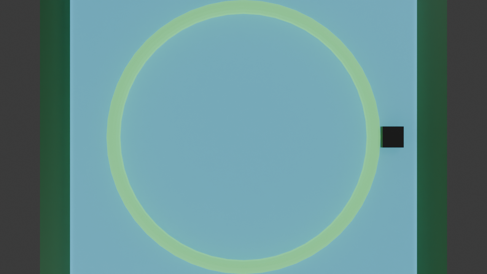
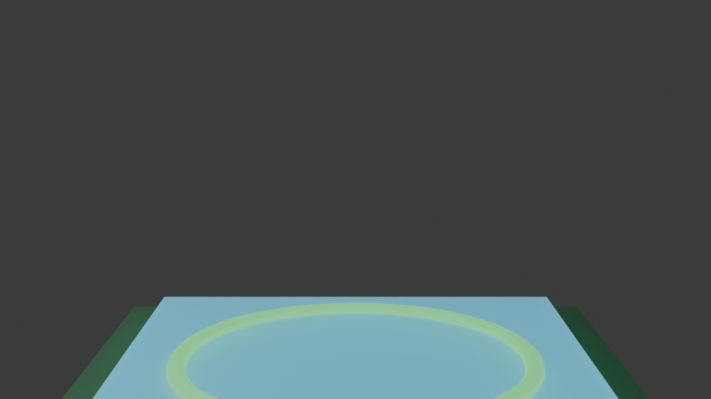


**sPHENIX Inner HCal tile assemblies** (original GDML + fiber + coating + light blocker + SiPM; STEP in `cad/sphenix_hcal/step/`):

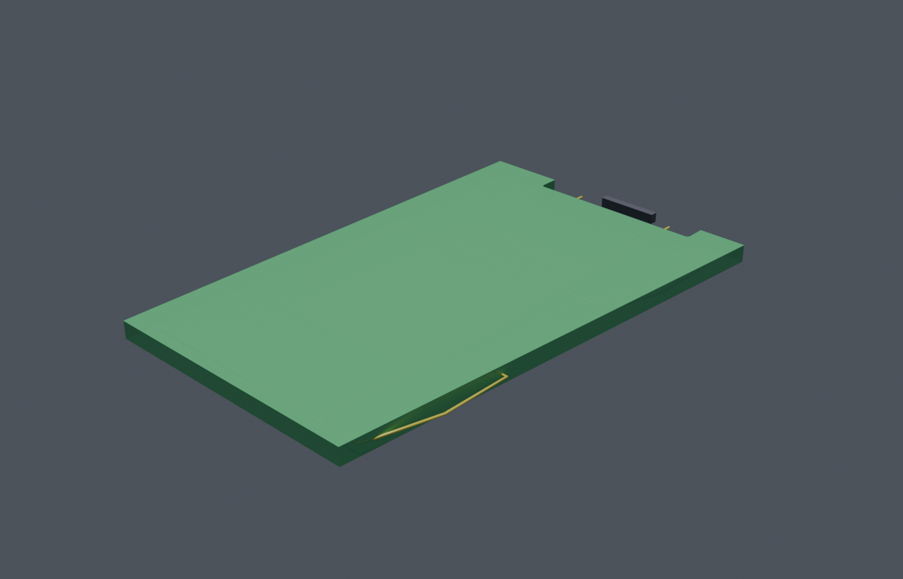
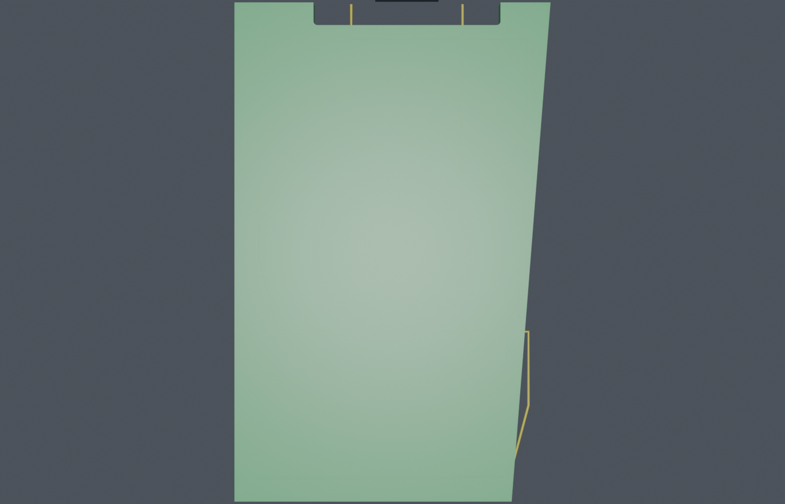
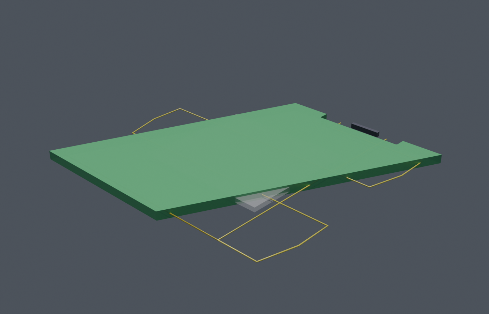
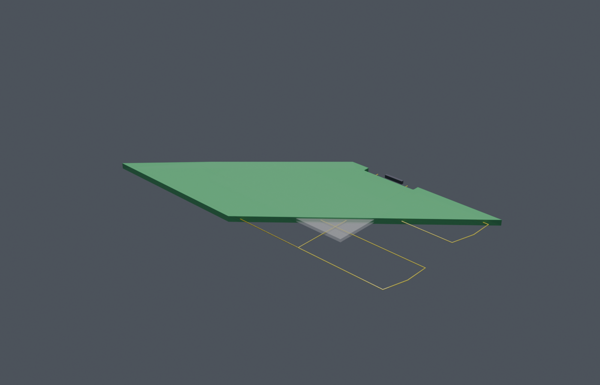

**Geant4 results for Inner HCal tile 01** (ROOT 6 plots, 200 events, Hamamatsu S12572):

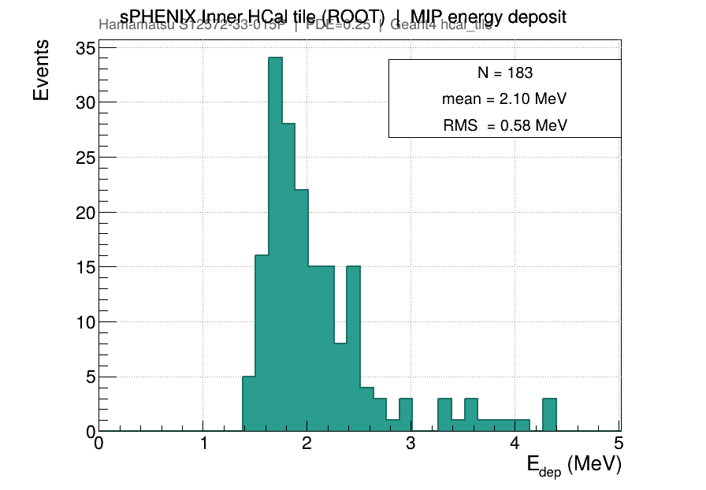
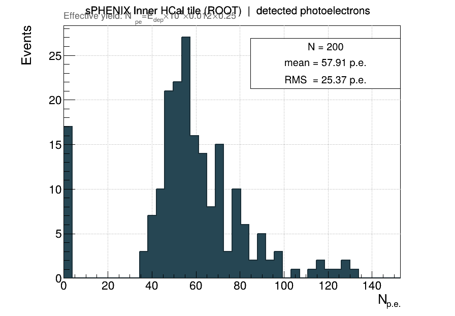
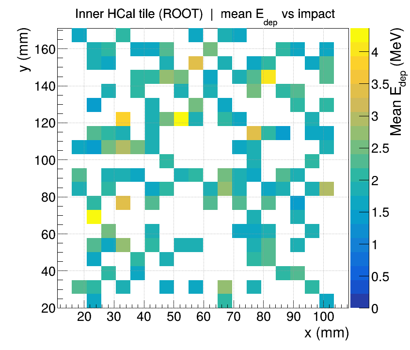
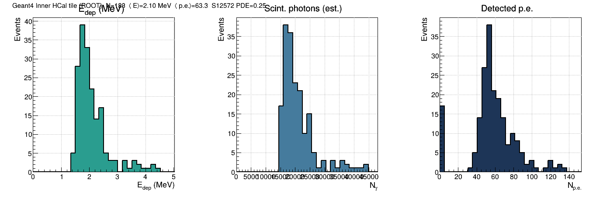
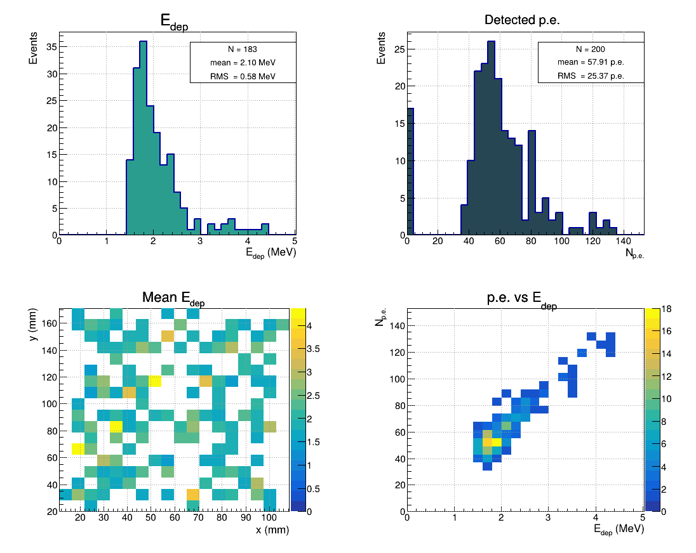

```bash
root -l -b -q 'sim/reports/root_hcal_and_geant4.C'
# 3D surfaces (openEMS + Geant4):
octave-cli --no-gui --quiet --eval "run('sim/plots_octave/plot_3d_openems_geant4.m')"
```

**Octave 3D (RF / openEMS / Geant4):**

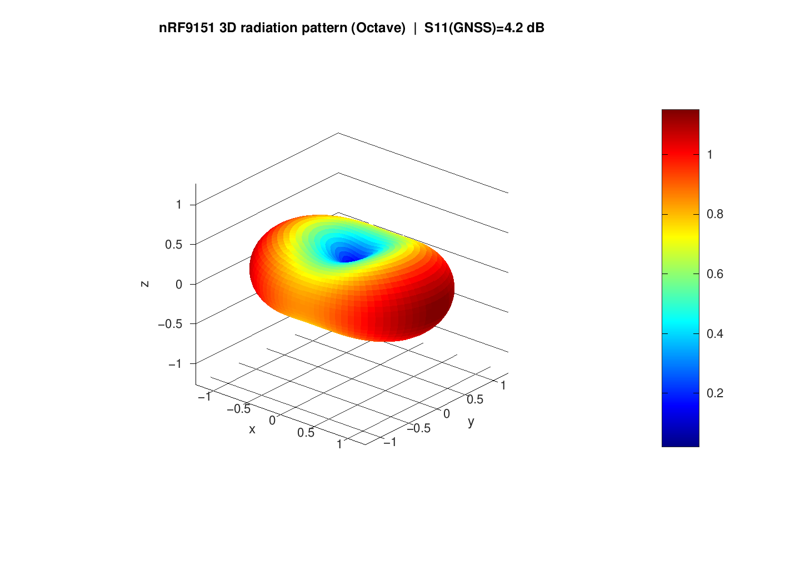
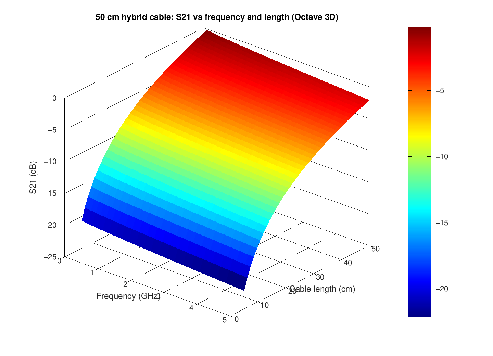
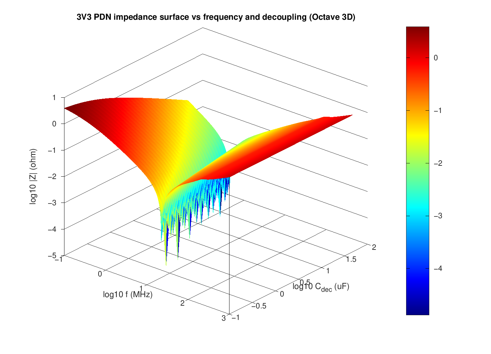
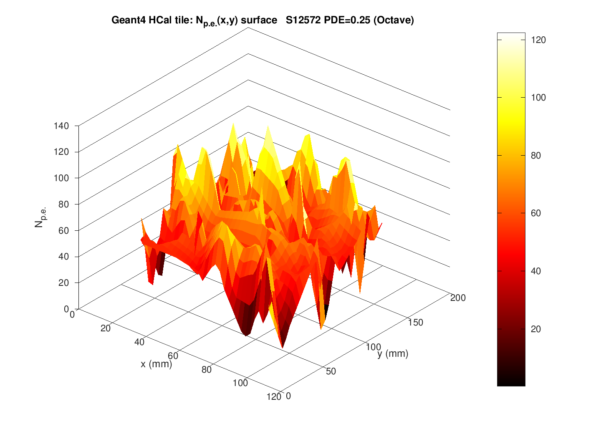

**Thermal / Peltier analysis** (subsection in paper):

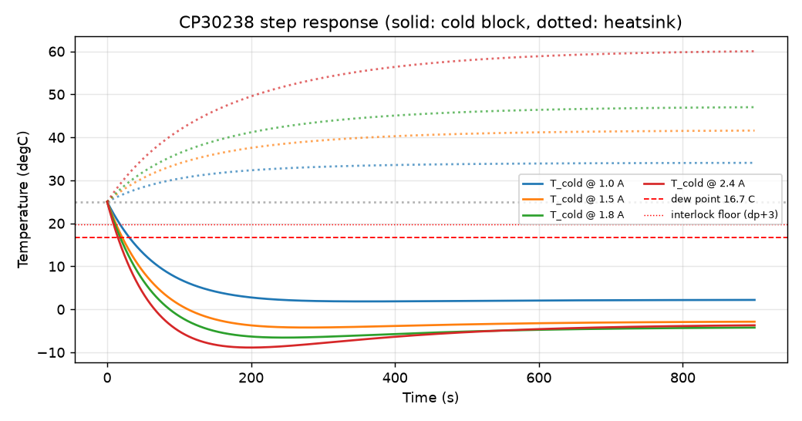
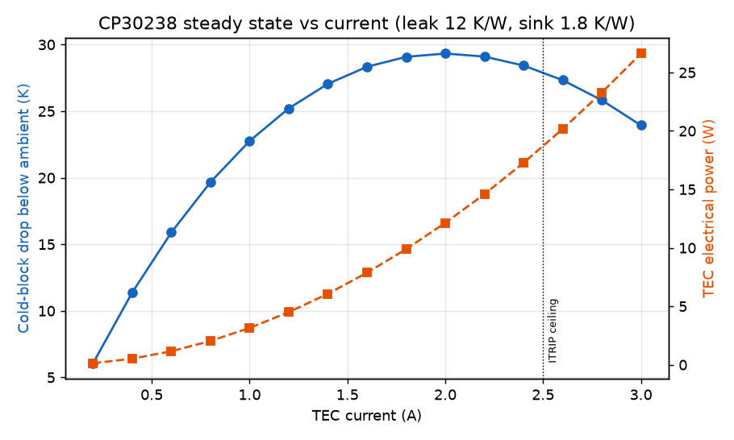

See `figures/`, `cad/blender/`, `cad/sphenix_hcal/`, `sim/`, and the paper for more (openEMS results in `figures/openems/`, Geant4/ngspice yields, power budgets, etc.).

### How to build and run simulations
See `sim/geant4/README.md`, `sim/README.md`, and the paper for instructions. Full Geant4 (with visualization and all required libraries) is needed for the complete optical model; stand-in + Python models provide rapid iteration.

## Current PCB work

The active clean-sheet PCB work now lives in [pcb/](pcb/README.md). It is a P0 architecture
baseline, not a fabrication release. The directory contains:

- a new KiCad project scaffold for `muon3`;
- a purchasing-oriented BOM and part-selection notes;
- per-component research folders with downloaded data sheets;
- live JLCPCB confirmation notes for several critical parts; and
- the current [schematic-freeze check](pcb/SCHEMATIC_FREEZE_CHECK.md) and
  [freeze questions](pcb/freeze_questions.md).

The most important live-confirmed prototype choices are:

- `nRF9151-LACA-R7` for cellular/GNSS/control, requiring JLCPCB Standard PCBA and X-ray;
- `ICE40UP5K-SG48I` for deterministic timing/coincidence logic;
- `OPA858IDSGR` for the SiPM TIA, subject to corrected bias and stability validation;
- `LT3482EUD#TRPBF` (**C515895**) for Hamamatsu S12572 ~70 V bias (not TPS61170/MicroFC);
- `CH224K` as a simple USB-C PD sink for a first USB-powered prototype; and
- `DRV8873HPWPR` as the Peltier-driver path, frozen by the 2026-07-11 decision that full JLCPCB
  assembly is a hard requirement.

Parts that should not be frozen yet include the comparator, DACs, 3.3 V and 1.2 V regulators,
external ADC, TCXO, SIM/eSIM hardware, the exact hybrid panel-connector family, and the USB
protection network. The battery/solar power path is decided out of this revision, and the TEC
module is selected: one Same Sky `CP30238` per SiPM channel (see
[pcb/parts/tec_cp30238/](pcb/parts/tec_cp30238/README.md)).

## Design decisions from the schematic-freeze review (2026-07-11)

All ten pre-freeze questions have been answered and recorded in
[pcb/freeze_questions.md](pcb/freeze_questions.md):

1. The first manufacturable board is 100% JLCPCB-assembled, including the TEC drivers. The
   DRV8873 H-bridge path is frozen; MAX1968 and daughterboard options are dropped.
2. This revision exposes only a protected USB-C PD input; battery/solar energy storage stays in
   an external qualified module (chosen as the simpler path).
3. Each SiPM uses a Same Sky CP30238 TEC (20 x 20 x 3.8 mm, 8.6 V / 3 A, Qmax 15 W) driven at
   roughly 1.2-1.8 A, with an aluminum cold block, a 40 mm-class hot-side heatsink, and a
   12 V tach fan. See [pcb/parts/tec_cp30238/](pcb/parts/tec_cp30238/README.md).
4. The station is a four-channel board that ships populated for three panels; the fourth channel
   is populated if the science data justifies expansion.
5. The AFE and cable budget are specified for a 50 cm panel cable.
6. Each panel connects through a single hybrid locking connector carrying shielded signal, bias,
   both NTCs, TEC power, and fan power/tach. The separate coax-plus-auxiliary scheme is retired.
7. Calibration injection (charge and optical) is per-channel from the start.
8. USB-C 5 V fallback is a valid science mode with TECs and fans disabled; cooling is optional.
9. Fan drivers with tach, hot-side NTCs, an enclosure-open input, and humidity/dew-point
   condensation sensing are all required on the first PCB.
10. Cellular certification risk dominates the outline: the Nordic reference antenna geometry and
    RF layout are followed as closely as possible.

## Suggested improvements

The strongest redesign direction is to split "science acquisition" from "thermal ambition" more
sharply. Freeze the SiPM/AFE/FPGA/nRF9151 measurement chain first, then give the TEC subsystem a
well-defined high-current interface, interlocks, and telemetry. That makes the first board useful
even if cooling needs a daughterboard or a second spin.

Recommended changes before schematic freeze:

- Add a multichannel external ADC for HV monitor, TEC current/voltage, cold-side NTCs, hot-side
  NTCs, and power rails. The nRF9151 ADC should not carry the whole telemetry system.
- Use two 8-channel precision DACs rather than one DAC plus small leftovers. Spare DAC outputs
  will be useful for threshold scans, baseline trim, HV trim, calibration amplitude, and TEC
  setpoints.
- Treat CH224K as the simple P0 PD path. If onboard battery/solar or 20 V/5 A power management is
  required, switch to a TPS25751-class PD controller and charger/power-path reference design.
- Make the TEC section default-off in hardware, not just firmware: invalid NTC, hot-side
  overtemperature, insufficient PD contract, watchdog loss, or overcurrent should all shut it down.
- Put charge injection and optical calibration hooks on the schematic now, even if some are DNP on
  the first build.
- Keep the LTE/GNSS RF section as reference-layout-shaped as possible, and let that constrain the
  board outline early rather than after placement has become emotionally expensive.
- Use touch-safe keyed panel connectors for bias and TEC power. U.FL-style connectors should be
  grounded RF/signal only, never exposed bias.

## Known release blockers

The existing generated Rev A design must not be ordered. The review identified, among other
issues:

1. **OPA858 common-mode violation.** The amplifier is powered from 3.3 V while its inputs are
   biased at 2.40 V. The current TI specification permits approximately 1.9 V maximum at that
   supply. The supplied behavioral model does not simulate this limit.
2. **iCE40 VCCPLL overvoltage.** VCCPLL is connected to 3.3 V; Lattice specifies a 1.2 V rail
   and a 1.42 V absolute maximum.
3. **Unrouted PCB.** The board contains footprints, zones, and stitching vias but zero routed
   track segments. Placement-only DRC is not a fabrication validation.
4. **Incomplete power and RF design.** USB-C PD, protected battery/solar power path,
   nRF9151-LACA reference RF layout, SIM protection, antenna matching, and cellular burst power
   integrity remain to be implemented.
5. **Incomplete calibration and thermal hardware.** Charge injection, optical injection, four
   complete NTC channels, TEC power stages, dew-point interlocks, and heat rejection are not in
   the Rev A schematic.
6. **No production RTL or nRF firmware.** The requested timing engine and secure fleet software
   remain specifications. Historical FPGA and RP2350 code is reference-only.

See the detailed
[Next-Generation PCB Review](reference_documentation/review_and_requirements/NEXT_GENERATION_PCB_REVIEW.md)
for the evidence, subsystem findings, questions, and recommended work order.

## Repository layout

```text
.
├── README.md
├── .gitmodules
├── pcb/                        # active clean-sheet Muon3 PCB workspace
├── gateware/                   # iCE40UP5K gateware (modern Yosys + nextpnr-ice40)
├── firmware/                   # nRF9151 firmware (modern Zephyr + NCS)
└── reference_documentation/
    ├── README.md
    ├── repositories/            # 28 historical Git submodules
    ├── publications/            # archived GSU and sPHENIX papers + index
    ├── prior_design_exports/    # chat history, decisions, handoffs, source packages
    ├── next_generation/         # KiCad, simulations, generators, reference firmware
    ├── review_and_requirements/ # active system review and requirements
    └── working_files/           # retained render/review intermediates
```

The main entry points are:

- [Archive index](reference_documentation/README.md)
- [Active PCB workspace](pcb/README.md)
- [Schematic freeze check](pcb/SCHEMATIC_FREEZE_CHECK.md)
- [Freeze questions](pcb/freeze_questions.md)
- [Next-generation requirements](reference_documentation/review_and_requirements/NEXT_GENERATION_REQUIREMENTS.md)
- [PCB and system review](reference_documentation/review_and_requirements/NEXT_GENERATION_PCB_REVIEW.md)
- [Publication index](reference_documentation/publications/README.md)
- [Historical decision log](reference_documentation/prior_design_exports/DECISIONS.md)
- [Historical design conversation](reference_documentation/prior_design_exports/CHAT_HISTORY.md)
- [Current reference hardware notes](reference_documentation/next_generation/nextgen_review/hardware/README.md)
- [Analog simulation report](reference_documentation/next_generation/nextgen_review/sim/design_report.md)
- [New Muon3 simulations (circuit / Geant4 / Python)](sim/README.md)
- [Gateware project](gateware/README.md) (Yosys + nextpnr-ice40)
- [Firmware project](firmware/README.md) (Zephyr + nRF Connect SDK)

## Clone and initialize

Clone the umbrella repository and all historical projects:

```sh
git clone --recurse-submodules git@github.com:muonTelescope/muon3.git
cd muon3
```

If the repository was cloned without submodules:

```sh
git submodule update --init --recursive
```

To update every historical repository to the commit recorded by Muon3:

```sh
git submodule update --init --recursive
```

Do not run `git submodule update --remote` unless intentionally reviewing newer upstream
commits; it changes the reproducible archive state.

## Working with the hardware package

The unpacked reference package is under:

```text
reference_documentation/next_generation/nextgen_review/
```

Important paths:

- `hardware/muon_telescope_v10/` - primary KiCad project;
- `hardware/muon_telescope_v7/` - legacy validation twin;
- `hardware/generator/` - schematic/symbol/PCB generators;
- `sim/` - prior behavioral ngspice models, analysis scripts, plots, and design report; and
- `rp2350_reference/` - superseded protocol and capture prototype.
- `gateware/` - modern iCE40 gateware project (Yosys + nextpnr)
- `firmware/` - modern nRF9151 firmware project (Zephyr/NCS)

**Simulations** (primary modeling suite for the 2026 P0 architecture):

All new simulation work lives in the top-level `sim/` directory (sibling to `pcb/`). This is the recommended location for electrical, detector-physics, and system modeling going forward.

See `sim/README.md` for the complete reference. Highlights:

- **circuit/** — ngspice models:
  - `muon3_frontend.lib` (S12572_015P + MicroFC, OPA858, dual TLV3601, charge inject).
  - `hv_lt3482.cir` / `afe_hamamatsu_s12572.cir` — primary HCal-tile HV+AFE (LT3482 C515895).
  - `afe_dual_threshold.cir` (full channel with low/high thresholds, protection, filtered DAC refs).
  - `hv_tps61170.cir` (boost + filtering + trim + HV_MON).
  - `cable_50cm.cir` (lossy 50 cm interconnect).
  - Scripts + analyzer for NPE sweeps, ToT, time-walk.

- **geant4/** — complete Geant4 application for muon transport + full optical photon tracking:
  - 200×200×10 mm EJ-200 panel + looped WLS fiber + MicroFC-30035.
  - Scintillation, WLS, surfaces, PDE.
  - Outputs: energy deposit, photon counts (produced/shifted/detected), timing, position dependence.
  - Build with CMake; includes run, vis, and position-scan macros.

- **python/** — behavioral & Monte-Carlo models:
  - `thermal_peltier.py` (Peltier + heatsink + fan + dew-point interlock + PID).
  - `power_budget.py` (5 V fallback vs. 12/20 V PD with 1–4 TEC channels).
  - `coincidence_rates.py` (efficiency, accidentals).
  - `sipm_to_tot.py` (parametrized ToT model).

**Usage workflow** (recommended):
1. Geant4 → realistic NPE distributions and photon time profiles.
2. Feed into ngspice AFE models for pulse shape / ToT / threshold studies.
3. Python models for thermal safety, power contracts, and rate predictions.
4. Always cross-check against measured panel data before locking parameters.

**Firmware and Gateware** (modern toolchains):

- `gateware/` — iCE40UP5K timing engine (pulse capture, exact-subset coincidence, ToT, PPS timestamps, SPI to nRF).
  - Modern flow: Yosys + nextpnr-ice40 + icestorm.
  - Build: `make` (after `source firmware/setup_env.sh`).

- `firmware/` — nRF9151 application (control, LTE-M/NB-IoT + GNSS, thermal loops, telemetry, SPI master to gateware).
  - Modern: Zephyr + nRF Connect SDK (NCS).
  - Toolchain: arm-none-eabi-gcc, west, nrfutil.
  - Setup: see `firmware/README.md` and `west.yml` (init NCS separately, large download).

Toolchains installed via Homebrew + pip (modern versions):
- Gateware: yosys, nextpnr-ice40, icestorm
- Firmware: arm-none-eabi-gcc 16.x, west, nrfutil, cmake, ninja, etc.

Use `firmware/setup_env.sh` to set PATH. Full NCS `west init` is heavy — take it slow.

These models directly support the documented requirements (dual-threshold ToT, per-channel calibration injection, hardware thermal interlocks, 5 V science fallback, etc.).

See also the prior reference simulations under `reference_documentation/next_generation/nextgen_review/sim/`.

Before editing generated EDA files, read the package `AGENTS.md`, decision log, hardware README,
and simulation report. Until the generators are retired, schematic changes should be made in the
generators and regenerated consistently. Once manual routing begins, ownership of the PCB file
must be explicitly frozen so a generator cannot overwrite hand routing.

Every hardware revision must include:

1. manufacturer-datasheet pin and operating-point verification;
2. KiCad 10 ERC and DRC;
3. exported-netlist assertions for critical rails and signals;
4. BOM/footprint/LCSC verification against the exact ordered parts;
5. power-up, power-down, fault, and unpowered-input analysis;
6. analog coupon or bench results tied to the simulation set;
7. synthetic-pulse RTL tests and clock-domain/metastability review; and
8. an independent schematic and layout peer review.

## Data products and calibration

Muon3 is intended to produce auditable scientific measurements rather than bare event counts.
Each report should retain:

- station and detector geometry identifiers;
- firmware, RTL, configuration, and calibration versions;
- raw singles and exact-subset coincidence counts;
- dual-threshold ToT histograms and shadow-window accidentals;
- livetime, deadtime, dropped-event, overflow, and reset counters;
- UTC/PPS lock state, measured clock frequency, timing uncertainty, and holdover state;
- thresholds, baselines, bias setpoint/readback, and injection-test results;
- SiPM, TEC hot-side, enclosure, and ambient temperatures;
- humidity, pressure, dew point, TEC current/power, and supply telemetry; and
- both raw and pressure-corrected rate products with the applied coefficient/version.

The historical publications validate the detector geometry and network use case but do not supply
a transferable single-photoelectron-calibrated yield for the current MicroFC loop-panel assembly.
Measured single-p.e., dark-rate, muon-efficiency, timing, and temperature data from representative
finished panels must drive the final analog gain and thresholds.

## Peltier cooling constraints

Cooling is intended to reduce SiPM dark rate and stabilize gain, not to reach the lowest possible
temperature. The baseline control policy is:

- fixed-temperature, fixed-delta, or dew-point-limited operation;
- remain at least 3 degC above calculated dew point unless the cold cavity is sealed and dry;
- default every TEC off on missing/invalid NTC data, hot-side overtemperature, fan failure,
  insufficient USB-PD contract, overcurrent, or firmware loss; and
- report cold-side temperature, hot-side temperature, current, voltage, control state, and all
  thermal interlocks.

MAX1968-class bipolar +/-3 A TEC control is a provisional candidate. TEC switching converters and
heat-rejection hardware must be isolated from the analog front end through physical placement,
filtered power branches, controlled return paths, shielding where justified, and acquisition-aware
switching/blanking tests.

## Research background

The archive includes:

- He et al., *Hybrid Portable Low-cost and Modular Cosmic Ray Muon and Neutron Detector*,
  PoS(ICRC2019)078;
- Aidala et al., *Design and Beam Test Results for the sPHENIX Electromagnetic and Hadronic
  Calorimeter Prototypes*, IEEE TNS 65 (2018); and
- a link to Mubashir et al., *Muon Flux Variations Measured by Low-Cost Portable Cosmic Ray
  Detectors and Their Correlation With Space Weather Activity*, JGR Space Physics 128 (2023).

The GSU work confirms the three-layer 20 cm panel lineage, real-world coincidence-rate scale, and
the importance of pressure and temperature correction. See the
[publication index](reference_documentation/publications/README.md) for local files and design
interpretation.

## Development roadmap

Recommended order:

1. import and analyze the existing single-p.e./muon/temperature measurements;
2. freeze layer count, spacing, acceptance, and tracking requirements;
3. select the exact SiPM package, TEC, thermal stack, nRF antenna, USB-PD/power-path parts,
   DACs, ADC, and regulators;
4. correct the analog and FPGA supply blockers;
5. build and characterize a one-channel analog/TEC test coupon;
6. specify and verify the FPGA register map and timing engine;
7. implement secure nRF9151 telemetry, buffering, OTA, and recovery;
8. complete the schematic and safe-state/fault analysis;
9. route, review, and manufacture an engineering prototype; and
10. perform EVT/DVT environmental, EMC, timing, calibration, and fleet-recovery testing.

## Contribution discipline

- Keep historical submodules pinned unless an update is intentional and documented.
- Do not treat a simulation result as component-level validation unless the model covers the
  relevant operating limits.
- Do not order generated hardware without current datasheet, netlist, ERC, DRC, BOM, footprint,
  and peer-review evidence.
- Record architecture decisions and rejected alternatives with quantitative reasoning.
- Preserve raw measurements and the scripts needed to reproduce every derived plot or threshold.
- Use SI units and include tolerances, environmental range, and verification status in design
  claims.

## License and third-party material

Muon3 project documentation, hardware design files, generated design artifacts, and original
repository content are released under the CERN Open Hardware Licence Version 2 - Strongly
Reciprocal, `CERN-OHL-S-2.0`. See [LICENSE](LICENSE).

Historical submodules retain their individual licenses and copyright. Bundled vendor/community
libraries, downloaded data sheets, and public papers retain their own license terms. Review those
terms before redistribution, modification, or commercial use.

## Building the Paper (LaTeX)

The main paper is `Muon3_Simulation_Studies.tex`.

### Install LaTeX (macOS)

```bash
# Install minimal TeX distribution
brew install --cask basictex

# Update PATH (or restart your terminal)
eval "$(/usr/libexec/path_helper)"

# Verify
pdflatex --version

# If some packages missing (e.g. siunitx, booktabs), install via tlmgr:
# sudo tlmgr install siunitx booktabs
```

**Note:** The cask installer requires administrator privileges. Run the brew command in a regular terminal.

### Compile

```bash
cd /path/to/physics
./build_paper.sh
```

Or manually:

```bash
pdflatex -interaction=nonstopmode Muon3_Simulation_Studies.tex
bibtex Muon3_Simulation_Studies
pdflatex -interaction=nonstopmode Muon3_Simulation_Studies.tex
pdflatex -interaction=nonstopmode Muon3_Simulation_Studies.tex
```

A pre-generated PDF (`Muon3_Simulation_Studies.pdf`) is included, produced via fpdf2 with embedded plots from the simulations (for environments without native pdflatex).

## Documentation Images, Simulations Data & Additional Information (Google Drive)

Many photos, test shots, hardware renders, diagrams, simulation outputs (Geant4 hits, ngspice waves, plots), and additional files live in Google Drive (support for multiple accounts) rather than being committed directly to the repo.

**Available connectors** (checked locally):
- Google Drive API v3 + rclone (recommended for sim data, CAD, PDFs, additional info).
- No active Google Drive for Desktop sync found on this machine.

See `scripts/README.md` for full details, multi-account setup, and usage.

### Quick pulls (Drive - simulations + additional info)

```bash
# rclone (best for multiple accounts + sim folders)
rclone copy gdrive-sims:Muon3/simulations ./sim/additional/drive --progress
# Or the Python connector:
cd scripts && python pull_google_drive.py --folder "Muon3/Simulations" --dest ../sim/data/drive
```

Then copy needed files into `figures/`, `sim/`, Muon3Vision resources, etc.

**Important**: Never commit `client_secret*.json`, `*_token*.json`, or bulk downloads. Use `.gitignore` (already configured) or Git LFS for large assets.

