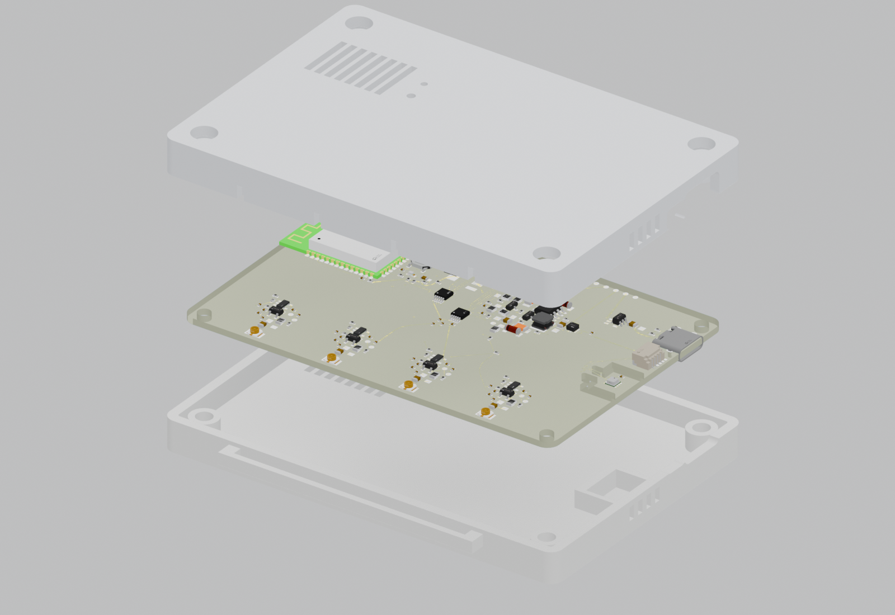

# Muon3: a networked cosmic-ray muon station

**In plain English:** muons from cosmic-ray showers pass through us all the time. A plastic scintillator tile gives
off a tiny flash when one crosses it. A silicon photomultiplier (SiPM) turns that flash into a current pulse, and a
small board counts pulses that arrive in several stacked tiles at once. Muon3 is the next-generation station for the
Georgia State University [gLOWCOST](https://cosmic.gsu.edu/) network: cheap, identical detectors in classrooms and
labs that log how the muon rate follows air pressure, temperature and space weather.

Each station (Rev C) is **one 96 × 64 mm, 4-layer, USB-powered board**, fully assembled by JLC on one side, in a
**102 × 70 × 16.5 mm printed ABS case** held by four M3 screws.
- It reads four decommissioned **sPHENIX inner-HCal tiles** (Hamamatsu S12572-33-015P SiPMs). Each tile's micro-coax
  plugs into a **U.FL jack inside the case**, so the SiPM bias never reaches an outside surface.
- The **four channels are identical**: channel 0 is placed and routed once, and cells 1–3 are exact copies at a 20 mm
  pitch (copper identical to 2 µm; checked on every build).
- The ESP32-S3 time-stamps and counts the hits and reports over Wi-Fi or USB.
- With cables, the station fits on every one of the 12 inner-HCal tile shapes.

| | |
|---|---|
|  |  |

```text
 tile ─ micro-coax ─► U.FL in the case (shell = bias via 47 kΩ) ─► OPA356 TIA (33 kΩ ‖ 2.7 pF) ─► LMV7219 ─► HIT_n ─► ESP32-S3
   ×4 (identical cells)           ▲                               ▲ VREF (DAC B·A)             ▲ VTH_n (DAC A)      PCNT + MCPWM
             MC34063 boost → 10 k / 1 µF RC ─ HV (53–83 V) ◄─ HV_TRIM (DAC B·B) ◄──────────────────────────── HV_EN
                         └──────────── HV_MON (÷ 27.7) ────────────────────────────────────────────────────► ADC
 INJ (GPIO) ─ 10 k/1.1 k ─ 1 pF into each input: 0.33 pC = 9 p.e. self-test
 BME280 (slotted thermal island, ≥ 20 mm from any input) · SC7A20H tilt · STEMMA QT · USB-C 5 V → AMS1117 3V3 + TLV75733 3V3A
```

## Numbers (all simulated; see `hw/sim/`)

| | Value | From |
|---|---|---|
| Bias range | **52.9–83.0 V** (TRIM 2.048 → 0 V); ≈ 4 V while HV_EN is low | ngspice |
| Bias power-up | nothing until firmware raises HV_EN; settles in 60–90 ms | ngspice |
| Switching ripple at the TIA output | **0.04 mV pk-pk (0.007 p.e.)**, including capacitor ESL, resistor shunt capacitance and 1.5 nH of ground shared with the boost | ngspice, 5 ns steps |
| 1 photoelectron / mean muon | **5.8 mV / 337 mV** (58 p.e. assumed), time over threshold ≈ 390 ns | ngspice |
| Injection self-test | 109 mV with no tile, 55 mV with a tile | ngspice |
| BME280 reading above room air | **+5.4 K** (low-power firmware), +9.2 K (Wi-Fi always on); a mid-board sensor would read +13 K | 2D thermal model |
| ESP32 Wi-Fi (+20 dBm) at the TIA inputs, cables included | **0.9–5.6 mV peak**, which rectifies to < 1 µV (≪ 0.01 p.e.) | openEMS FDTD |


## Build one

1. **Board:** `cd hw && bun run build`, then upload `out/muon3-gerbers.zip` with `out/bom.csv` and `out/cpl.csv` to JLC:
   4 layers, 1.6 mm, top-side assembly only.
2. **Case:** `freecadcmd hw/case/case.py` writes `hw/out/case/case_base.stl` and `case_lid.stl`.
   - Print in ABS: 0.2 mm layers, 4 walls, 30 % infill, each part flat face down (base on its floor, lid on its top).
   - Hardware: 4 × M3 × 5.7 heat-set inserts (Ø 4.0 holes) and 4 × ISO 4762 M3 × 12 socket-head screws.
   - Cabling: lay each tile's U.FL micro-coax (Ø 1.13 or 1.37 mm) in its lid notch, close the case, then zip-tie the
     four cables to the bar on the outside of the base.
3. **Test:** `python hw/tools/station_test.py board`. The guide, with simulated scope screens, is in
   [hw/docs/TESTING.md](hw/docs/TESTING.md).

Details are in [hw/README.md](hw/README.md): the board-as-code pipeline, the parts library, the case and every
simulation.

## Design review

### Rev C (this revision)

- **U.FL jacks, inside the case.** The edge SMAs carried the bias on exposed shells.
  - Hirose U.FL-R-SMT-1(80) jacks now sit behind the case wall; the tile coax enters through notches.
  - The bias is enclosed whenever the case is closed.
  - The jacks cost $0.09 each instead of the SMA's $0.21 (at quantity 100), and they are ordinary top-side parts: no unpasted tabs.
  - Rating: U.FL is specified for 60 V AC rms (85 V peak) with a 200 V AC withstand. 83 V DC is inside that, but
    without much margin, so don't run the bias above the 83 V the circuit can reach.
- **The four channels are identical by construction.**
  - `place.ts` force-places channel 0 inside its 20 × 22 mm cell and copies it at a 20 mm pitch.
  - `autoroute.ts` routes channel 0's six local nets and its GND fan-out, then copies them. A copy that isn't legal
    in its cell is reported rather than silently rerouted.
  - `copper.ts` smooths a channel-0 track only where the move is legal in all four cells.
  - The build log states `18/18 copies identical`. A check of the KiCad file finds cells 1–3 equal to cell 0, which
    is 80 segments each including GND.
  - The shared feeds (VREF, VTH_n, 3V3A, HV, INJ_D, HIT_n) come from the DACs, the boost and the ESP32 below the row,
    so their approach to each cell differs.
- **Room to breathe.** Everything, rotated as each tile needs, fits inside all 12 tile shapes:
  - The 96 × 64 mm board sits in a 102 × 70 mm case, about 102 × 78 mm with the cable bar.
  - The largest footprint that still fits every tile is ≈ 175 × 80 mm (tile 11, the most slanted, limits it).
  - The extra area moved the BME280 island to the left edge, ≥ 20 mm from any TIA input, and lowered the ESP32 so
    its antenna is ≥ 10 mm from the nearest cell.
- **Could the bias ripple get amplified? Yes, but there is almost nothing left to amplify.**
  - Ripple on the jack shell reaches the TIA through the SiPM's own 320 pF.
  - The TIA's gain from shell to output is ≈ 2× at the 33 kHz switching frequency and rises to C_SiPM / Cf ≈ 120×
    above 1.8 MHz, where the OPA356's 200 MHz GBW caps it.
  - The two RC poles in front (10 k / 1 µF, then 47 k / 100 nF) reduce the 230 mV at the boost output to 4 mV on the
    jack shell. In regulation the MC34063 fires short bursts rather than every cycle.
  - Net result at the TIA output: 0.04 mV pk-pk, with realistic ESL and a shared ground. An earlier 1.6 mV reading was
    the RC chain still settling, not ripple.
  - The main remaining risk is magnetic coupling from the 150 µH inductor into an input trace. The boost is now
    ≥ 15 mm from every cell.

**Mistakes found and fixed along the way**

1. **The bias could not reach the tiles.**
   - The old PWM trim spanned 26–70 V, not 15–85 V, and overshot to 73 V at power-up.
   - Now: MCP4728 → 1 k / 100 nF → 68 k into FB (52.9–83.0 V), plus a 2N7002 that holds the boost off until HV_EN.
2. **Bias noise.** The 1 mH / 1 µF LC post-filter rang with about 2 V pk-pk. An RC plus a 136 mA peak current fixed
   it.
3. **The 5 V rail was routed at signal width.** The width table still listed the deleted battery nets. It is now
   0.5 mm.
4. **1 p.e. is 5.8 mV, not 9.5 mV.** Thresholds and test limits now use 5.8 mV.
5. **EMI.** In Rev B the island's plane void sat next to channel 0's input and raised its Wi-Fi pickup to 24.5 mV
   (3.8 mV with the plane solid). In Rev C the same channel picks up 0.9 mV.
6. **The Geant4 tile model** (details below).
   - The published "58 p.e. per muon" was a hard-coded fallback: E_dep × 10 000/MeV × 1.2 % × 0.25, used whenever no
     tracked photon reached the SiPM, which is 57 p.e. at 1.9 MeV.
   - Why no tracked photon ever reached it:
     - every diagonal fiber segment was mirrored (`G4PVPlacement` takes the inverse rotation), leaving the tile by
       5.8 mm;
     - the SiPM's silicon had no refractive index, so Geant4 killed every photon at its surface;
     - the reflector was a skin on the tile, so it also sat between the tile and its fibers;
     - the fiber ends stopped 21 mm from the SiPM, and the fiber's return leg crossed three other legs in the same
       plane;
     - the fiber absorbed its own light over 3.5 cm, and the core had the cladding's refractive index.

**Temperature sensor.** The BME280 sits on a slotted island on the cool left edge. The island hangs on a
2.6 × 3.6 mm arm, has no plane copper, is fed by four necked 0.127 mm traces, and has its own ribbed, vented chamber
in the case.
- It still reads **+5.4 K** above room with low-power firmware. The 0.3–0.6 W inside the box warms the whole case,
  and any sensor soldered to the board follows it.
- The design therefore treats the reading as case temperature with a calibrated offset, and takes SiPM gain from the
  dark-count staircase (see TESTING).
- Pressure, the main correction to the muon rate, is unaffected. For true tile temperature, plug a BME280 or TMP117
  into the STEMMA QT port and tape it to the tiles.


**EMI.** The openEMS model includes:
- the board and the ABS case;
- the ESP32 can and antenna (tuned to 2.44 GHz);
- each tile's coax shield, running out through the case wall to the absorbing boundary;
- the four input paths.

Results:
- As built, the inputs see 0.9–5.6 mV peak at +20 dBm.
- **Metal shield cans over the amplifiers make it worse** (1.1–10.6 mV): the pickup arrives on the input path, and a
  can with a cable notch concentrates the field there.
- A printed ABS cavity changes nothing.
- So there are no cans, which saves a part, a placement and ≈ $1 per board.


### Geant4 tile model

`sim/geant4/src/HcalTileDetectorConstruction.cc` now follows the tile as published (Aidala et al., IEEE TNS 65
(2018), Table II):
- extruded polystyrene + 1.5 % PTP + 0.01 % POPOP, 7 mm thick;
- Kuraray Y11(200) single-clad 1 mm fiber: polystyrene core n = 1.59 in PMMA cladding n = 1.49, 7 ns decay;
- the fiber glued with EPO-TEK 301 into its groove, nested inside the tile;
- a 50 µm painted TiO₂ reflector, modelled as a border surface;
- a wrap of Al foil, cling film and black vinyl;
- both fiber ends routed through the connector pocket onto the S12572 behind a 0.75 mm air gap.

Status: it compiles against Geant4 11.4, passes the overlap check, and transports light end to end. The tracked
yield is still only **0.1 p.e. per muon**, far below a working tile, so a loss remains. The next suspect is the
tight S-bend where both fibers converge in the pocket. Until that is found, no p.e./MIP number from this model should
be quoted.

### Open questions and risks

- **The U.FL voltage margin** (83 V DC vs. a 60 V AC rms rating). Formal sign-off is still needed, although the bias
  no longer reaches an outside surface.
- **USB power banks** often switch off below 50–100 mA. The station draws 40–120 mA, so use a wall adapter or a bank
  with an "always on" mode.
- **The MC34063 reference is ±2 %**, about ±2 V on HV until the factory test stores each board's HV(TRIM) line. After
  that the dark-count servo holds the gain.
- **Via-in-pad.** The GND fan-out drops vias inside large pads. Order with filled and capped vias, or check JLC's
  4-layer terms.
- **Tile-by-tile V_op.** GSU's per-tile PR data should seed `station_test.py tile`.

## Repository

| Path | What |
|---|---|
| [`hw/`](hw/README.md) | Board as code (TypeScript → Gerbers), parts library, case (FreeCAD), simulations, test tools |
| `sim/` | Geant4 tile and panel models, earlier ngspice/openEMS/thermal studies |
| `cad/` | sPHENIX inner-HCal tile STEP assemblies (all 12 shapes), Blender scenes |
| `figures/` | Plots and renders used in the paper |
| `tools/memguard.sh` | Runs heavy jobs under a memory cap. The 8 GB development Mac crashed when builds and simulations ran in parallel |
| `reference_documentation/` | Archived `muonTelescope` repositories, publications, earlier reviews |

## License

See [LICENSE](LICENSE). Third-party datasheets and 3D models belong to their manufacturers. They are fetched on
demand (`cd hw && bun run parts`), not redistributed.
