# Muon3: a networked cosmic-ray muon station

**In plain English:** muons from cosmic-ray showers pass through us all the time. A plastic scintillator tile gives off a
tiny flash when one crosses it. A silicon photomultiplier (SiPM) turns that flash into a current pulse, and a small board
counts pulses that arrive in several stacked tiles at once. Muon3 is the next-generation station for the Georgia State
University [gLOWCOST](https://cosmic.gsu.edu/) network: cheap, identical detectors in classrooms and labs that log how the
muon rate follows air pressure, temperature and space weather.

A station is **four decommissioned sPHENIX inner-HCal tiles** (Hamamatsu S12572-33-015P SiPMs), stacked 100 mm apart in a
printed ABS frame. Each tile carries one wavelength-shifting fiber in a closed loop, under a reflective coating and a
light-tight wrap. **One 337 × 40 mm, 4-layer, USB-powered board**, assembled by JLC on one side, stands behind the tiles with
its long axis along the stack: its four channel cells sit right behind the four SiPM boards, so the four micro-coax cables are
short (57 mm) and identical. The hub (USB-C, ESP32, bias supply, pressure/temperature) sits between tiles 1 and 2. A printed
three-segment case covers the board. There is no display: the station reports over USB and Wi-Fi.

| | |
|---|---|
| 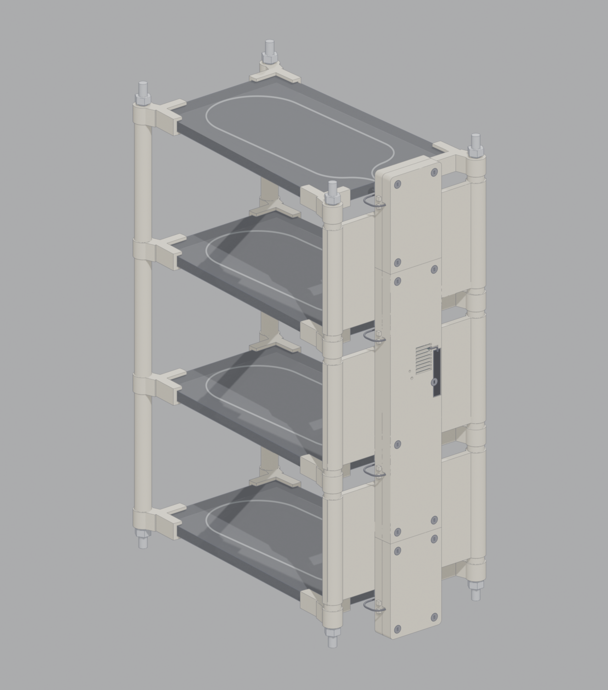 | 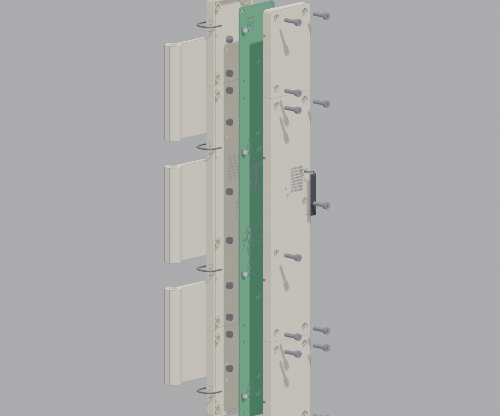 |

## Contents

0. [Quick start](#quick-start) · [How a muon becomes a count](#how-a-muon-becomes-a-count) · 1. [What you get](#1-what-you-get) · 2. [Bill of materials and cost](#2-bill-of-materials-and-cost) · 3. [Install it: step by step](#3-install-it-step-by-step)
· 4. [Test and calibrate](#4-test-and-calibrate) · 5. [The 12 tile shapes](#5-the-12-tile-shapes) · 6. [The electronics](#6-the-electronics)
· 7. [Simulated performance](#7-simulated-performance) · 8. [Regenerate the design files](#8-regenerate-the-design-files)
· 9. [Design notes, open questions, repository map](#9-design-notes-open-questions-repository-map)

---

## Quick start

```bash
git clone git@github.com:muonTelescope/muon3.git && cd muon3/hw
bun run parts && bun run build && bun run drc      # the board: Gerbers, BOM, CPL in hw/out/ (section 8 lists the tools to install first)
freecadcmd case/case.py                            # the three case segments
TILE=6 freecadcmd case/assembly.py                 # the frame, plate and tile stack for tile shape 6 (any of 1–12)
python tools/station_test.py board                 # factory test over USB, once a board is assembled
```

## How a muon becomes a count

1. **Light.** A cosmic-ray muon crossing a 7 mm polystyrene tile deposits about 1.5 MeV and makes some 13 000 scintillation photons
   (blue, 420 nm). About 2 500 of them are absorbed by the 1 mm wavelength-shifting fiber in the tile and re-emitted at 476 nm (green);
   light trapped in the fiber travels both ways round the closed loop to the SiPM. Of the order of 150 photons reach the SiPM and about
   35 are detected (PDE 25 %): the **photoelectrons (p.e.)**.
2. **Current.** The S12572 SiPM, biased at 53–83 V, turns each p.e. into a fast current pulse (gain about 2.3 × 10⁵). The bias comes from
   the MC34063 boost converter on the board and reaches the SiPM over the same micro-coax that carries the signal back.
3. **Voltage.** A transimpedance amplifier (OPA356, 33 kΩ) gives 5.8 mV per p.e., so a mean muon makes a 209 mV pulse about 370 ns long.
4. **Decision.** A comparator (LMV7219) fires when the pulse passes a threshold set by a DAC: 29 mV, 5 p.e., rejects dark counts (single
   p.e.) and keeps essentially every muon that crosses the tile.
5. **Count.** The ESP32-S3 time-stamps each edge (MCPWM capture, 12.5 ns) and counts singles (PCNT); coincidences of the four tiles are
   formed in firmware, together with pressure and temperature (BME280), and sent over Wi-Fi or USB. The muon rate follows air pressure,
   temperature and space weather: that is what the gLOWCOST network logs. `sim/python/coincidence_rates.py` computes the coincidence and
   accidental rates; `sim/python/sipm_to_tot.py` maps SiPM charge to time over threshold.

---

## 1. What you get

- **Identical channels.** Channel 0 is placed and routed once; cells 1–3 are exact copies at a 100 mm pitch (copper identical
  to 2 µm, checked on every build with `hw/tools/cell_identity.py`). The pitch is the tile pitch, so cell *k* is behind tile *k*.
- **The SiPM bias never leaves the case.** Each tile's micro-coax plugs into a U.FL jack inside the case.
- **External antenna.** An ESP32-S3-WROOM-1U-N16R8 sends its Wi-Fi/BLE through a U.FL pigtail to a flat antenna on the lid.
- **Fits every tile.** All 12 inner-HCal tile shapes, from the 121 mm wide, nearly rectangular tile 01 to the 403 mm
  parallelogram tile 12, get a frame and a fiber loop generated from their outline.
- **Self-testing.** The board tests itself over USB in 2 minutes (nothing plugged in), and calibrates each tile's gain from its
  own dark counts.

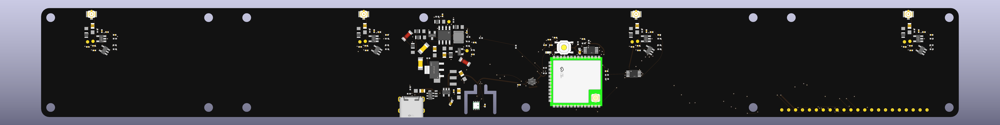

```text
 tile ─ micro-coax ─► U.FL in the case (shell = bias via 47 kΩ) ─► OPA356 TIA (33 kΩ ‖ 2.7 pF) ─► LMV7219 ─► HIT_n ─► ESP32-S3
   ×4 (identical cells)           ▲                               ▲ VREF (DAC B·A)             ▲ VTH_n (DAC A)      PCNT + MCPWM
             MC34063 boost → 10 k / 1 µF RC ─ HV (53–83 V) ◄─ HV_TRIM (DAC B·B) ◄──────────────────────────── HV_EN
                         └──────────── HV_MON (÷ 27.7) ────────────────────────────────────────────────────► ADC
 INJ (GPIO) ─ 10 k/1.1 k ─ 1 pF into each input: 0.33 pC = 9 p.e. self-test
 BME280 (slotted thermal island, ≥ 20 mm from any input) · SC7A20H tilt · USB-C 5 V → AMS1117 3V3 + TLV75733 3V3A
```

---

## 2. Bill of materials and cost

### Board (JLC assembles it; 155 parts, 45 lines)

Upload `hw/out/muon3-gerbers.zip`, `hw/out/bom.csv` and `hw/out/cpl.csv` to JLCPCB: **4 layers, 1.6 mm, top-side assembly only**,
337 × 40 mm. Parts come from LCSC; the full list is [`hw/parts/INDEX.md`](hw/parts/INDEX.md).

| Line | Part | Per board | Share |
|---|---|---|---|
| BME280 (pressure, temperature) | C92489 | $4.46 | 27 % |
| ESP32-S3-WROOM-1U-N16R8 (Wi-Fi, BLE, U.FL antenna connector) | C3013946 | $4.10 | 24 % |
| MCP4728 DAC × 2 | C478093 | $3.06 | 18 % |
| OPA356 TIA × 4 | C183100 | $1.83 | 11 % |
| LMV7219 comparator × 4 | C20613263 | $0.99 | 6 % |
| U.FL jack × 4, SC7A20H, AMS1117, MC34063, TLV75733 | | $0.95 | 6 % |
| the other 34 lines, mostly 0402/0805 passives | | $1.19 | 7 % |

**Cost at 100 boards (importer: GSU): parts $16.58 + PCB $6.19 + JLC assembly $1.32 = $24.08 ex-works, $35.57 landed in the US**
($105.57 per board for the two Berlin prototypes). The PCB price is an estimate ($0.045 per cm² of 4-layer board, 135 cm² here): get a
quote. Cheaper variants (saves about $6.3 per board, landed $35.6 → $26.4): BME280 → SPA06-003 (same package, pressure + temperature,
$0.51), drop the second MCP4728 (fixed VREF divider, PWM HV trim), ESP32 N4 module, drop the tilt sensor, two extended parts →
basic parts. Not worth it: a 2-layer board (saves $1.50, loses the ground plane), dropping the analog LDO, cheaper op-amps.

### Mechanics and cables (you print and buy these)

| Part | Qty | How |
|---|---|---|
| Corner clip (ABS, 12.4 mm thick, 8.0 mm slot, M6 hole) | 16 | printed, flat |
| Spacer tube (Ø 12 / Ø 6.4) | 18 (6 × 87.6 mm, 12 × 4.8 mm) | printed; the long ones can be aluminium tube |
| Back plate bar (one piece for tiles 1–11; two halves + a splice plate for tile 12) | 3 | printed, lying on its back |
| Case base + lid, segments A (71 mm), B (200 mm), C (71 mm) | 3 + 3 | each flat |
| M6 threaded rod, about 345 mm | 4 | cut from 1 m stock |
| M6 nut + washer | 8 + 8 | |
| M3 × 5.7 heat-set insert | 13 (lid) + 10 (plate bars) (+ 12 for the tile-12 splices) | pressed in with a soldering iron |
| M3 × 12 socket-head screw (ISO 4762) | 13 | lid, through the board's edge holes |
| M3 × 6 socket-head screw (ISO 4762) | 10 (+ 12 for the tile-12 splices) | case floor to plate bars |
| U.FL to U.FL micro-coax, Ø 1.13 mm, 70 mm | 4 | tile SiPM board to station board; four equal lengths |
| 2.4 GHz FPC antenna, 35 × 7 mm, with U.FL pigtail | 1 | sticks in the lid recess |
| Tile wrap: 100 µm Al foil, 30 µm cling film, 100 µm black vinyl, epoxy (EPO-TEK 301 class) | 4 tiles | plus the tile's 50 µm painted reflector |
| 4 decommissioned sPHENIX inner-HCal tiles with their fibers, SiPMs and SiPM boards (from GSU) | 4 | of one shape |

Print in ABS at 0.2 mm layers, 4 perimeters, 30 % infill, 100 °C bed, enclosure closed. The longest parts are case segment B
(206 mm) and the plate bars (up to 212 mm): both fit a 220 mm bed.

---

## 3. Install it: step by step

All M3 joints are **socket-head screws into heat-set inserts** (no nuts, no glue). Press the inserts in first: hold each on its hole
with a soldering iron at 220–240 °C and push it flush. Everything below is generated for your tile shape (1–12): run the commands in
[section 8](#8-regenerate-the-design-files) with `TILE=<n>` to get the exact STL/STEP files.

### Step 0: order and print

1. Order the board (section 2). Order or print the parts (`hw/out/case/case_{base,lid}_{A,B,C}.stl`, and the clips, spacers and bars
   from `hw/out/assembly/tileNN/`).
2. Check the board when it arrives: `python hw/tools/station_test.py board` (section 4).

### Step 1: the tiles

The tile is a slab of extruded polystyrene with **one Kuraray Y11 fiber laid in a closed loop**: both ends leave the flat SiPM edge
side by side, each runs through an S-bend of 25 mm radius onto a leg, the two legs run down the tile and a semicircle closes the
loop near the far edge. Over the tile go the **50 µm painted reflector** and the **wrap: 100 µm aluminium foil, 30 µm cling film,
100 µm black vinyl**, each following the tile's outline and open only where the coupler sits (Aidala et al., IEEE TNS 65 (2018),
Table II and Fig. 6). Tiles 01, 06 and 12, bare, with the fiber in its groove and the coupler and SiPM board on the SiPM edge:

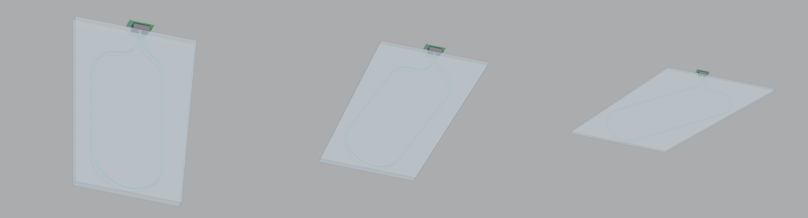

The same tile with its layers lifted off one by one (reflector, foil, cling film, vinyl):

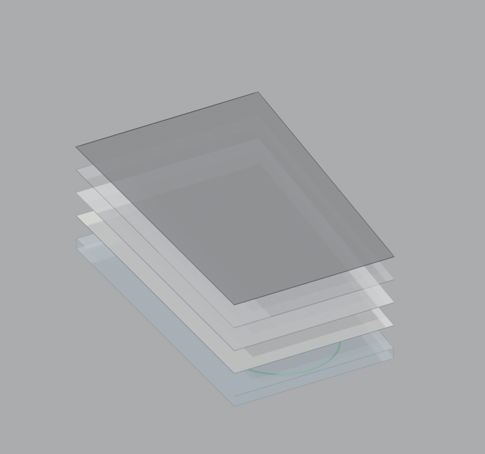

1. Lay the fiber in its groove (epoxy) and cut and polish both ends flush with the SiPM edge.
2. Put on the reflector and the wrap (foil, cling film, vinyl), open at the coupler.
3. Glue the coupler block (16 × 6 × 8 mm, black ABS) on the SiPM edge over the two fiber ends, with the SiPM board and its U.FL
   jack behind it. Both ends, 1.2 mm apart, face the one 3 × 3 mm SiPM across a 0.75 mm air gap.

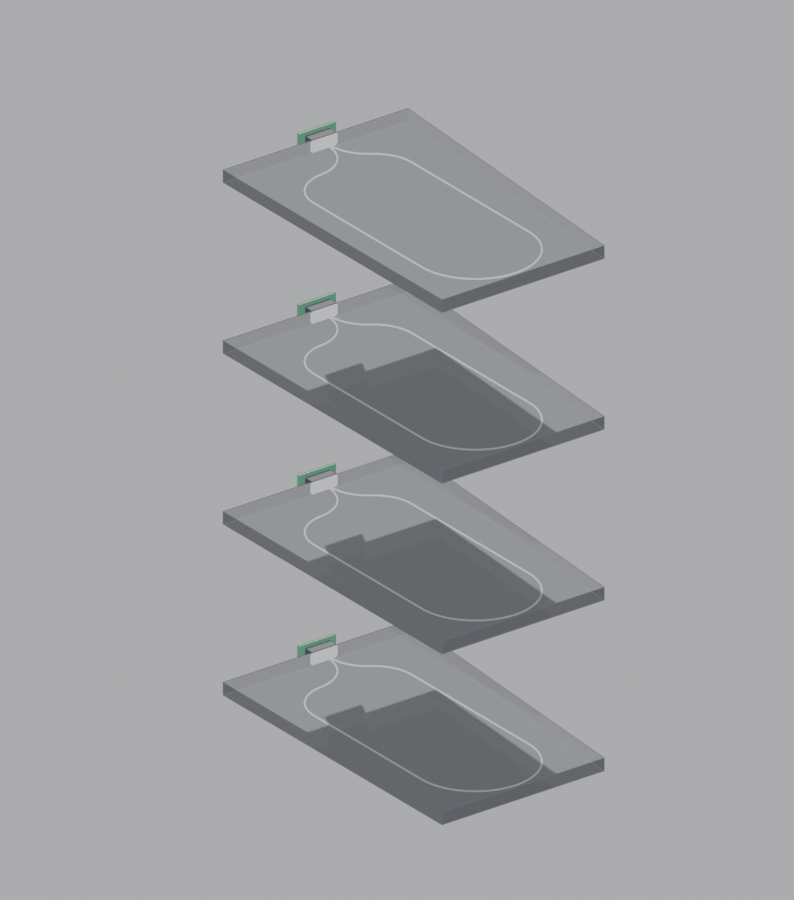

### Step 2: the frame

Slide the four rods through the bottom clips, add the nuts, then build up: spacer, tile in its four corner clips, spacer, next tile.
The four clips of a tile clamp its corners in an 8.0 mm slot; the tile is never drilled. The rods sit 8.5 mm outside each corner, so
they never touch the scintillator.

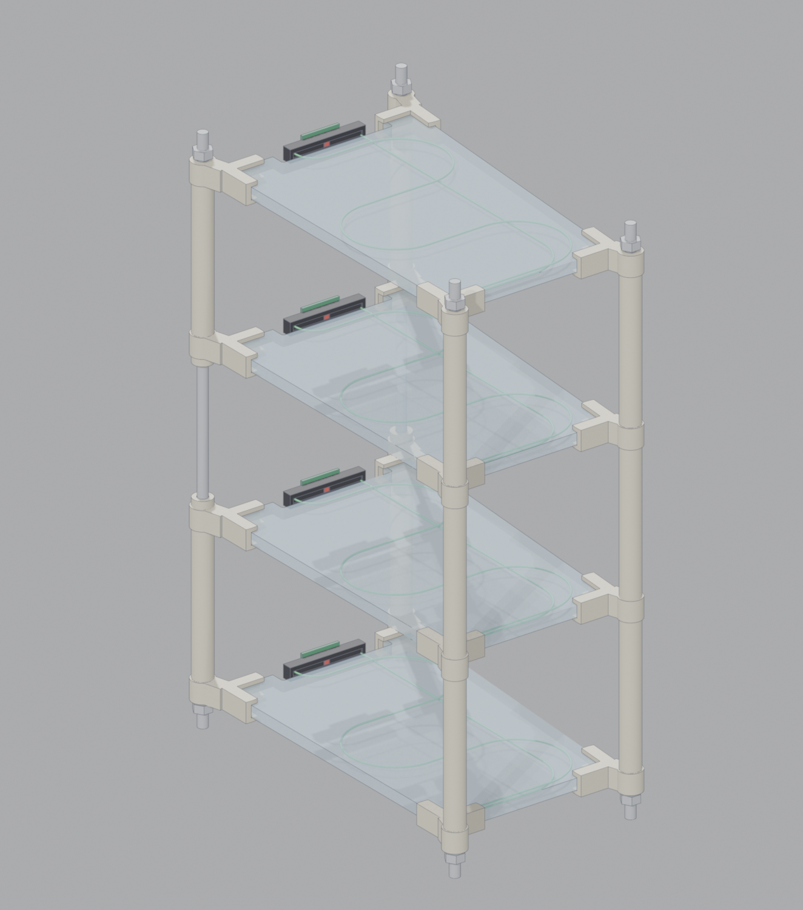

### Step 3: the back plate

A bar replaces the back-rod spacer between tiles 0/1, 1/2 and 2/3. Each bar's two sleeves slide onto the back rods (bars are at
z = 50, 150 and 250 mm, clear of the SiPM boards at z = 0, 100, 200, 300, so the coax passes between them). For tile 12 each bar is
two halves joined by a splice plate on the front face (4 × M3 × 6).

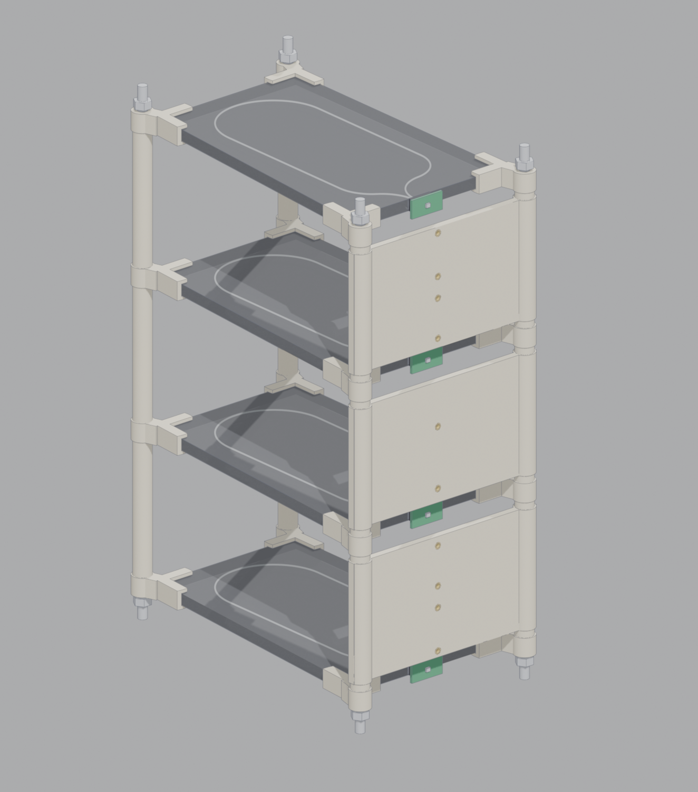

### Step 4: the electronics

Press the inserts into the three case bases. Drop the board onto the bosses of the bases (the board's underside has no parts; the
heads of the floor screws sit in the 4.6 mm gap under it), close the three lids (13 × M3 × 12) and screw each segment's base to the
bars (10 × M3 × 6). The segments join at the bars (board x = 68.5 and 268.5 mm). The USB-C opening is on the far long wall, the
BME280 vent beside it.

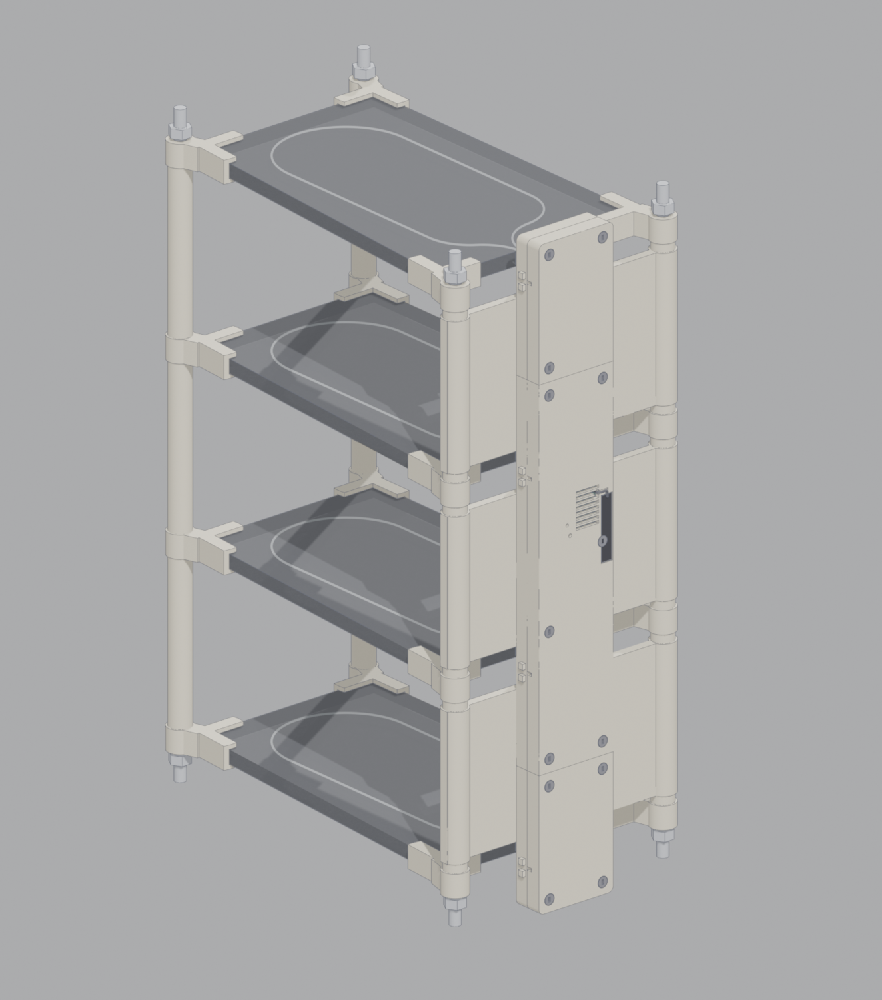

### Step 5: cables and antenna

Plug a 70 mm micro-coax onto each tile's SiPM board, route it out to the case wall, and click its other plug onto the board's jack
through the notch in the lid skirt, then lay it in the zip-tie bridge on the wall. All four cables are identical. Stick the FPC antenna
in the lid recess and click its pigtail onto the ESP32 module's U.FL through the lid hole.

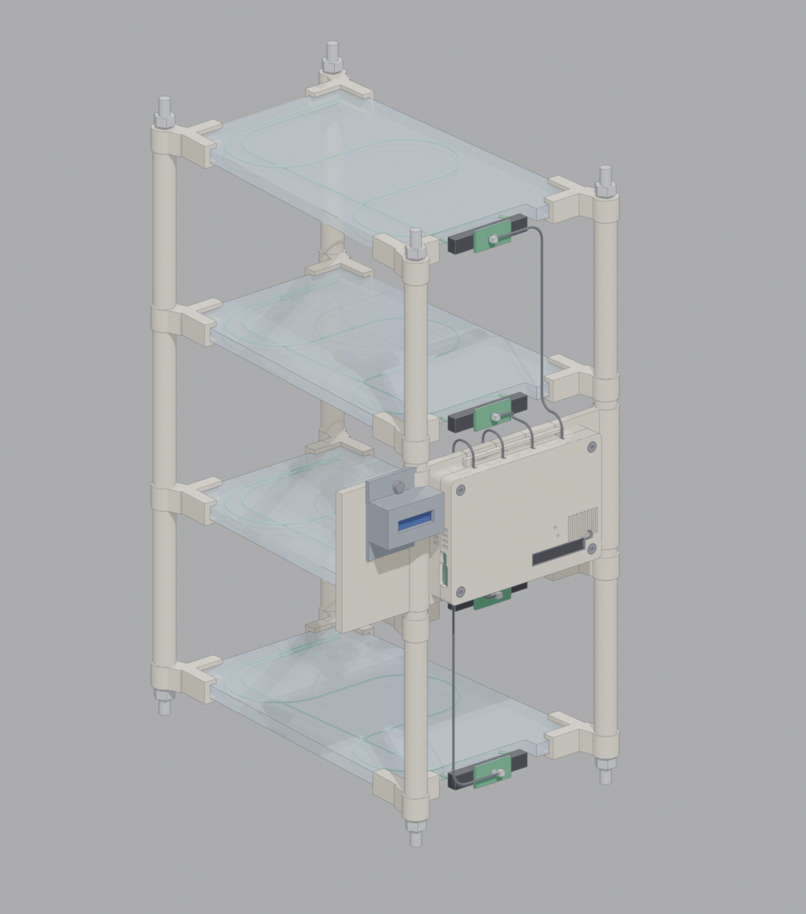

### Sections (tile 01)

Through the SiPM edge (scintillator with its coating and wrap, fiber in its groove, coupler, SiPM, board, plug) and through the case
at the hub (lid, board on its 4.6 mm standoffs, base, plate bar):

| | |
|---|---|
| 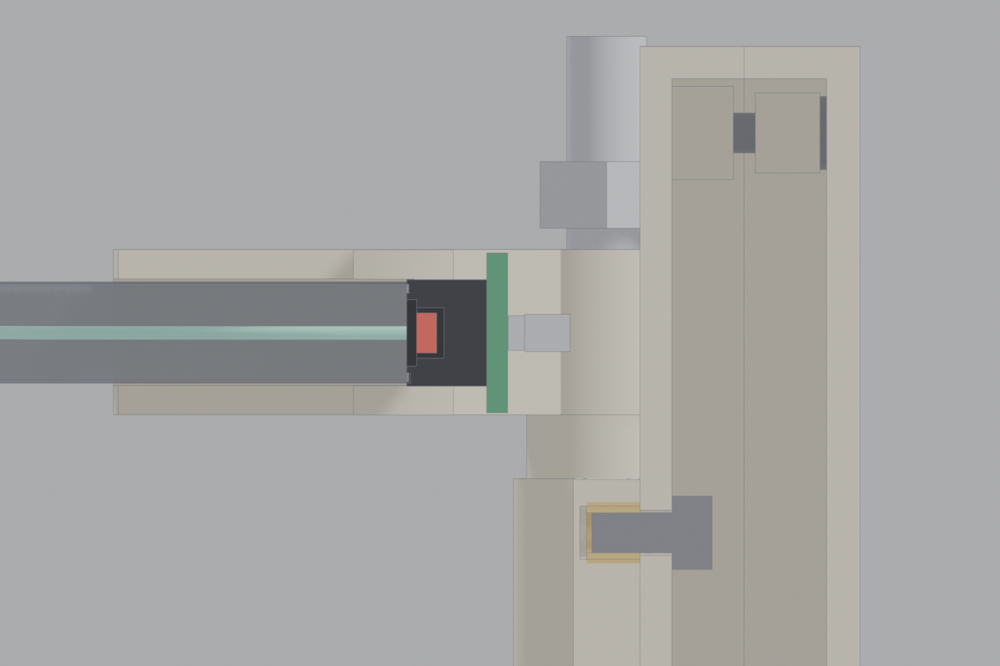 | 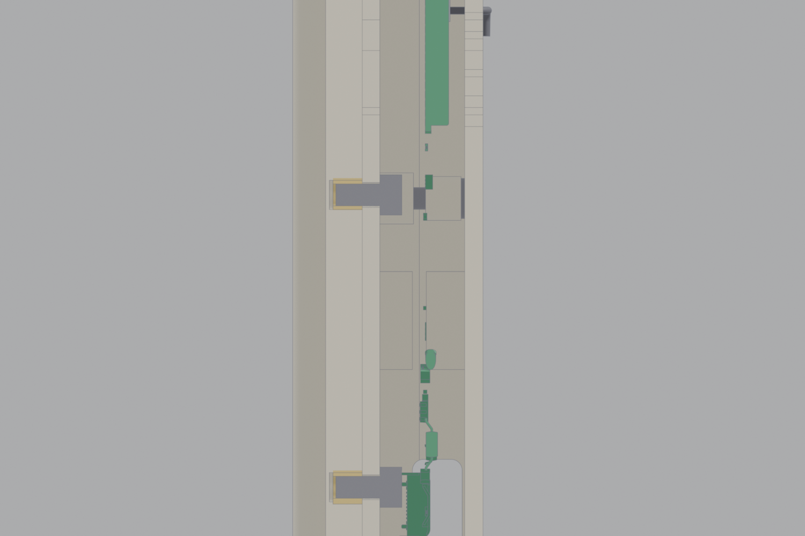 |

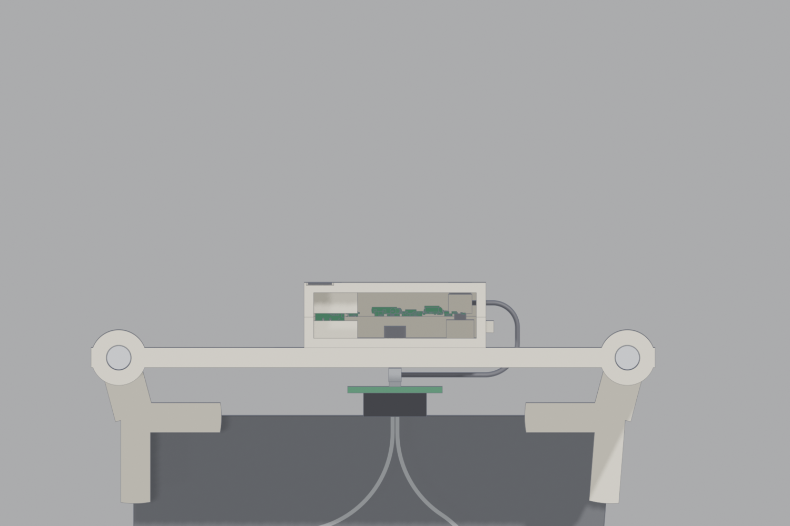

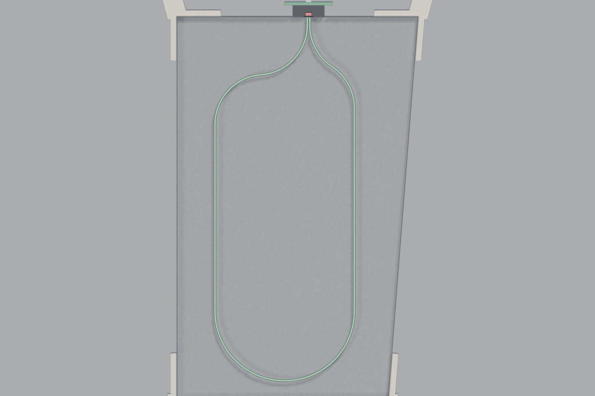

The widest shape (tile 12), from the back:

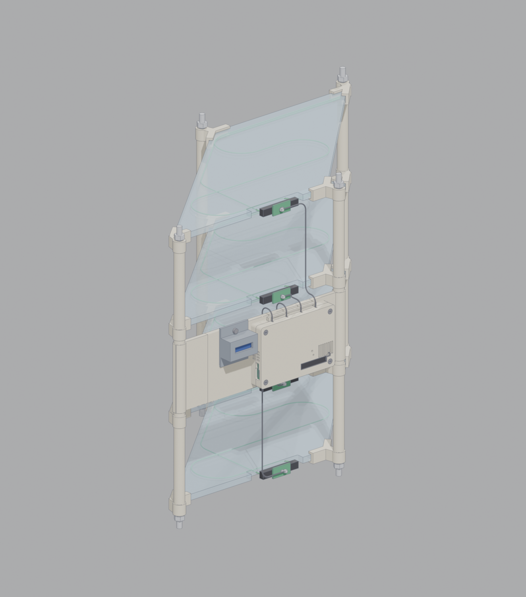

### Case and plate details

- **Three printed segments** (71, 200, 71 mm, each with a base and a lid, split at the board mid-plane) because the board is 337 mm long;
  the joints sit on the plate bars. The lid screws sit 7 mm either side of a joint so that no boss is cut.
- **Coax entry.** A 1.8 × 2.4 mm notch in the lid skirt above each U.FL takes the micro-coax; a small zip-tie bridge on the wall takes the
  strain off the plug. The bias on the U.FL shells stays inside the closed case.
- **BME280 chamber.** Ribs above and below the island (stopping 0.15 mm short of the board), vented to room air through eight 1.6 mm
  slots in the far wall. **Hot side:** eight 1.6 × 14 mm chimney slots in the floor and lid over the ESP32 and AMS1117.
- **External antenna.** A Ø 3.2 mm hole in the lid over the module's U.FL jack passes the pigtail to a 35 × 7 × 0.7 mm recess on the
  lid's outer face, along the far edge.
- **Mounting.** Ten Ø 3.4 mm holes in the base floors take M3 × 6 screws into the bars' inserts (two per segment per bar).

### Step 6: install

Put the stack where it will stay (tiles horizontal). Plug a USB-C power source into the hub's USB-C port (a bank that can deliver
the station's 40–120 mA continuously: many switch off below 50–100 mA). Give it Wi-Fi credentials over the USB serial port.
*(The firmware is not written yet: its USB line protocol is specified in `hw/tools/station_test.py`.)*

---

## 4. Test and calibrate

Every board is tested and calibrated by the ESP32 itself, driven from a laptop over USB:

```bash
python hw/tools/station_test.py board          # factory test: nothing plugged in, about 2 min
python hw/tools/station_test.py tile --ch 0    # per tile, at installation: about 10 min per channel
```

No scope or fixture is needed. The probe row (22 pads, 2.54 mm pitch, far long edge at the right-hand end of the board) and the
TIA/GND scope pair in each channel cell are for diagnosing a board that fails. The station has one status LED (next to the BOOT
button, through a light pipe in the lid): the firmware is specified to blink fast during the 10 s self-test, slowly while counting and
to stay on in a fault.

**How it works.** Each channel has a 1 pF injection capacitor driven from the INJ GPIO through a 10 k / 1.1 k divider: each edge puts
0.33 pC on the TIA input, which is 9 photoelectrons (p.e.). The firmware sweeps the threshold DAC and counts HIT pulses: the threshold
at which half the injected pulses still fire measures the whole chain at once. The bias checks itself through HV_MON (HV ÷ 27.7). The
tile calibrates its own gain: in the dark a SiPM fires single p.e., the count rate against threshold falls in a staircase, and the step
spacing is 1 p.e. (set the bias so it is 5.8 mV, then put the threshold at 5 p.e. = 29 mV). The same staircase, repeated every few
minutes, is the running gain servo.

### Factory test (`board`)

| Step | What the firmware does | Pass | Source |
|---|---|---|---|
| 1 | Scan both I2C buses | BME280 0x76, SC7A20H 0x19, MCP4728 0x60 on I2C0 and I2C1 | design |
| 2 | Read BME280 pressure | 850–1090 hPa | — |
| 3 | HV_EN low, read HV_MON | 2.5–5.5 V (USB 5 V minus the boost diode; not 0 V) | [SIM] ≈ 4 V |
| 4 | HV_EN high, TRIM = 0 / 1.0 / 2.048 V | 80–86.5 V / 65.5–71.5 V / 50–56 V | [SIM] 83.0 / 68.3 / 52.9 V |
| 5 | Store HV(TRIM) line; leave the bias at TRIM 2.048 V and HV_EN low | — | — |
| 6 | Per channel: VTH staircase with no injection | noise edge ≤ 8 mV below VREF | [SIM] < 3 mV |
| 7 | Per channel: VTH staircase with INJ pulses, 50 % point | 85–135 mV below VREF | [SIM] 109 mV |
| 8 | Join the test access point, read RSSI (the external antenna must be on the lid) | ≥ −65 dBm at 2 m | first prototype |

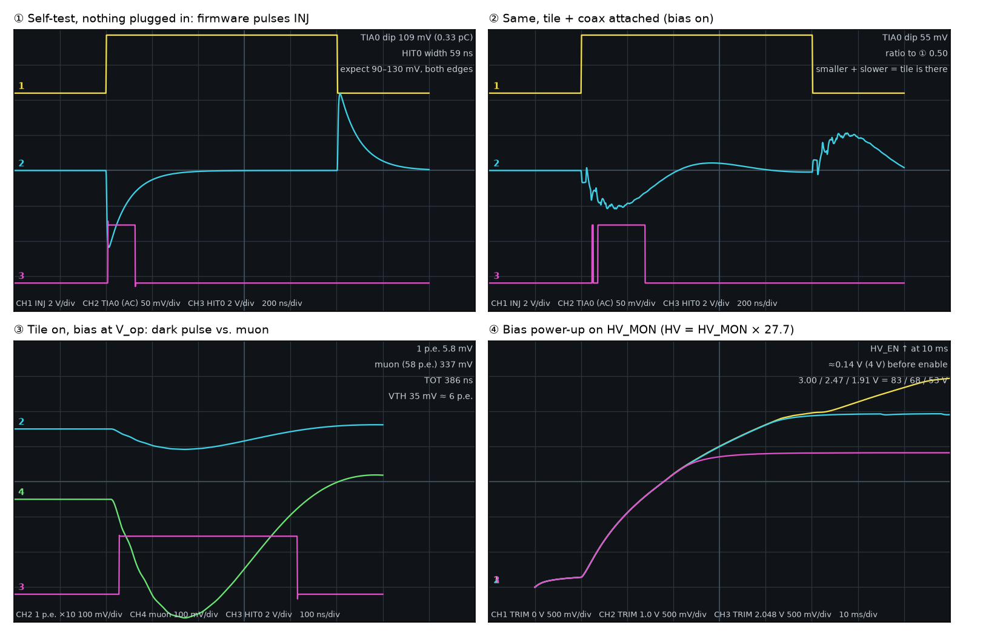

*Simulated scope screens (what you should see on the probe points): ① injection with nothing plugged in: a 109 mV dip follows each INJ
edge and HIT0 fires on the negative one. ② With a tile and coax attached the charge shares the SiPM's 320 pF and the dip halves (55 mV).
③ A single dark pulse (5.8 mV, shown ×10) and a mean muon (36 p.e., 209 mV, time over threshold ≈ 370 ns). ④ The bias power-up on
HV_MON: ≈ 4 V until HV_EN goes high at 10 ms, then 60–90 ms to settle.*

### Per-tile calibration (`tile`)

1. Attach the tile and close the light-tight wrap. Set the bias to the tile's operating voltage V_op (from the Hamamatsu/GSU sheet);
   the firmware closes the loop on HV_MON using the stored HV(TRIM) line.
2. **Staircase.** Sweep VTH 1–40 mV below VREF, 200 ms per step. The peaks in −d(log rate)/dVTH sit between p.e. steps; their
   spacing is the 1 p.e. amplitude.
3. If the step is not 5.8 mV, move V_op by ΔV = (5.8 / step − 1) · (V_op − V_bd) and repeat.
4. Threshold = 5 p.e.; store `pe_n`, `vth_n` and V_op in NVS.
5. With the tiles stacked, run the coincidence plateau: V_op ± 1 V in 0.25 V steps, 5 min each. The rate should be flat within its
   statistical error. Expect a few counts per minute for a 12 × 19 cm tile (cosmic muons: about 1 per cm² per minute × the geometric
   acceptance). Measure each tile's efficiency with the coincidence method (three tiles fire, does the fourth?).

### Diagnosing a failed board

| Probe (row, left → right) | Expect |
|---|---|
| GND · 5V · 3V3 · 3V3A | 0 · 4.8–5.2 · 3.25–3.35 · 3.25–3.35 V |
| VREF · VTH0–3 | as set (default 2.50 V; VTH = VREF − 29 mV) |
| HIT0–3 | 0 V idle, 3.3 V pulses |
| INJ | 0/3.3 V square during self-test |
| HV_EN · HV_TRIM · HV_MON | 0/3.3 V · 0–2.048 V · HV ÷ 27.7 |
| DAC_C · DAC_D | spare DAC outputs |
| SDA0 · SCL0 | I2C0, 3.3 V idle |

- Scope the TIA with a ground spring on the TIA/GND pair in each cell. **Never clip a scope ground to a U.FL shell: it carries the bias.**
  The four cells are identical, so a good channel next door is your reference.
- A TIA pinned at VREF with no injection dip: dead op-amp or open input. Pinned at a rail: shorted Cf/Rf or an input tied to the shell.
- HV stuck at ≈ 4 V with HV_EN high: the BSS123 gate (HV_GATE), the 150 µH inductor or the MC34063 current sense (2.2 Ω).
- No Wi-Fi with a good board: the antenna pigtail is not clicked onto the module's U.FL, or the FPC antenna is not on the lid.

---

## 5. The 12 tile shapes

The shapes differ a lot: tile 01 is almost a rectangle (121 × 191 mm); tile 12 is a 403 × 191 mm parallelogram leaning 45°. All are
drawn at the same scale (rods, corner clips, the fiber loop, the coupler on the SiPM edge at the top):

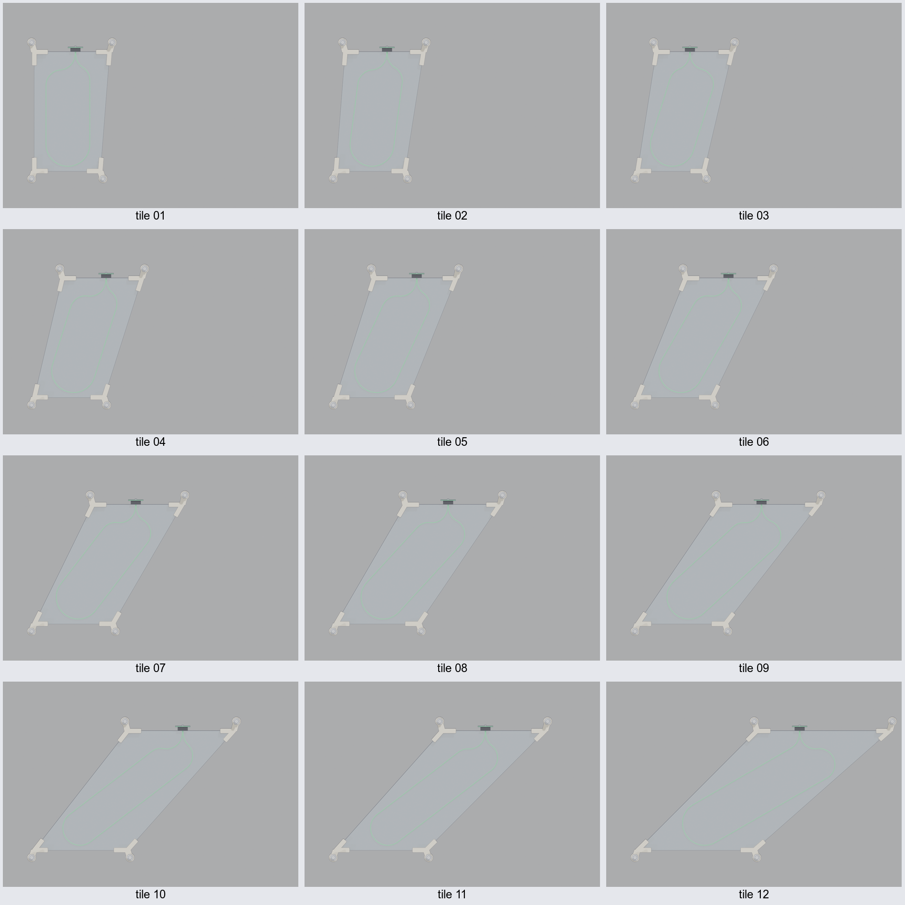

<!-- SHAPES -->
| Tile | Bounding box (mm) | Left-edge slant | Stack footprint x × y × z (mm) | Fiber loop: lean, legs apart, length | Distance tile → fiber: mean / 95 % / max | Plate bars | Coax (mm) | ABS volume |
|---|---|---|---|---|---|---|---|---|
| 01 | 121 × 191 | 0° | 143 × 244 × 344 | 0.0°, 70 mm, 439 mm | 15 / 30 / 44 mm | 3 × 1 piece | 57 | 413 cm³ |
| 02 | 140 × 191 | 4° | 162 × 244 × 344 | 7.5°, 70 mm, 441 mm | 15 / 32 / 45 mm | 3 × 1 piece | 57 | 418 cm³ |
| 03 | 151 × 191 | 9° | 173 × 244 × 344 | 17.5°, 70 mm, 446 mm | 14 / 32 / 47 mm | 3 × 1 piece | 57 | 413 cm³ |
| 04 | 172 × 191 | 13° | 194 × 244 × 344 | 17.5°, 70 mm, 457 mm | 14 / 31 / 46 mm | 3 × 1 piece | 57 | 420 cm³ |
| 05 | 192 × 191 | 18° | 214 × 244 × 344 | 25.0°, 70 mm, 467 mm | 15 / 32 / 48 mm | 3 × 1 piece | 57 | 425 cm³ |
| 06 | 214 × 191 | 22° | 236 × 244 × 344 | 30.0°, 70 mm, 479 mm | 15 / 32 / 54 mm | 3 × 1 piece | 57 | 431 cm³ |
| 07 | 237 × 191 | 26° | 259 × 244 × 344 | 37.5°, 70 mm, 501 mm | 15 / 33 / 54 mm | 3 × 1 piece | 57 | 438 cm³ |
| 08 | 262 × 191 | 30° | 284 × 244 × 344 | 42.5°, 70 mm, 519 mm | 16 / 34 / 63 mm | 3 × 1 piece | 57 | 447 cm³ |
| 09 | 289 × 191 | 34° | 311 × 244 × 344 | 47.5°, 70 mm, 542 mm | 16 / 34 / 65 mm | 3 × 1 piece | 57 | 457 cm³ |
| 10 | 319 × 191 | 38° | 341 × 244 × 344 | 52.5°, 55 mm, 580 mm | 16 / 37 / 66 mm | 3 × 1 piece | 57 | 469 cm³ |
| 11 | 334 × 191 | 42° | 356 × 244 × 344 | 52.5°, 55 mm, 571 mm | 16 / 37 / 73 mm | 3 × 1 piece | 57 | 463 cm³ |
| 12 | 403 × 191 | 45° | 425 × 244 × 344 | 60.0°, 70 mm, 643 mm | 19 / 45 / 91 mm | 3 × 2 halves + splice | 57 | 535 cm³ |
<!-- /SHAPES -->

- **One fiber, one closed loop per tile.** The sPHENIX goal is a deposit within about 25 mm of a fiber. A single loop meets that only
  near its legs: the table gives the mean, 95 % and maximum distance from a point of the tile to the fiber (about 15 mm on average,
  30–45 mm at the 95 % mark, up to 90 mm in the corners of the long tile 12). `cad/sphenix_hcal/scripts/fiber_loop.py` chooses the lean,
  position and leg spacing (55–70 mm) that bring the fiber closest to each shape's area; the same loop feeds the Geant4 model and the CAD.
  The real tiles may use longer patterns on the wide shapes: **check against GSU's own drawings before cutting grooves.**
- **The coax is the same for all shapes** (the SiPM board is at the same x on every tile, the board's jacks at the same z as the SiPM boards).
- The source tile CAD (upstream sPHENIX GDML) has **no fiber, coupler, coating or wrap**; all four are added here from the published
  construction. It does have a 71 × 8.7 mm connector pocket in the SiPM edge, which the model fills (flat edge).

---

## 6. The electronics

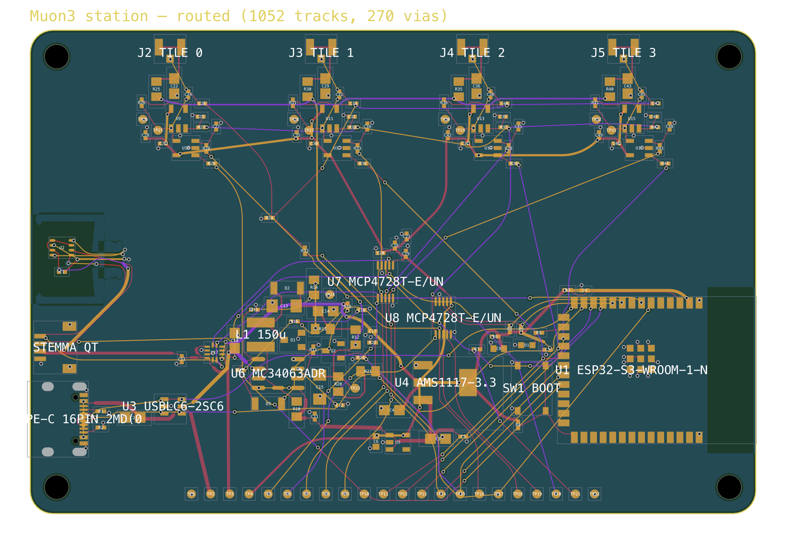

*The routed copper: tapered pad exits and parts at 15° steps where that shortens the nets.*

| | |
|---|---|
| Outline | 337 × 40 mm, 3 mm corner radius, 13 × M3 holes along the long edges (at both ends of each case segment and between) |
| Coordinates | Board x runs along the stack (x = tile z + 18.5 mm), board y across it; y = 0 is the edge the coax leaves by, y = 40 the USB-C / vent edge |
| Channel cells | 4 × (20 × 22 mm) along the coax edge, **100 mm pitch**. Each cell: a U.FL at x = 18.5 + 100k, y = 3, the 47 k / 100 nF bias feed, the TIA, the comparator and a TIA/GND scope pair. Placement, local copper, GND fan-out and silk are identical |
| Hub | x 130–207 mm, between cells 1 and 2: USB-C (x 136, far edge), bias and DAC feeds, charge injection, MC34063, AMS1117, the ESP32 (x 196, its U.FL faces +x), the BME280 island (x 156–167, far edge) |
| Stack-up | JLC 4-layer 1.6 mm: L1 signal + parts, **L2 solid GND**, L3 signal/power, L4 signal |
| Rules | 0.127/0.127 mm signal track/clearance; 0.5 mm for 5 V, 0.4 mm for 3V3, 0.3 mm for 3V3A and HV_SW; HV nets ≥ 0.26 mm to anything; 0.3/0.5 mm vias |
| BME280 island | 8.4 mm deep on the far long edge, ≥ 20 mm from any TIA input, cut free by two C-shaped slots; no plane and no plane vias on island and arm |
| Probe row | 22 pads at 2.54 mm at the right-hand end: GND 5V 3V3 3V3A VREF VTH0–3 HIT0–3 INJ HV_EN HV_TRIM HV_MON DAC_C DAC_D SDA0 SCL0 GND |
| Long nets | HV, 3V3A, VREF, INJ, VTH_n and HIT_n run 50–250 mm between the hub and the cells over the L2 ground plane; the TIA inputs stay inside their cells |

| Block | Parts | Notes |
|---|---|---|
| Input × 4 | Hirose U.FL-R-SMT-1(80) inside the case; shell = SiPM cathode = HVJ_n fed from HV via 47 kΩ with 100 nF to GND; centre = anode = SIG_n | The shell is the bias *and* the signal's AC shield. U.FL is rated 60 V AC rms / 200 V AC withstand; the bias tops out at 83 V DC |
| TIA × 4 | OPA356, Rf 33 k ‖ Cf 2.7 p, IN+ = VREF via 100 Ω / 100 nF | 5.8 mV per p.e.; 209 mV for the 36 p.e. mean muon |
| Discriminator × 4 | LMV7219, IN+ = VTH_n via 1 k / 100 nF, 33 Ω into the ESP32 | Threshold at 5 p.e. set by calibration |
| Self-test | INJ GPIO → 10 k / 1.1 k → 1 pF into every SIG_n | Each edge injects 0.33 pC = 9 p.e. |
| DACs | MCP4728 A (I2C0) = VTH0–3; MCP4728 B (I2C1) = VREF, HV_TRIM, DAC_C/D (spares) | Internal 2.048 V reference |
| Bias | MC34063 (2.2 Ω sense → 136 mA peak), BSS123, 150 µH, LL4148, 1 µF + 100 nF, 10 k / 1 µF RC post-filter; feedback 1.02 M / 20 k; TRIM → 1 k / 100 nF → 68 k into FB; HV_EN: a 2N7002 releases a clamp that otherwise holds FB high | **83.0 V at TRIM 0 V, 52.9 V at 2.048 V**; ≈ 4 V while HV_EN is low; HV_MON = HV ÷ 27.7 |
| MCU | ESP32-S3-WROOM-1U-N16R8: U.FL antenna connector, 16 MB flash, 8 MB octal PSRAM (IO35–37 reserved). USB on IO19/20 | PCNT singles, MCPWM capture (time stamp + time over threshold), coincidences in firmware |
| Power | USB-C 5 V (5.1 k Rd), USBLC6 ESD → AMS1117-3.3 (digital) + TLV75733 (analog) | No battery |
| Sensors | BME280 (0x76) on the island; SC7A20H tilt (0x19) | |

---

## 7. Simulated performance

All numbers come from simulations (`hw/sim/`, `sim/geant4/`); nothing has been measured on hardware yet.

| | Value | From |
|---|---|---|
| **Light: photoelectrons per muon that crosses a tile**, tile 01 | **36.6** (σ 13, min 15); every one of 272 crossing muons passes a 5 p.e. threshold. Tiles 03 / 06 / 09 / 12: 38.7 / 38.9 / 34.3 / 35.8 | Geant4, 150–300 muons per shape |
| Pulses: 1 p.e. / mean muon | **5.8 mV / 209 mV**, time over threshold ≈ 370 ns; threshold 5 p.e. = 29 mV | ngspice |
| Bias range | **52.9–83.0 V**; ≈ 4 V while HV_EN is low; settles in 60–90 ms | ngspice |
| Switching ripple at the TIA output | **0.04 mV pk-pk (0.007 p.e.)** (capacitor ESL, resistor shunt C, 1.5 nH shared ground) | ngspice, 5 ns steps |
| Injection self-test | 109 mV with no tile, 55 mV with a tile | ngspice |
| BME280 above room air | **+4.8 K** (low-power firmware), +8.8 K (Wi-Fi always on); mid-board would read +9.7 K | 2D thermal model |
| Wi-Fi at the TIA inputs (+20 dBm accepted, external antenna, cables included) | **0.9 / 1.6 / 9.3 / 1.1 mV peak** (cell 2 is 15 mm from the antenna feed), rectifying to ≪ 0.01 p.e. | openEMS |
| Cost at 100 boards | **$24.08 ex-works, $35.57 landed** ($16.58 parts, $6.19 PCB) | `bun run cost` |

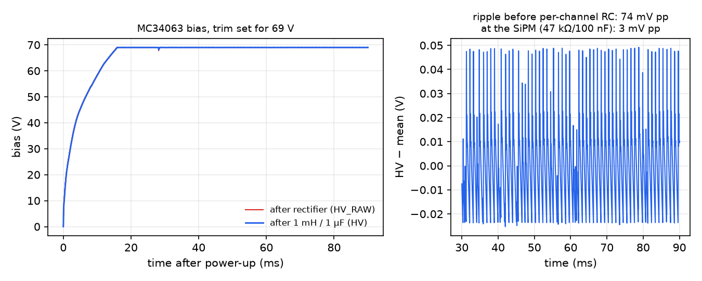

### Light yield (Geant4)

The tile is modelled with one closed fiber loop, the 50 µm reflector (border surface, R = 0.95, Lambertian), the three wrap layers
(absorbing skin), the coupler and a Hamamatsu S12572-33-015P (flat PDE 0.25) across a 0.75 mm air gap. Material data: extruded
polystyrene + 1.5 % PTP + 0.01 % POPOP (n = 1.59, attenuation 2.2 m, 8000 photons/MeV, an estimate); Kuraray Y11(200) single-clad 1 mm
(PS core n = 1.59, PMMA cladding n = 1.49, EPO-TEK 301 groove n = 1.52, absorption 430 nm, emission 476 nm, attenuation 3.5 m).

| Tile | Generated / crossing | Fiber loop (length, mean distance tile → fiber) | p.e. per crossing muon: mean (σ), min | ≥ 5 p.e. |
|---|---|---|---|---|
| 01 | 300 / 272 | 439 mm, 14.5 mm | **36.6** (13.3), 15 | 100 % |
| 03 | 150 / 125 | 446 mm, 14.4 mm | **38.7** (14.9), 19 | 100 % |
| 06 | 150 / 107 | 479 mm, 14.9 mm | **38.9** (17.2), 15 | 100 % |
| 09 | 150 / 95 | 542 mm, 16.1 mm | **34.3** (10.8), 15 | 100 % |
| 12 | 150 / 97 | 643 mm, 18.8 mm | **35.8** (17.7), 6 | 100 % |

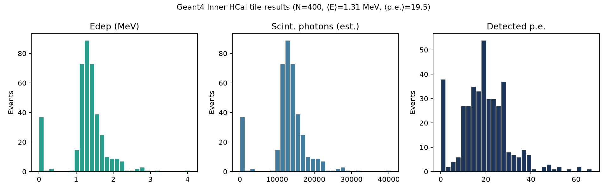

- The closed loop lets light that travels the far way round reach the SiPM: 36.6 p.e. against 21.5 for the earlier open loop (1.7 ×).
- "Crossing" means the muon deposited > 0.3 MeV; the gun is 50 mm above the tile and up to 50° off the vertical, so about 9 % of
  the muons miss the tile (more on the slanted shapes). That is a geometric acceptance loss, not a light-yield one.
- Per generated muon on tile 01: 13 100 scintillation photons → 2 540 absorbed by the fiber → 2 320 re-emitted → 156 reach the SiPM →
  33 detected.
- A first version of the loop (small, same size on every shape) gave only 24.7 p.e. on the 403 mm tile 12; the loop generator now fits
  the loop to the shape.
- **Not modelled:** the tile-to-tile variation of the groove, the polishing of the fiber ends, wrinkles of the wrap, SiPM cross-talk,
  after-pulsing and saturation (40 000 pixels, small at 36 p.e.). The yield depends on the fiber attenuation and on the light entering
  the fiber (the "WLS efficiency", 0.90): treat 36 p.e. as a simulation, not a prediction.
- Two earlier statements are withdrawn: "58 p.e. per muon" never came from the optical transport (an event-action fallback
  substituted a formula when no photon arrived; it is opt-in now, `HCAL_EFFECTIVE_YIELD=1`), and "90 % efficiency at 5 p.e." was the
  share of generated muons that hit the tile.

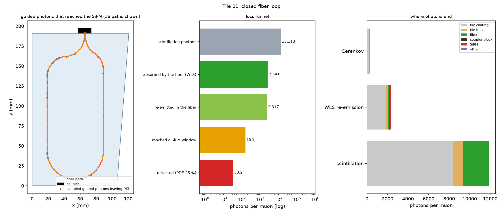

How the transport was debugged (with the model as first written, 0.0–0.1 p.e. per muon; `HCAL_DEBUG=1` logs where every photon ends):
mirrored fiber pieces (`G4PVPlacement` takes the inverse rotation); Y11 absorption and emission overlapping on a coarse spectrum grid;
no refractive index on the SiPM (Geant4 kills the photon at the boundary); the reflector also sitting between tile and fiber; sharp
fiber corners and 3 mm chords (now 1° mitre-cut `G4CutTubs` chords: `G4Torus` joints made photons hop); the connector pocket (filled);
an impossible coupler (fiber ends 43 mm apart, from my old heuristic); and coating and wrap built as boxes round the bounding box (now
shells that follow the outline).

### Electronics

**Thermal.** The BME280 hangs on a slotted island on the far edge (no plane copper, four necked traces) in its own vented chamber and
reads +4.8 K above room air with low-power firmware (+8.8 K with Wi-Fi on). In the long layout the island is only 20 mm from the ESP32,
so it helps less than before. The design treats it as case temperature and takes SiPM gain from the dark-count staircase; for true tile
temperature, add a BME280 or TMP117 on a cable taped to the tiles.

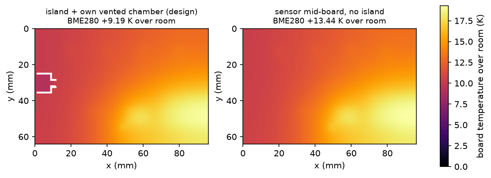

**EMI.** The openEMS model (2.7 M cells) has the board, the case, the ESP32 can, the external inverted-L antenna on the lid, each
tile's coax shield leaving through the case wall, and the four input paths. With +20 dBm accepted the four TIA inputs pick up 0.9, 1.6,
9.3 and 1.1 mV peak at 2.44 GHz; a few mV at a CMOS op-amp input rectifies to microvolts. (In the earlier study metal cans or an ABS
cavity over the amplifiers did not help; not re-run for this layout.)

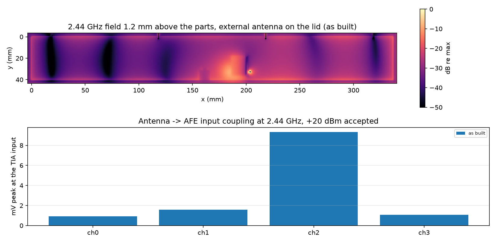

---

## 8. Regenerate the design files

### Software you need

| Tool | Used for | Install (macOS) |
|---|---|---|
| [Bun](https://bun.sh) | board-as-code (TypeScript → Gerbers) | `brew install oven-sh/bun/bun` |
| KiCad 10 (`kicad-cli`, tested with 10.0.6) | DRC oracle, PCB STEP and 3D render | `brew install --cask kicad` |
| FreeCAD 1.x (`freecadcmd`) | case, frame and assembly | `brew install --cask freecad` |
| Blender 4.x | assembly renders | `brew install --cask blender` |
| Python 3 with numpy, matplotlib | fiber-loop generator, plots | `pip install numpy matplotlib` |
| ImageMagick (`magick`) | montages | `brew install imagemagick` |
| ngspice | bias, front end, scope screens | `brew install ngspice` |
| openEMS + Python bindings (optional) | EMI study | build from source against Homebrew (VTK 9.7); see the `CSXCAD_INSTALL_PATH=/opt/homebrew pip install --no-build-isolation CSXCAD/python openEMS/python` recipe |
| Geant4 11.4 (optional) | light yield | `micromamba create -p g4 -c conda-forge geant4 cmake make cxx-compiler` (about 3.5 GB) |

Heavy jobs (board build, FreeCAD, ngspice, openEMS, Geant4, Blender) go through `tools/memguard.sh -l <MB> -- cmd`, one at a time: the
8 GB development Mac crashed apps when they ran in parallel.

### Board

```bash
cd hw
bun run parts          # fetch footprints, pins, datasheets, STEP/OBJ for every LCSC part (once)
bun run build          # netlist → place → route → smooth → planes → silk → Gerbers/drill/BOM/CPL (~25 s) → hw/out/
bun run drc            # kicad-cli DRC: expect 0 errors (the "footprint library" warnings are harmless), 0 unconnected
python tools/cell_identity.py     # the four channel cells' copper must be identical
bun run cost           # BOM + JLC fees + freight/duty (Berlin prototypes, GSU/US batch)
```

### Case, frame and renders

```bash
cd hw
kicad-cli pcb export step --subst-models --no-dnp --force -o out/assembly/pcb.step out/kicad/muon3.kicad_pcb
freecadcmd case/case.py                              # the three case segments → out/case/
TILE=6 freecadcmd case/assembly.py                   # one shape (1–12) → out/assembly/tile06/ (SECTIONS=1 cuts section solids; TILE_STEP=1 writes cad/sphenix_hcal/step/*.step; STEP=1 the whole station)
sh case/build_assemblies.sh                          # all 12 shapes + Blender renders
python case/assembly_doc.py                          # copy renders to hw/docs/assembly/ and refill the table in this README
```

`out/assembly/tileNN/station.FCStd` is the hierarchical FreeCAD document:

```text
Station
├── Tiles ─ Tile_0 … Tile_3        (placed at z = 0, 100, 200, 300 mm)
│            └── Body (grooved PS) · Fiber (Y11, 1 mm, one closed loop) · Coating · WrapAl · WrapCling · WrapVinyl
│                · Coupler · SiPM · SiPM_PCB · UFL
├── Frame ─ Clip_k_FL/FR/BR/BL     (4 corner clips per tile)    Rod_×4 + Nut_×8    Spacer_×18
│            └── PlateBar_0/1/2 (one per gap: z = 50, 150, 250)  + inserts (+ splice plates for the widest shape)
├── Electronics ─ Case_Base_A/B/C · Case_Lid_A/B/C · PCB · LidScrew_×13 · LidInsert_×13 · MountScrew_×10
│                 · BoardPlug_×4 · Antenna_FPC · Antenna_Pigtail · Antenna_Plug
└── Cables ─ Cable_0 … Cable_3 (+ U.FL plugs)
```

### Tile data and fiber loops

```bash
python3 cad/sphenix_hcal/scripts/parse_inner_tile.py     # outlines, pocket, SiPM position, fiber loops → cad/sphenix_hcal/tile_params.json (about 25 s per tile)
python3 cad/sphenix_hcal/scripts/export_mesh_json.py     # → sim/geant4/gdml/mesh/*_mesh.json (read by Geant4)
```

### Simulations

```bash
cd hw && mkdir -p OUT/scope
sh sim/run_hv2.sh $PWD/OUT                     # bias supply at three DAC settings (ngspice)
(cd OUT/scope && ngspice -b ../../sim/scope_guide.cir)   # one channel: injection, 1 p.e., mean muon
python sim/plot_scope.py OUT                   # → docs/scope_guide.png
python sim/thermal.py                          # board + case-air thermal model → docs/thermal.png
python sim/emi_openems.py none OUT && python sim/plot_emi.py OUT    # 2.44 GHz coupling (openEMS)
```

```bash
cd sim/geant4 && mkdir build && cd build
cmake .. -DCMAKE_PREFIX_PATH=$CONDA_PREFIX && make -j2 hcal_tile      # in the conda env, -DEXPAT_LIBRARY/-DZLIB_LIBRARY (and *_INCLUDE_DIR) may be needed
G4BUILD=$PWD sh ../scripts/run_tile.sh 12 200 run12                   # tile 12, 200 muons → run12/muon_panel_hits.csv
HCAL_DEBUG=1 HCAL_DEBUG_EVENTS=20 ./hcal_tile run.mac                 # + photon_fate.csv, photon_tracks.csv (run.mac: /run/initialize, /run/beamOn N; ../macros/hcal_tile_run.mac and hcal_tile_vis.mac are ready-made)
python3 ../scripts/plot_hcal_tile_results.py --csv muon_panel_hits.csv
python3 ../scripts/debug_photons.py . ../gdml/mesh/InnerHCalTile01_EJ200_mesh.json debug.png
```

`HCAL_POCKET=1` keeps the connector pocket in the tile solid; `HCAL_EFFECTIVE_YIELD=1` restores the old formula fallback (not a transport result).

---

## Wright-style detector layouts (3 matched panels, printed + M3 only)

Five architectural layouts for one detector of **three identical tiles** stacked 100 mm apart and exactly registered, so triple-coincidence overlap is 100 % for a vertical track. Panel holders now carry LED strips (5 mm edge-lit strip inside the wall plus a visible light band on the outer wall). Everything except tiles, PCBs, SiPM, LEDs, fiber and wires is 3D-printed; every joint is an M3 cap screw with a captive hex nut. Models are built in ClassCAD (`tools/classcad/wright/`), rendered with `hw/case/wright/render.py`.

| Fallingwater (tile 7) | Guggenheim (tile 10) |
|---|---|
| 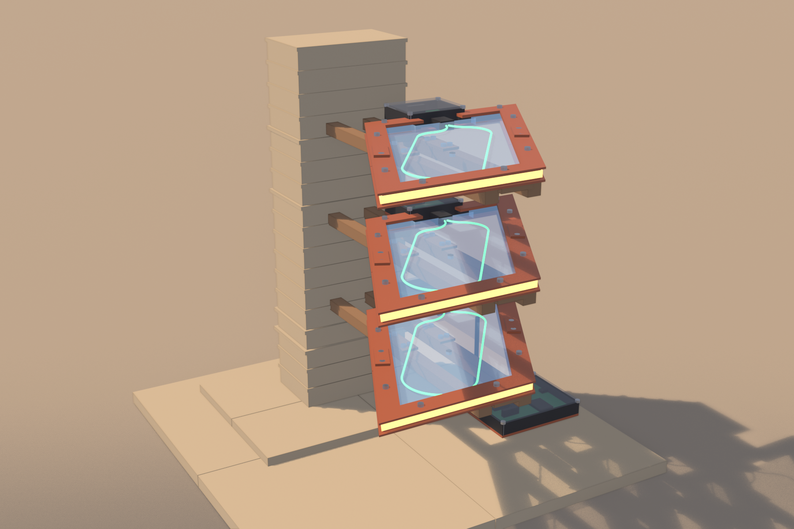 | 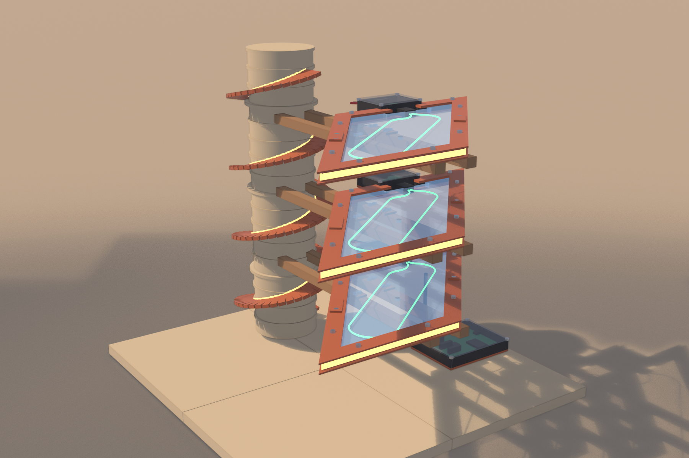 |
| **Robie (tile 9)** | **Hanna (tile 4)** |
| 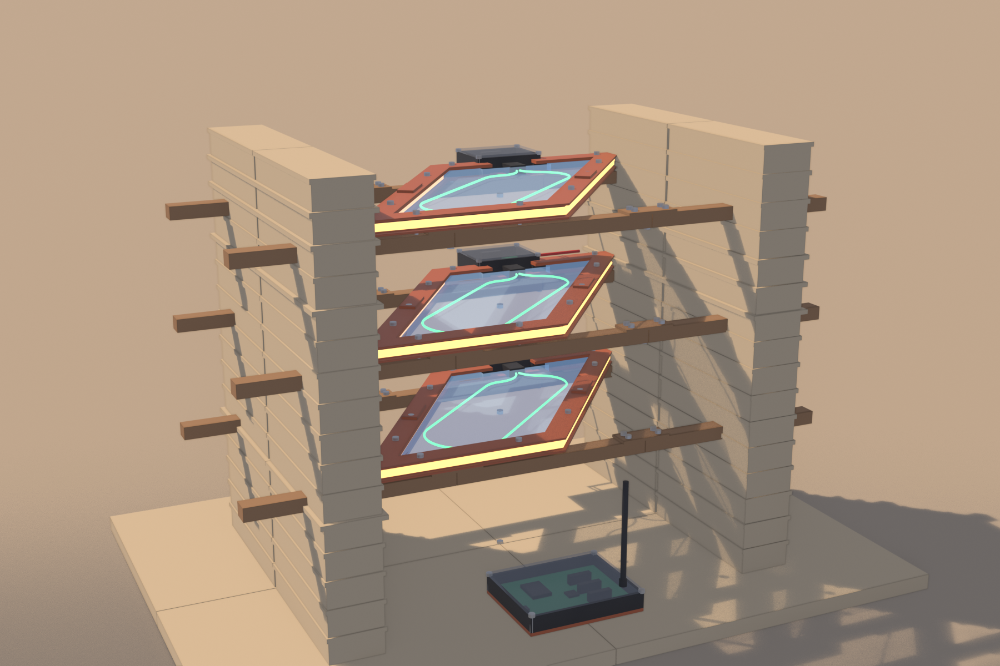 | 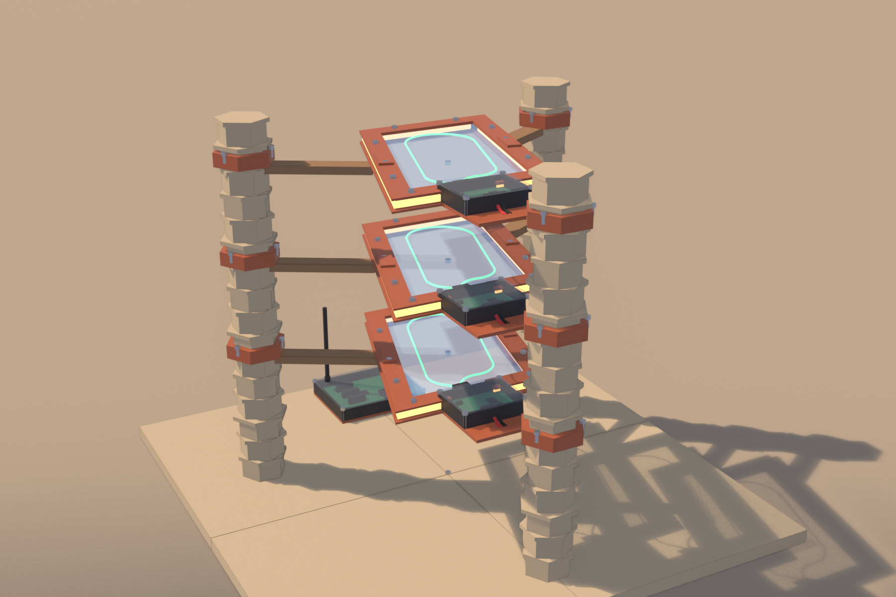 |

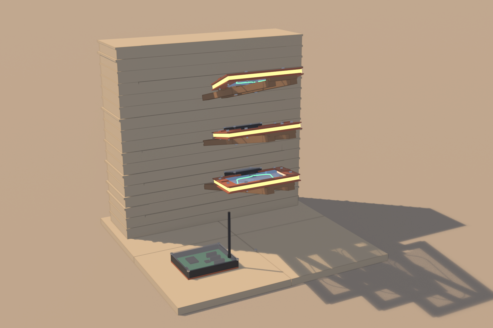

Regenerate: `python3 hw/case/wright/tile_data.py 7 10 9 4 5 && node tools/classcad/wright/build.mjs && blender -b --factory-startup --python hw/case/wright/render.py -- A hw/docs/wright`. Outputs (STEP/STL per material group, manifest) go to `hw/out/wright/<layout>/`. Geometry is generated, not print-tested; tile wrap, fiber and wire thickness are shown schematically, and tiles 11–12 are too wide for a 230 mm bed without a second holder split.

## 9. Design notes, open questions, repository map

### Design notes

- **The board follows the stack.** Channel cell *k* is at tile *k*'s height, so the coax is 57 mm and identical for all channels and all 12
  shapes. The price is copper area: 135 cm² instead of 61 cm² for the earlier 96 × 64 mm board.
- **Clips, not a tray.** Four small corner clips replace a tile-sized tray, so one design handles a 121 mm and a 403 mm tile.
- **Bias.** The earlier PWM trim spanned only 26–70 V; MCP4728 → 1 k / 100 nF → 68 k into FB gives 52.9–83.0 V, with a 2N7002 holding the
  boost off until HV_EN. The LC filter that rang at 2 V is an RC. 1 p.e. is 5.8 mV.
- **U.FL jacks inside the case** replaced edge SMAs whose shells carried the bias. The external antenna removes the PCB-antenna keep-out.
- **Footprints at any angle, tapered traces.** Small parts (up to six pads) may sit at any multiple of 15° when that shortens their nets by
  10 %; every track leaving a pad starts as wide as the pad's narrow side (up to 0.45 mm) and tapers to the net width in six steps.
- **Pipeline** (`hw/src/`): parts (LCSC/EasyEDA API) → circuit by pin name → placement (force + legalisation, identical channel cells) →
  0.1 mm grid A* router (3 layers, soft rip-up) → taut copper with arc fillets and pad tapers → L2 ground plane → silk → Gerber X2 with
  native arcs, Excellon with slots, BOM/CPL → KiCad export for DRC and 3D.

### Open questions and risks

- **The real fiber pattern and coupler.** The loop follows the published design; GSU's drawings of the inner-HCal tiles decide the actual
  grooves. On the widest shapes a single loop leaves corners up to 90 mm from the fiber; longer real patterns would raise the yield.
- **The U.FL voltage margin** (83 V DC against a 60 V AC rms rating, 200 V AC withstand) needs formal sign-off, although the bias no
  longer reaches an outside surface.
- **The long board.** Its price is an estimate, its long nets (HV, VREF, INJ, thresholds and hits, 50–250 mm) are unmeasured, and the
  three-segment case has not been printed and fitted.
- **Wi-Fi range** with the external antenna and the brass inserts is unmeasured (the test has an RSSI step: ≥ −65 dBm at 2 m). **USB
  power banks** often switch off below 50–100 mA; the station draws 40–120 mA.
- **The MC34063 reference is ±2 %**, about ±2 V on HV until the factory test stores each board's HV(TRIM) line.
- **Via-in-pad:** the GND fan-out drops vias inside large pads; order filled and capped vias or check JLC's terms.
- **Not done:** firmware (ESP-IDF; the USB protocol is specified in `hw/tools/station_test.py`); a real JLC quote; the EMI variants with
  cans or an ABS cavity for this layout; Geant4 for shapes 02, 04, 05, 07, 08, 10, 11.

### Repository map

| Path | What |
|---|---|
| `hw/src/` | Board as code: `design.ts` (netlist), `floorplan.ts` + `place.ts` (placement, identical cells), `router.ts` + `autoroute.ts` (routing), `copper.ts` (smoothing, tapers), `planes.ts`, `silk.ts` + `labels.ts`, `gerber.ts`, `jlc.ts`, `kicad.ts`, `drc.ts`, `build.ts` (the driver) |
| `hw/tools/` | `fetch_parts.ts` (LCSC/EasyEDA parts), `cost.ts` and `bom_cost.ts` (BOM and landed cost), `station_test.py` (factory test and the firmware's USB protocol), `cell_identity.py` (copper check) |
| `hw/case/` | `case.py` (three case segments), `assembly.py` (FreeCAD tile stack, frame, plate, cables), `render_assembly.py` (Blender), `assembly_doc.py` (copies renders, refills the shape table here), `build_assemblies.sh` |
| `hw/sim/` | ngspice (bias, front end, ripple, scope screens), `thermal.py`, `emi_openems.py` and their plot scripts |
| `hw/docs/` | The figures used in this README: board renders, simulation plots, `assembly/` renders |
| `hw/parts/` | The parts index and one folder per LCSC part (datasheets and 3D models are fetched on demand, not redistributed) |
| `hw/out/` | Generated (git-ignored): Gerbers, BOM/CPL, KiCad file, case and assembly files |
| `cad/sphenix_hcal/` | `tile_params.json`, the original tile GDMLs, `scripts/fiber_loop.py` (the fiber-loop generator), `scripts/parse_inner_tile.py`, `scripts/export_mesh_json.py`, and one STEP per tile shape in `step/` |
| `sim/geant4/` | Geant4 tile model: `hcal_tile.cc` and `src/` (the `hcal_tile` program), `gdml/mesh/` (tile meshes and loops), `scripts/` (`run_tile.sh`, plots), `hcal_tiles_yield.json`. The older `muon_panel` program (the July 200 × 200 mm panel) still builds from the same CMake project and is not used |
| `sim/python/` | `coincidence_rates.py` (coincidence and accidental rates), `sipm_to_tot.py` (SiPM charge to time over threshold) |
| `figures/` | Geant4 result plots used in this README |
| `tools/memguard.sh` | Runs heavy jobs under a memory cap |
| `reference_documentation/` | Archived `muonTelescope` repositories, publications and earlier reviews |

The LaTeX paper, the July reports and charts, the Octave plots, the Vision Pro visualiser, the Google-Drive scripts and the July
panel renders were removed; `git log --diff-filter=D --name-only` finds them.

## License

See [LICENSE](LICENSE). Third-party datasheets and 3D models belong to their manufacturers. They are fetched on demand
(`cd hw && bun run parts`), not redistributed.
