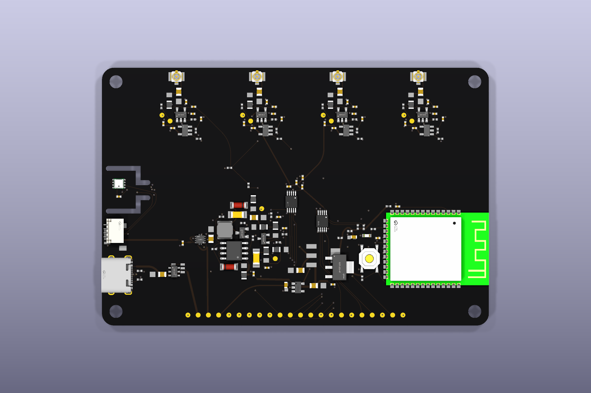
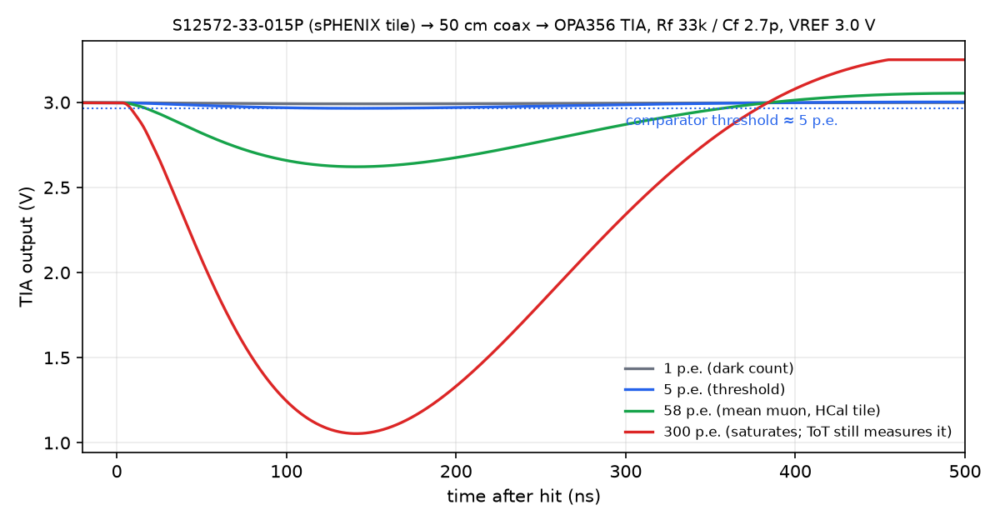
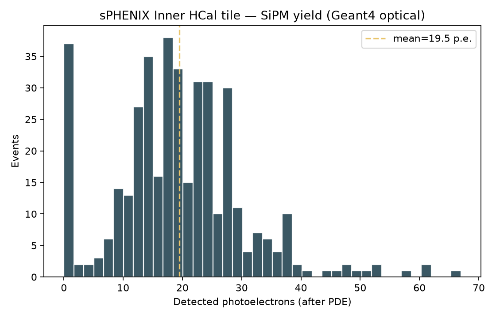
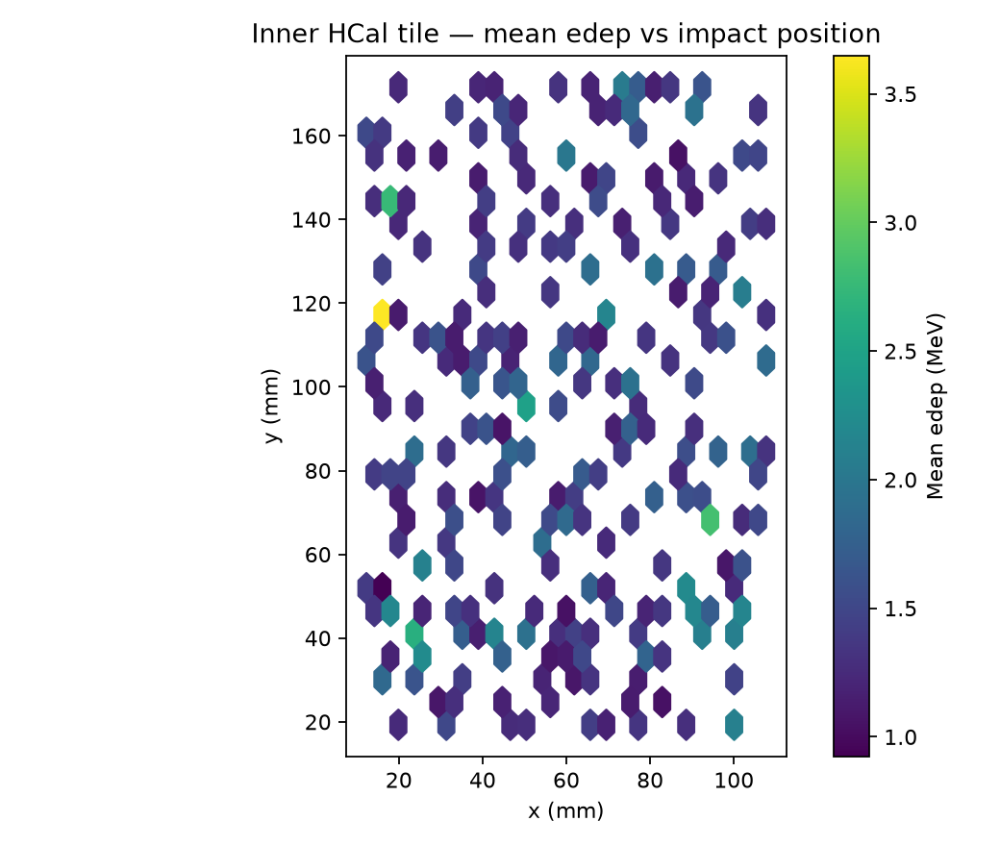
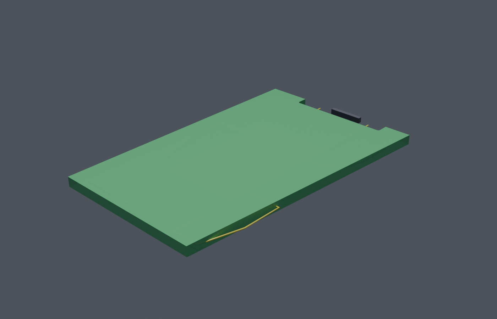

# Muon3: Networked Cosmic-Ray Muon Telescope

**In plain English:** muons from cosmic-ray showers pass through us all the time. A plastic scintillator
tile gives off a tiny flash when one crosses it; a silicon photomultiplier (SiPM) turns that flash into a
current pulse; a small board counts pulses that arrive in several stacked tiles at once. Muon3 is the
next-generation station for the Georgia State University [gLOWCOST](https://cosmic.gsu.edu/) network —
cheap, identical detectors in classrooms and labs around the world that log how the muon rate follows
pressure, temperature and space weather.


## The station board (Rev B, 2026-09-29)

One **84 × 50 mm, 4-layer, USB-powered board, assembled by JLC on one side only**. It reads four
**decommissioned sPHENIX inner-HCal tiles** (EJ-200 + Y11 WLS fiber + Hamamatsu **S12572-33-015P**) through four
edge-launch SMA jacks. There is no battery, no FPGA and no LoRa. The ESP32-S3 time-stamps the hits itself, and a
USB power bank serves as the UPS. The board is designed, placed, routed and turned into Gerbers entirely in
TypeScript; see [`hw/`](hw/README.md).

```text
HCal tile ── pigtail + SMA plug ──► edge SMA ×4 (shell = SiPM bias via 47 kΩ; centre = anode)   [SAFETY SIGN-OFF OPEN]
                                       │
                         OPA356 TIA (33 kΩ ‖ 2.7 pF; baseline VREF_n = per-channel bias trim, MCP4728 #1)
                                       │
                         LMV7219 comparator (threshold VTH_n, MCP4728 #2) ── 33 Ω ── HIT_n
                                       ▼
                ESP32-S3-WROOM-1-N8: MCPWM capture (12.5 ns, both edges → time-over-threshold),
                PCNT singles counters, coincidences in firmware; Wi-Fi / BLE / USB-CDC
                                       │ HV_PWM (2-pole RC)          ▲ HV_MON (ADC)
                                       ▼                              │
                MC34063 boost + BSS123 + 150 µH + LL4148, 1 mH/1 µF LC filter ──► HV (boot-safe low default)
                                       │
BME280 (pressure · temperature · humidity) · SC7A20H tilt · STEMMA QT (I2C expansion)
USB-C 5 V only (5.1 kΩ Rd, USBLC6 ESD) ─► AMS1117-3.3 (digital) + TLV75733 (analog)   ·   no battery: use a USB power bank
```

| | |
|---|---|
|  |  |
| Routed copper: three routed layers (L1, L3, L4) around a solid GND plane on L2. Traces are pulled taut and every corner is a true arc (G02/G03 in the Gerbers). | Top view. Four edge-launch SMAs straddle the top edge (as on gLOWCOST 2v2); USB-C and STEMMA QT sit on the left edge; the ESP32 antenna is flush with the right edge over a copper keep-out. |

*These renders date from commit 267a13f (84 × 50 mm, 4-layer), which is before the MC34063 bias change in
db3ec53. The HV corner still shows the earlier bias parts. Regenerate them with `cd hw && bun run build`.*

Status (last build 2026-09-29 23:35 CEST): fully routed. The KiCad DRC shows 0 errors and 0 unconnected; its
117 warnings are all "footprint library not configured" notices. The build has 117 placements and 43 BOM lines.
Rebuild with `cd hw && bun run build` (≈10 s) and `bun run drc`.

### What changed, and why (Musk order: fix requirements → delete → simplify → speed up → automate)

GSU's science product is minute/hourly rates from indoor sites that have power and Wi-Fi, at about $700 per
detector. Everything else had to earn its place.

The max-scope freeze earlier on 2026-09-29 is preserved in commit `594b36c`. Rev B supersedes it and removes:
- panel-head boards, the LVDS harness, TEC coolers and interlocks
- the LTE modem, GNSS, USB-PD, the 4S/18650 battery and charger
- Ethernet, OLED, microSD
- the iCE40 FPGA, LoRa, $16 DACs, and the second comparator per channel

What remains is what the tested [gLOWCOST 2v2](https://github.com/tharinduudu/gLOWCOST-2v2-mppcInterface-) board
proved: edge SMAs with bias on the shell, anode-offset bias trim, and the 2v2 boost topology (now controlled by an
MC34063 instead of the MAX1932, at about $0.15 instead of $6.09 at quantity 100). Rev B adds USB and Wi-Fi. The
full kept/deleted list is in [`hw/README.md`](hw/README.md).

**How the tiles connect.** The official sPHENIX inner-HCal tiles have *no connector*. Each tile's SiPM daughter
board has a short soldered shielded twisted-pair pigtail, and the temperature sensor sits on the tower
electronics, not the tile ([arXiv:1704.01461](https://arxiv.org/abs/1704.01461); sPHENIX ICD-003,
[PD-2/3 review 2019](https://indico.bnl.gov/event/6145/)). Muon3 terminates each pigtail in an SMA plug and uses
the on-board **BME280** for temperature-compensated bias (S12572: 60 mV/°C).

**Safety note: the bias voltage is on the SMA shells [OPEN, needs safety sign-off].** Each jack's outer shell
carries the SiPM bias (up to ≈ 70–85 V; see the HV note in [`hw/README.md`](hw/README.md)) through a 47 kΩ resistor.
The 47 kΩ limits a DC short to about 1.7 mA. However, the 100 nF capacitor at each jack sits on the shell side of
that resistor, so touching a shell can discharge it directly. Get this reviewed and signed off before boards go
to classrooms.

### Cost

Not yet re-estimated for Rev B. Run `cd hw && bun run cost` (`tools/cost.ts` picks the 4-layer and one-sided-assembly
prices automatically). The ≈ $91/board and ≈ $971 landed figures in earlier versions of this README were for the
100 × 150 mm 6-layer battery board and no longer apply.

## Simulations

**Front end, HCal tile → station** ([`hw/sim/afe_s12572_tia.cir`](hw/sim/afe_s12572_tia.cir), ngspice). S12572-015
delivers only ≈ 37 fC per photoelectron from 320 pF, so the amplifier is a transimpedance stage straight on the
anode. That gives:
- ≈ 9.5 mV per photoelectron (p.e.)
- a 5 p.e. threshold at ≈ 35 mV (≈ 8σ above amplifier + dark-count noise)
- ≈ 380 mV for a mean muon (58 p.e.)

After-pulse settling stays 3–11 mV from baseline, far from the threshold, so a muon cannot count twice.



**Bias supply** ([`hw/sim/hv_mc34063.cir`](hw/sim/hv_mc34063.cir), behavioural MC34063 + BSS123 + LC filter):


**Light yield, sPHENIX inner-HCal tile 01** (Geant4 optical model, `sim/geant4/`, ROOT plots, 200 events):
⟨N<sub>pe</sub>⟩ ≈ 58 at 1.9 MeV deposited, about 10× margin over the 5 p.e. threshold.

| | |
|---|---|
|  |  |
|  |  |

More in [`sim/`](sim/README.md) (Geant4 optical transport, ngspice, openEMS, thermal and power models),
[`cad/sphenix_hcal/`](cad/sphenix_hcal/README.md) (tile STEP assemblies) and the paper
[`Muon3_Simulation_Studies.pdf`](Muon3_Simulation_Studies.pdf) (`./build_paper.sh`). Some sim and paper sections
describe the earlier July architecture (nRF9151, OPA858, TEC); the physics results still apply.

```bash
root -l -b -q 'sim/reports/root_hcal_and_geant4.C'     # HCal tile plots
ngspice -b hw/sim/afe_s12572_tia.cir                    # front-end gain sweep
```

## Repository layout

| Path | What |
|---|---|
| [`hw/`](hw/README.md) | **Station board as code**: netlist, placement, router, Gerber writer, DRC, JLC BOM/CPL, cost model, parts library (footprints + datasheets + STEP per LCSC part) |
| `sim/` | Geant4, ngspice, openEMS, Python thermal/power/coincidence models |
| `cad/` | sPHENIX inner-HCal tile STEP assemblies, Blender scenes |
| `figures/` | Plots and renders used here and in the paper |
| `Muon3Vision/` | Vision Pro viewer for the detector geometry |
| `reference_documentation/` | 28 archived `muonTelescope` repos, publications, earlier reviews and requirements |
| `scripts/` | Google Drive sync for large data |

The retired July tscircuit board, the Rev A KiCad project, the nRF firmware, the iCE40 gateware and the `pcb/`
max-scope freeze documents were removed on 2026-09-29. They remain in git history: `git log --all -- pcb board`,
and `git show 594b36c:pcb/MUON3_MAX_SCOPE_ARCHITECTURE.md`.

## Open items

1. **Safety sign-off for the bias voltage on the SMA shells** (see the note above).
2. Re-check the bias trim range and power-up behaviour with the real TRIM network (see [`hw/README.md`](hw/README.md)).
   Then regenerate the renders, re-run the cost model and get a real JLC quote for the 4-layer, one-sided board.
3. Firmware (ESP-IDF): MCPWM/PCNT hit capture and coincidences, bias control loop (HV_PWM + HV_MON) with BME280
   temperature compensation, threshold calibration, rates over Wi-Fi/USB. GSU's duty treatment for the US boards.
4. Bench test of one channel on a real HCal tile before the 5-board order.

## Background

- sPHENIX calorimeter design and beam tests: Aidala et al., IEEE TNS 65 (2018), [arXiv:1704.01461](https://arxiv.org/abs/1704.01461).
- gLOWCOST network: [cosmic.gsu.edu](https://cosmic.gsu.edu/); ICRC 2019/2021 proceedings in `reference_documentation/publications/`.
- Earlier readout generations: `reference_documentation/repositories/mppcInterface`, [gLOWCOST 2v2](https://github.com/tharinduudu/gLOWCOST-2v2-mppcInterface-).

## License

See [LICENSE](LICENSE). Third-party datasheets and models belong to their manufacturers and are fetched,
not redistributed (`cd hw && bun run parts`).
