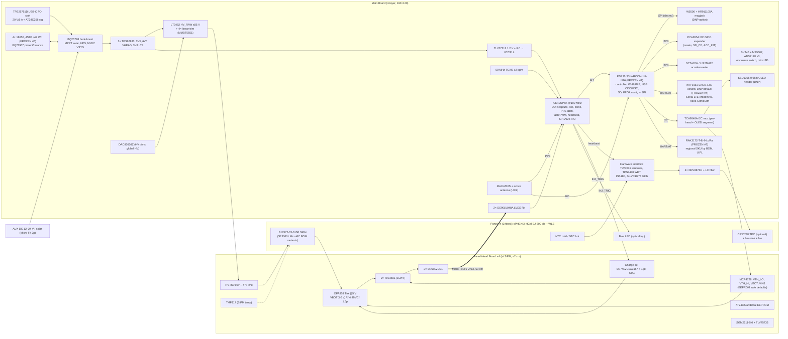

# Muon3 — Max-Scope System Architecture Specification

**Status:** architecture spec. It sets up the KiCad schematic re-freeze and has not been released for fab.
**Date of decisions:** 2026-09-29 (Europe/Berlin). **User review:** 2026-09-29, with corrections and answers at 20:15, 20:17, 20:24 and **20:36**. See *Locked decisions* below. **Decisions #1–#12 are FROZEN.** One user item is still **OPEN**: the LTE SIM provider. Anything else is PROPOSED: selected here, not yet user-approved.
**Baseline chased:** the largest-scope freeze of **2026-07-11**. Sources: `freeze_questions.md`, Codex commit `bbdfeb6` (2026-07-11 14:13), and the S12572/LT3482 HCal path from commit `2ddf737` (2026-07-15).
**Author:** Grok Bot, delegated by Sawaiz. Committed to the repo 2026-09-29 as `pcb/MUON3_MAX_SCOPE_ARCHITECTURE.md`. The companion parts list is `pcb/key_parts_max_scope.csv`, and the GSU web captures are in `reference_documentation/gsu_cosmic/`. The `web/…` datasheet paths cited in the text refer to the working copies; they were not committed.
**Stock snapshot:** there are two sources. JLCPCB assembly stock comes from the local JLC catalog snapshot dated **2026-09-02** ("JLC"). Live LCSC retail stock was queried **2026-09-29** ("LCSC"). A 0 in one pool does not mean a shortage in the other.

Tag legend. Every number carries one of these tags:
- **[DS]** manufacturer datasheet. The file or URL is given where it is not obvious.
- **[SIM]** simulation or study in the Muon3 repo: `sim/`, `Muon3_Simulation_Studies.tex`, `pcb/parts/*`.
- **[WEB]** a public web source, with its URL.
- **[EST]** an engineering estimate made here. It must be verified at the gate listed in §j.

---

## Locked decisions (2026-09-29)

Sawaiz reviewed the top-5 decisions on **2026-09-29**. #2, #3 and #5 were approved at review.
- **#1 is approved:** the user's 20:15 message said "move to the esp32 module".
- **#6 and #7** were answered at 20:17.
- **#4** is resolved and frozen here, within #1. It does not need a user decision: it keeps the freeze's nRF9151 as the only LTE part and adds no new chip.

| # | Decision | Status | Scope of the lock |
|---|---|---|---|
| 1 | **ESP32-S3-WROOM-1U-N16 (LCSC C2980298) is the main system controller.** **RP2040 and nRF54 are removed** from the design. Wi-Fi + BLE 5 + native USB-OTG come from the ESP32-S3. | **FROZEN 2026-09-29** (user, 20:15) | Replaces the Jul 11 "nRF9151 primary + RP2040 co-processor + optional nRF54". Firmware split §h and I/O allocation §d.6 follow from this. |
| 2 | **Panel-Head Boards (PHB) at each SiPM + Molex Micro-Fit 3.0 2×12 locking harness** (0430452400, LCSC C277384; housing 0430252400, C485674) | **FROZEN 2026-09-29** | Board partitioning (§g), digital LVDS over the 50 cm harness, the 24-circuit Micro-Fit family. Pin order is subject to G-MECH1. PHB part choices are PROPOSED. |
| 3 | **TEC drivers (DRV8873 ×4) + hardware interlock on every main board.** CP30238 coolers, fans and heatsinks fitted **only on hot-site or lab units**. Science default is temperature-compensated bias. | **FROZEN 2026-09-29** | Interlock part choices are PROPOSED. |
| 4 | **nRF9151-LACA-R7 is the optional LTE-M/NB-IoT variant, DNP by default.** It runs Nordic Serial LTE Modem firmware over UART to the ESP32-S3. **No SIM7080G footprint on Rev A.** SIM7080G (C2943992) is only the *Rev B evaluation candidate*, and only if an LTE batch is needed while the nRF9151 JLC pre-order lead time is > 8 weeks. | **FROZEN 2026-09-29** (resolved within #1) | The nRF9151 footprint, 3V8_LTE buck, nano-SIM + MFF2 pads and LTE U.FL are all DNP on the default (Wi-Fi) build. The modem driver in firmware is an AT-modem HAL, so a Rev B swap needs no controller change. |
| 5 | **External antennas via U.FL** instead of Nordic on-board antenna geometry | **FROZEN 2026-09-29** | Wi-Fi (ESP32-S3-WROOM-1U), GNSS, LoRa, and LTE on LTE builds. Gate G-RF applies. |
| 6 | **On-board battery: 4× 18650 Li-ion in on-PCB holders, 4S1P** (14.4 V nominal, 12.0–16.8 V) ≈ **49 Wh** (reference cell Samsung INR18650-35E, 4 × 3.6 V × 3.4 Ah). BQ25798 charger + TI BQ76907 per-cell protection and balancing. MYOUNG BH-18650-B1BA002 holders (C2988620) on the **bottom side** of the 160 × 120 mm main board. | **FROZEN 2026-09-29** (user, 20:17) | Cell brand, charge voltage (4.10 V/cell recommended) and protection FETs are PROPOSED (§d.7a). Holder fit is checked against the datasheet (§g). |
| 7 | **LoRa: RAKwireless RAK3172 family, regional SKUs on one footprint.** Region is set by BOM swap plus the firmware band. Primary SKUs are **RAK3172-T-8-SM-I** (C19723908) and **RAK3172-T-9-SM-I** (C19723909). | **FROZEN 2026-09-29** (user, 20:17) | The per-country SKU mapping is PROPOSED (G-LORA1). |
| 8 | **SiPM mounting: soldered directly on the PHB** for standard units. **TEC units use a flex carrier ≤ 3 cm** from the PHB to the cold plate. | **FROZEN 2026-09-29** (user, 20:36) | The flex-carrier design (JLC FPC, 125 V-rated 1.0 mm FPC connector, TMP117 on the carrier) is PROPOSED (§g, G-FLEX). |
| 9 | **First 5-unit build: 3× US915 (RAK3172-T-9-SM-I) + 2× EU868 (RAK3172-T-8-SM-I). One of the five is the LTE variant.** | **FROZEN 2026-09-29** (user, 20:36) | Which unit carries LTE, and fitting the Ethernet option on one validation unit, are PROPOSED (§k). |
| 10 | **Stations ship without cells.** Cell specification: **UN38.3-certified Samsung INR18650-35E / LG INR18650-MJ1 class** (≥ 3.4 Ah, ≥ 8 A discharge, protected by the on-board BQ76907, *unprotected* flat-top or button-top per the holder check). | **FROZEN 2026-09-29** (user, 20:36) | Local purchase or separate shipment. The shipping SOP is G-BAT4. |
| 11 | **LoRa backhaul: The Things Network where covered; otherwise one LoRaWAN gateway per site cluster.** | **FROZEN 2026-09-29** (user, 20:36) | The gateway model is PROPOSED (§d.11). |
| 12 | **Added features:** optional **DNP W5500 Ethernet + magjack**; **LIS2DH12-class accelerometer**; **boot self-test + automatic bias/threshold calibration and plateau scan**; **ESP32-S3 Secure Boot v2 + flash encryption + signed OTA + per-device certificates**; optional **SSD1306 0.96″ I2C OLED header**; a **pre-crimped Molex Micro-Fit harness** sourcing route. | **FROZEN 2026-09-29** (user, 20:36) | Feature inclusion is frozen. Part choices are PROPOSED (CSV). Pin budget re-verified in §d.6.1. |
| — | **SIM provider for LTE units** | **OPEN** (user did not approve the Onomondo recommendation) | Needed only before the LTE unit is commissioned. It does not block the Rev A schematic, because nano-SIM + MFF2 cover every provider. |

Notes:
- `key_parts.csv` status column: **frozen** means the part is covered by a user-approved decision (the Jul 11/15 freeze or the 2026-09-29 decisions #1–#12). **proposed** means it is selected here but not yet user-approved. **removed** means the part was deleted from the design, with the row kept for traceability (W25Q128). RP2040 and nRF54 rows were deleted. **dnp** means the footprint is on the board but the part is not fitted by default. **open** is used only for the SIM row.
- **Resolved inconsistencies:**
  - (a) *49 Wh vs 3-day solar target.* The requirement is revised: the on-board pack is an **overnight/outage UPS (≥ 18 h at the 2 W design value)**. Multi-day autonomy moves **off-board** to a commodity 12–24 V solar kit on the new AUX DC input (§e, P7).
  - (b) *Holder placement.* It fits the bottom of 160 × 120 mm without changing the outline, per the datasheet dimensions (§g).
  - (c) *Cells are not JLC-assembled.* "100 % JLC" applies to the PCBA. Stations ship **without cells** (FROZEN #10).
  - (d) *nRF9151 serial-instance budget.* Removed: the nRF9151 is only a UART modem now, and the ESP32-S3 I/O allocation fits (§d.6).
- **New inconsistencies found while applying #8–#12, and how each is resolved:**
  - (e) *ESP32 pins for Ethernet.* The W5500 needs CS, INT and RST, but only IO37 was spare. **Fixed:** a PCA9554 I2C expander takes the four slow reset/detect lines. Result: **33 of 36 GPIO used, 3 spare** (§d.6.1).
  - (f) *Injection cannot measure a muon plateau.* Charge injection calibrates threshold (mV per p.e.) and skew, but not the scintillator/SiPM detection efficiency. **Fixed:** the automatic scan runs in three stages: injection S-curves, a dark-count staircase for gain/V_br, then a cosmic-coincidence bias plateau overnight (§h.1).
  - (g) *LIS2DH12TR is at 0 LCSC stock* (2026-09-29). **Fixed:** the fitted part is the pin- and register-compatible **Silan SC7A20HTR** (106,222 in stock). The LIS2DH12TR stays as the same-footprint alternate. The driver must accept WHO_AM_I 0x11 or 0x33.
  - (h) *There is no 24-circuit off-the-shelf Molex Micro-Fit cable assembly* (the 245132 OTS family stops at 10 circuits), and Molex pre-crimped leads are single wires, not twisted pairs. **Fixed:** prototypes use Molex pre-crimped leads in a hand-loaded 0430252400 housing, with LVDS pairs twisted. Production uses a custom harness to a Muon3 drawing (§g, G-MECH2, G-LVDS).
  - (i) *Common FPC connectors are rated 50 V*, below the ≤ 85 V SiPM bias on the TEC flex carrier. **Fixed:** the carrier uses the 125 V-rated **Molex 2005280080** with a guard pin next to HV (§g).
  - (j) *Secure boot does not cover data partitions.* An FPGA bitstream in a separate partition would bypass signature checks. **Fixed:** the bitstream is embedded in the signed app image (§d.6.3).

---

## (a) Program context: GSU gLOWCOST / COSMIC

What the program runs today. Only facts that were actually found are listed here.

| Fact | Source |
|---|---|
| **22 sites in 11 countries on 5 continents**, reporting 24/7. The detector network was founded in 2023 at GSU's COSMIC centre. | [WEB] https://cosmic.gsu.edu/ (site data file `glowcost-data.js`, fetched 2026-09-29) |
| The detector is "a few-hundred-dollar instrument: plastic scintillator, SiPMs, edge-computing node". Photos show detectors "wired to single-board computers". | [WEB] https://cosmic.gsu.edu/ |
| An **east–west oriented detector arrangement** is used to study **directional muon flux**. | [WEB] https://cosmic.gsu.edu/ |
| Daily products: hourly flux % change with the pressure effect; a 30-day stack against **Kp, Dst and GOES X-ray**; an uncorrected-panel plot. Station metadata includes **geomagnetic cutoff rigidity**. Data are free on request (xhe@gsu.edu). | [WEB] https://cosmic.gsu.edu/ |
| Four thrusts: (1) global space weather (intensity **and arrival anisotropy**, CMEs/SEPs, Forbush decreases); (2) upper-atmosphere dynamics (SSW); (3) radiation and health; (4) STEM / citizen science. | [WEB] https://cosmic.gsu.edu/ |
| Roadmap: 2023–26 prove the design. Then "a detector in every country", with dense clusters at sensitive latitudes and altitudes. Then open data. Then forecasting with GEANT4. The donation text says "One hundred and eighty-four to go". | [WEB] https://cosmic.gsu.edu/ |
| Outreach tiers: 0 browser; 1 smartphone; 2 build a kit; 3 "**Host a permanent station… or fly a payload on a high-altitude balloon**". A host needs "**A room, power, and a teacher who checks on it**". | [WEB] https://cosmic.gsu.edu/ |
| Campaigns: **SSW Watch (Oct 2026–Apr 2027**, strongest at Lund) and Forbush Watch. The detector recorded an **altitude profile at cruising height** on an aircraft flight and ran live at a STEM Expo. | [WEB] https://cosmic.gsu.edu/ |
| Sites include Chacaltaya **5,240 m** (UMSA), UPEA El Alto, APO 2,788 m, Mt Wilson, Lund (northernmost), Singapore (highest cutoff), Sri Lanka ×2, Abuja (NASRDA), India ×3, Japan ×2, Türkiye ×2 (Erzurum, high altitude), Belgrade (**two detectors ~2 km apart**), Colombia, US schools, MSU (18 Sep 2026). | [WEB] https://cosmic.gsu.edu/ |
| gLOWCOST is a tabletop detector **provided fully assembled** to research labs and to middle-school, high-school and college classrooms. **28 distributed**, free to groups, "**valued at approximately $700**". Goal: **>100 countries in 5 years**. Funders: GSU, DOE, NSF. | [WEB] https://physicstoday.aip.org/news/muon-detectors-for-the-people (24 Jun 2026) |
| "Edge computing and IoT… real-time analysis and transmission"; "plug-and-play" citizen science; >15 detectors in 10 countries outside the US. | [WEB] Innovation News Network, Feb 2026 (search result) |
| Legacy telescope: **20×20×1 cm** sPHENIX-HCal-inspired tiles with a corner cut-out for the SiPM PCB and a glued WLS loop. Three layers, **25 cm** top–bottom separation, adjustable middle layer. Readout is an RPi plus a custom **8-ch FPGA board** (bias, amplification/shaping, coincidence). U.FL cables carry bias and signal. The RPi carries GPS, humidity, temperature and inclination sensors. Minute counts. ~200 tiles (Uniplast); goal 50 telescopes. **SiPM: Hamamatsu S13360**. There is also a muon+neutron variant with a liquid-scintillator cell. Requirement: **identical detectors** (no acceptance correction). | [WEB] ICRC 2021, https://pos.sissa.it/395/1257/pdf (co-author S. Syed) |
| The network records pair coincidences 1&2, 1&3, 2&3 **every minute** and sends them to a GSU server. Rates are **~100 cpm near the equator** (Sri Lanka, Colombia) and **>200 cpm** in Atlanta/California. Hourly precision is **1.3 % at 100 cpm**. Pressure anti-correlation is clear. Data gaps come from **power failures**. One unit ran 18 months. | [WEB] JGR Space Physics 2023, doi:10.1029/2023JA031943 (abstract/snippet) |
| Further publications: ASR 2025 doi:10.1016/j.asr.2025.04.032; IEEE TNS 2021 (DLL readout ASIC). | [WEB] https://cosmic.gsu.edu/ |
| ICRC2019 (repo): four-channel SiPM readout, 14 cm spacing, bias plateau above ~54 V, ~120 paired counts/min. | repo `reference_documentation/publications/README` |

### What this changes in Muon3's requirements
1. **Most deployments are indoor, mains-powered, in institutional rooms that already have a network.** The fleet today is networked through single-board computers on campus networks. **Wi-Fi and USB are first-class paths (FROZEN #1).** LTE-M alone is a coverage and data-plan risk across 11+ countries, so LTE is an optional variant (FROZEN #4).
2. **Rate monitoring is the core science product**: minute and hourly counts, pressure-corrected, Forbush decreases, SSW. The next priority is **directional (E–W) flux**. Inter-station EAS timing is secondary and applies only to local clusters such as Belgrade. The design therefore focuses on **efficiency and rate stability (livetime ≥99.5 %, gap-free)** before ns-level network timing.
3. **Cost anchor: ~$700 per assembled station**, and the goal is 100+ countries. Every fitted feature has to earn its cost. Expensive features (TEC, LTE) become **fit-per-deployment variants** on one PCB.
4. **Identical detectors.** Acceptance and efficiency must be reproducible unit to unit. This calls for a calibration system (charge + optical injection), per-head ID EEPROMs and a stable plateau.
5. **Power failures cause gaps.** UPS ride-through is justified: BQ25798 backup mode with the on-board 4S 18650 pack (#6 FROZEN).
6. **Tier-3 balloon and aircraft flights.** This requires a wide-range barometer (BME280's 300 hPa floor is not enough), local storage (microSD), a battery below 100 Wh, and a GNSS airborne dynamic mode.
7. **Extreme sites**: 5,240 m altitude, the tropics (Abuja, India, Singapore) and a Lund winter. Design operating range is **−20 to +50 °C ambient** [EST]. Parts must be rated to −40/+85 °C. This is why the controller is the **ESP32-S3-WROOM-1U-N16** (−40…85 °C) and not the N16R8 octal-PSRAM variants, which are rated to +65 °C only [DS Espressif WROOM-1/1U datasheet v1.3 ordering table].
8. **The fleet uses S13360 SiPMs** (Vop ~56 V). Muon3 is aimed at S12572 on sPHENIX HCal tiles (Vop ~69 V). The HV and AFE must cover **both**, and MicroFC (~30 V) as well.

---

## (b) Requirements

### Science / detector
| ID | Requirement | Value | Source |
|---|---|---|---|
| S1 | Channels | 4 on the PCB, shipped with 3 heads populated. 4 channels allow two tilted 2-fold telescopes (E–W mode). | freeze 2026-07-11; GSU E–W [WEB] |
| S2 | MIP efficiency per tile at the operating threshold | ≥ 99 % (≥ 95 % minimum) | NEXT_GENERATION_REQUIREMENTS; [SIM] >98 % at 3 p.e. |
| S3 | Mean light yield (HCal tile + S12572) | ≈ 58 p.e. [SIM]; loop-panel/MicroFC ≈ 79 p.e. mean, min 26 [SIM] | sim/, tile_params.json |
| S4 | Electronics false-trigger rate (no light) | < 0.01 Hz/ch above the LO threshold | NEXT_GENERATION_REQUIREMENTS |
| S5 | Accidental coincidence fraction | < 1 %, **measured on-line** with a shadow (delayed) window | requirements doc |
| S6 | Rate stability over the plateau | Efficiency change < 0.1 % per °C [EST]. It must stay well below the 1.3 % hourly statistical precision [WEB JGR]. | derived |
| S7 | Gain stability | ≤ 2 % over the operating temperature range, using temperature-compensated bias. TEC is optional. | requirements doc |
| S8 | Pulse capture | Pulses ≥ 5 ns. Coincidence window 10 ns–2 µs. Hold-off 0–50 µs. | requirements doc |
| S9 | Channel-to-channel skew | ≤ 2 ns typical, ≤ 5 ns over temperature, **after injection calibration** | requirements doc |
| S10 | Absolute time (event to UTC) | ≤ 50 ns rms vs GNSS | requirements doc |
| S11 | Livetime | ≥ 99.5 % | requirements doc |
| S12 | Calibration | Per-channel charge injection (1–70 p.e. equivalent) and optical injection (LED into the tile/fiber). Injection crosstalk < 1e-4. **Boot self-test every power-up; automatic threshold/gain calibration and bias plateau scan at commissioning and on demand** (FROZEN #12, §h.1). | freeze 2026-07-11; user 2026-09-29 |
| S14 | Orientation | 3-axis tilt of the station, ±0.5° [EST] after 1-point calibration, logged hourly. Supports E–W tilted-telescope geometry and checks the setup (the legacy RPi logged inclination [WEB ICRC2021]). | GSU E–W [WEB] |
| S13 | Products | Minute counts for every subset (exact-subset coincidence), singles, accidentals, ToT spectra, a muon-decay (lifetime) histogram, pressure/temperature/humidity, and GNSS time/position. | freeze 2026-07-11; GSU daily plots [WEB] |

### Deployment / environment
| ID | Requirement | Value |
|---|---|---|
| E1 | Ambient temperature | −20 to +50 °C operating [EST from site list]; storage −40 to +85 °C |
| E2 | Pressure | 10–1100 hPa (ground to balloon float) → MS5607 [DS: 10–1200 mbar] |
| E3 | Humidity | 0–95 % RH non-condensing. Dew-point supervision is **mandatory** when the TEC runs. |
| E4 | Mechanics | 50 cm locking harness per panel. Main board 160 × 120 mm or smaller, 4-layer. Head boards about 40 × 30 mm [EST]. |
| E5 | Installation | "A room, power, and a teacher" [WEB]. Must be plug-and-play: USB-C PD adapter; Wi-Fi provisioning over BLE or SoftAP, including **WPA2-Enterprise/eduroam** and captive-portal handling; no tools. |
| E6 | Manufacturing | 100 % JLCPCB PCBA (Standard PCBA, X-ray). KiCad is the fab source, because tscircuit cannot emit 4-layer gerbers. |

### Power
| ID | Requirement |
|---|---|
| P1 | Input: USB-C PD up to **20 V / 5 A (100 W)** sink. The PD source role is not needed. |
| P2 | Solar input with MPPT (BQ25798, 3.6–24 V in) [DS LCSC C2876593] |
| P3 | **On-board battery (FROZEN #6): 4× 18650 in on-PCB holders, 4S1P, ≈ 49 Wh**, < 100 Wh for airline/balloon transport. Per-cell protection and balancing (BQ76907). Charging is inhibited below 0 °C and above 45 °C via BQ25798 TS/JEITA [DS-class; verify cell DS]. |
| P4 | Science mode (TEC off) ≤ 2.0 W design value, 3 heads (§e) |
| P5 | TEC is allowed **only** on PD ≥ 15 V or on an adapter. It is **never allowed on battery**. Enforced in hardware. |
| P6 | UPS: seamless switch to battery when the input is lost, with no loss of livetime |
| P7 | **Autonomy (revised 2026-09-29):** the on-board pack gives **≥ 18 h at the 2.0 W design value** (overnight and typical outages). Multi-day autonomy comes from an **off-board** 12–24 V DC source (e.g. a commodity 12 V solar kit with its own battery) on the **AUX DC input**. That input is BQ25798 input 2 [verify dual-input, G-PWR3]. |

### Networking
| ID | Requirement |
|---|---|
| N1 | **Wi-Fi 2.4 GHz is the primary uplink (FROZEN #1).** It needs WPA2/WPA3-Personal and WPA2-Enterprise (eduroam PEAP/TTLS). Also: **USB-C** (CDC for the existing Web-Serial dashboard protocol, plus MSC for the SD card), and microSD store-and-forward. |
| N2 | **LTE-M / NB-IoT optional variant (FROZEN #4):** nRF9151 with nano-SIM + MFF2 eSIM. DNP by default. Fitted for remote or no-Wi-Fi sites. Regions EU + US + GSU partner countries. **SIM provider OPEN** (candidates from the requirements doc: Onomondo, DT nuSIM). |
| N3 | Payload: minute records (~200 B) + hourly histograms (~4 kB) → **< 10 MB/month** [EST] |
| N5 | **LoRa (FROZEN #7)**: LoRaWAN (or LoRa P2P to a site gateway) as a low-rate telemetry and store-and-forward uplink for sites without Wi-Fi or LTE. One PCB builds any region by BOM swap within the RAK3172 family. Payload is 15-minute summaries of ≤ 51 B, which fits EU868 DR0 [EST vs RP002]. |
| N4 | Signed OTA of the ESP32-S3 firmware + iCE40 gateware (one image), plus nRF9151 modem FOTA on LTE builds. **Secure Boot v2 + flash encryption + per-device X.509 certificates (mTLS)** (FROZEN #12). |
| N6 | **Wired Ethernet option (FROZEN #12):** W5500 10/100 + magjack footprint, **DNP by default**. Fitted for sites that forbid Wi-Fi devices or have no usable Wi-Fi. Shares the FPGA SPI bus. |

### Safety (hardware-enforced, independent of any processor)
| ID | Requirement |
|---|---|
| X1 | TEC and fans default **OFF** at power-up, reset, brown-out and firmware crash |
| X2 | The TEC interlock trips on: invalid NTC (open or short), cold side below dew point + margin (via the controller, with a hardware window as backstop), hot side > 60 °C [EST], PD contract < 15 V, watchdog timeout, aggregate overcurrent, per-driver IPROPI overcurrent, enclosure open, head absent |
| X3 | HV (≤ 90 V) only when the head is present (presence pin plus ID EEPROM read). Output-current limited. **No HV on any exposed coax shell.** |
| X4 | HV energy class: aim for **ES1 by current limiting** (≤ 2 mA DC touch current) under IEC 62368-1. This is to be verified by a compliance engineer. |

---

## (c) System block diagram

**Diagram status:** all blocks reflect FROZEN decisions #1–#12. Individual part choices inside the blocks are PROPOSED where the CSV says so. W25Q128 is removed: the ESP32-S3 configures the iCE40 over SPI (§d.4).

**Text version, per panel harness** (Micro-Fit 3.0, 24 circuits): 2 LVDS pairs (LO, HI), INJ_TRIG, I2C, VHEAD 6 V, 3× GND, PRESENT#, NTC_COLD, NTC_HOT, FAN_12V, FAN_TACH, TEC_A ×2, TEC_B ×2, HV_BIAS with guard positions. Full pin map in §g.

---

## (d) Per-subsystem decisions (dated 2026-09-29)

All MPNs are concrete. The stock column gives JLC assembly stock from the 2026-09-02 snapshot and/or LCSC retail stock checked 2026-09-29.

### d.1 Photosensor and tiles: **keep Hamamatsu S12572-33-015P on decommissioned sPHENIX HCal tiles**
- **Why.** The tiles and SiPMs are a sunk asset. The HCal inner tile 01 simulation gives **⟨Npe⟩ ≈ 58** at Edep 1.92 MeV [SIM], which is ~10× margin over a 5 p.e. threshold. S12572-015 electrical data (pixel family data from the S12571-015 table; the 3×3 mm S12572 has the same 15 µm pixel):
  - gain 2.3e5 → **Q ≈ 36.8 fC/p.e.**
  - PDE 25 % at 460 nm
  - Vbr 65 ± 10 V, Vop = Vbr + 4.0 V
  - **ΔVop/ΔT = 60 mV/°C**
  - gain tempco 3.5e3/°C = **1.5 %/°C**

  [DS Hamamatsu S12571 datasheet, fetched mirror `web/10-22030G62129A7.pdf`; the S12572 sheet itself was not retrieved.] Scaling by area from 1×1 mm to 3×3 mm: **Ct ≈ 320 pF** (repo value 320 pF) and **DCR ≈ 0.9 Mcps** at 0.5 p.e. [EST].
- **Supported BOM variants on the same head PCB** (resistor/cap option set):
  - S13360-3050 class, the GSU fleet, Vop ~56 V (repo notes): ~7× higher charge per p.e. [EST from repo 270 fC]
  - MicroFC-30035, ~30 V, ~480 fC/p.e. [repo HAMAMATSU_SIPM_COMPATIBILITY]
- **Rejected:**
  - Switching the new build to S13360/MicroFC. The HCal tile inventory and the frozen 2026-07-15 path point to S12572.
  - A new SiPM purchase. The per-unit cost goes against the ~$700 anchor.

### d.2 Analog front end: **move the AFE to a Panel-Head Board (PHB) at the SiPM** (FROZEN 2026-09-29, decision #2)
**Decision:** the TIA, both comparators, the threshold DAC, charge injection and the SiPM temperature sensor go on a small 4-layer PHB. The PHB is ≤ 2 cm from the SiPM, or carries the SiPM directly in the no-TEC variant. The PHB sends **LVDS digital** hits over the 50 cm harness.

Why the split is required and not optional:
- The S12572 delivers **36.8 fC/p.e.** from a **~320 pF** source [DS/EST].
- Putting a 50 cm cable (~50 pF, plus pickup) in front of a TIA, in a harness that also carries a 2.5 A PWM TEC current and fan current, is the worst possible place to put ~40 fC signals.
- The 2026-07-11 plan also needed HV on a coax shield or a special hybrid coax contact. The review marked that prohibited, and no MPN was ever found (the "hybrid connector MPN unset" issue).
- With LVDS there is no coax contact, and a standard power/signal connector works (§g).

**TIA — TI OPA858IDSGR (LCSC C970232; JLC 1,498).**
- Specs [DS `OPA858.pdf` SBOS629B]:
  - GBWP 5.5 GHz
  - en 2.5 nV/√Hz
  - CCM 0.62 pF
  - IQ 20.5 mA at 5 V
  - supply 3.3–5.25 V
  - **input CM high limit 3.4 V min at 5 V (−40…125 °C)**; only **1.7 V min at 3.3 V**
  - output VOL 1.2 V worst case, VOH 3.9 V
- **Bug fix:** run the PHB OPA858 at **5.0 V** with **VBOT = 3.0 V**. That leaves 0.4 V margin to the 3.4 V CM limit. SiPM anode current drives the output **downward**, from 3.0 V to VOL 1.2 V, giving a **1.8 V linear range** [DS-derived].
  - The frozen design ran the part at 3.3 V with VBOT 2.40 V. That violates the 1.7 V CM limit.
- **Values:** Rf = **4.99 kΩ**, Cf = **1.5 pF** C0G.
  - Butterworth Cf = √(Ct/(2π·Rf·GBWP)) = 1.36 pF for Ct = 321 pF.
  - f−3dB ≈ √(GBWP/(2π·Rf·Ct)) ≈ **23 MHz** [EST from DS].
  - Output noise ≈ en·(1+Ct/Cf)·√(1.57·f) ≈ **3.2 mV rms**, against **~13–25 mV/p.e.** (pulse-shape dependent) → **σ ≈ 0.13–0.25 p.e.** [EST].
  - A mean muon (~58 p.e., ~2.1 pC spread over ~20 ns by the EJ-200 + Y11 WLS decay) peaks at **~0.5 V** [EST]. That leaves ~3.5× headroom before the 1.8 V rail. Beyond that the output saturates, but ToT still encodes amplitude.
  - Earlier sims used Rf 2k (S13360, 24.4 mV/p.e., 52.5 MHz, walk 6.7 ns) and the study default Rf 15k for S12572 (12.6 MHz) [SIM]. 4.99k is the bandwidth/gain middle ground.
  - **Gate G-AFE1:** re-run the repo ngspice with the TI OPA858 model at Ct = 320 pF.
- **BOM variants:**
  - S13360: Rf 1.00 kΩ / Cf 3.3 pF [EST] (7× more charge)
  - MicroFC: Rf 1.0 kΩ / Cf 3.3 pF (per the paper Cf 3.3p) [SIM]
- **Rejected:** OPA356 (walk 19.1 ns [SIM]); keeping the AFE on the main board (see above); an AC-coupled pole-zero stage (DC coupling keeps baseline/ToT physics simple).

**Comparators — TI TLV3601DCKR ×2 per head (LCSC C2974371; JLC 11,998; $2.83).**
- Specs [DS `TLV3601.pdf`]:
  - tPD 2.5 ns typ / 3.5 ns max
  - overdrive dispersion 600 ps
  - 1.25 ns minimum pulse
  - hysteresis 3 mV
  - ICC 4.9 mA
  - input CM range 200 mV beyond both rails
- The comparators run at 3.3 V. The input range (−0.2 to 3.5 V) covers the TIA swing of 1.2–3.0 V.
- LO threshold ≈ **5 p.e.** (timing/efficiency). HI threshold ≈ **25 p.e.** (MIP tag / ToT dynamic range; the HI crossing gives a second walk-correction point).
- **Why 5 p.e. and not 3 p.e.**
  - The expected ≥3 p.e. dark rate from crosstalk at ~0.9 Mcps DCR is up to ~10² Hz [EST]. That would give ~1 % accidentals in a 100 ns window.
  - At 5 p.e. the dark rate is ≪ 10 Hz [EST], so singles are dominated by scintillator background.
  - Efficiency loss at 5 p.e. with a 58 p.e. mean is < 1 % [SIM-based EST].
- **LVDS drivers — SN65LVDS1DBVR ×2 per head** (LCSC C465731; LCSC 10,167; $0.87).
- **Rejected:**
  - TLV3604DCKR, which has an integrated LVDS output (C2916042): only 164 in stock, $6.03.
  - Driving single-ended 3.3 V CMOS over 50 cm: ground bounce returns to the TIA ground, and crosstalk into NTC/I2C lines.
  - The iCE40UP5K differential-comparator inputs as the LVDS receiver. They need **|VID| ≥ 250 mV at VCCIO = 2.5 V** [DS iCE40UP DS 4.18], while LVDS VOD can be as low as 247 mV. No margin.

**Head DAC — Microchip MCP4728T-E/UN (LCSC C478093; 7,943; $2.45).**
- Four 12-bit channels: VTH_LO, VTH_HI, VBOT, VINJ.
- Per-channel **EEPROM power-on defaults** [DS]. Defaults are safe thresholds, which means no false-trigger storm before the controller boots.
- LSB 0.5 mV (internal 2.048 V ref, G = 1) ≈ 0.03 p.e. [DS/EST].
- All heads share one I2C address map behind a TCA9548A on the main board.
- **Rejected:** two DAC80508 on the main board (the frozen plan). The thresholds would then travel 50 cm as analog signals, and it adds $16+.

**Charge injection.** SN74LVC1G3157DBVR (LCSC C10426) toggles one plate of a **1.0 pF C0G** between VINJ and GND on INJ_TRIG. The other plate connects to the TIA summing node.
- Q = C·ΔV → **1 pF × 36.8 mV = 1 p.e.**, so 0–2.5 V ≈ 0–68 p.e. [EST].
- Absolute calibration comes from the dark-count single-p.e. ToT peak.
- The freeze had **no injection network**. This fixes that.
- **Gate G-AFE2:** measure switch feed-through and crosstalk to the other heads (< 1e-4).

**Optical injection.** 0603 blue LED (JLC basic-class; exact LCSC code to confirm at schematic) at the tile/WLS. It is driven by a 2N7002/MMBT3904 pulser from INJ_TRIG, and amplitude is set by VINJ. It can be left unfitted (DNP) per unit.

**SiPM temperature.** TI **TMP117AIDRVR** (LCSC C699536; LCSC 41,204). Accuracy ±0.1 °C from −20 to 50 °C [DS TI TMP117]. It sits on the PHB copper next to the SiPM, or on the cold plate in the TEC variant. It feeds the bias-compensation loop: 60 mV/°C [DS].

**Head ID.** Microchip **AT24CS02-STUM-T** (LCSC C2060969; 838). It holds a factory-programmed 128-bit serial number [DS] and stores the SiPM Vop, Rf/Cf variant and calibration constants. This supports the "identical detectors" requirement [WEB ICRC2021].

**Head power.**
- VHEAD = 6.0 V arrives on the harness.
- **SGM2211-5.0XN5G/TR** (LCSC C3294701; JLC 1,421; 20 V in, 500 mA, 14 µVrms, 100 dB PSRR at 1 kHz [DS LCSC listing]) → 5.0 V for the OPA858.
- **TLV75733PDYDR** (LCSC C22399950; JLC 2,407) → 3.3 V for the comparators, LVDS, DAC and sensors.
- Rejected: TPS7A2050PDBVR (C2864504). LCSC 0, JLC unknown, and its 6 V Vin max leaves no margin.

### d.3 SiPM bias (HV)
- **Boost: Analog Devices LT3482EUD#TRPBF** (LCSC C515895; LCSC 2,592; $7.80).
  - 2.5–16 V in, **up to 90 V out**, 650 kHz / 1.1 MHz
  - Iq 3.3 mA
  - integrated APD current monitor
  - [DS ADI LT3482, per the repo part notes]
  - It generates **HV_RAW ≤ 85 V** from the 6.0 V rail. The global setpoint is DAC-trimmed.
- **Per-channel linear trim**, 0–20 V down from HV_RAW.
  - Each channel: **MMBT5551** emitter follower (PJSEMI, 160 V, LCSC C2977363; 21,472; $0.017). Its base is pulled down across a 200 kΩ resistor by an op-amp-controlled current sink (a second MMBT5551 cascode + TLV9002).
  - HV_OUT = HV_RAW − I_trim·200 kΩ − VBE.
  - Set by **one TI DAC80508ZRTER** (LCSC C2679499; JLC 144 / LCSC 895; $16.12). The **Z variant powers up at zero scale**, so zero code gives the lowest HV and power-up is safe [DS TI].
  - 16-bit resolution over 20 V ≈ **0.3 mV/LSB**, ≪ 60 mV/°C.
  - DAC80508 channel use: ch0–3 trims; ch4 LT3482 FB margining (global HV); ch5 spare (TCXO VC if a VCTCXO is ever fitted); ch6–7 spare.
- **Readback.** Each HV_OUT goes through a 10 MΩ : 100 kΩ divider (100 V-rated 0805/1206) into **ADS7128IRTER** (LCSC C2867992; 1,155). This closes the temperature-compensation loop in firmware. The LT3482 MON pin gives total SiPM current. Per-channel current is inferred from the TIA baseline shift and the trim loop.
- **Safety.** HV is enabled only when PRESENT# is asserted and the ID EEPROM reads valid. A 47 kΩ series resistor at the PHB, plus the LT3482 limit, keeps touch current ≤ 2 mA [EST; verify X4]. **100 V-rated** capacitors on all HV nodes; the 50 V parts are removed. Clamps are **BAS21** (250 V, C8661) and **BAV116WS** (C459842), replacing BAV99 (30 V BV, inadequate) [review doc]. HV_BIAS sits on a corner Micro-Fit pin with blank neighbours. There is no HV on any coax shell.
- **Rejected:**
  - TPS61170: 38 V limit, which cannot bias S12572 or S13360.
  - A per-channel boost (4× cost and ripple).
  - A C-W multiplier (ripple).

### d.4 Timing & logic: **Lattice iCE40UP5K-SG48I** (LCSC C2678152; JLC 728 / LCSC 274; $8.87 @30)
- Resources: 5,280 LUTs, **128 kB SPRAM** (event FIFO: ~10k events buffered while the controller sleeps), 1 PLL (fOUT 16–275 MHz, fVCO 533–1066 MHz), global clock fMAX 185 MHz [DS iCE40UP DS FPGA-DS-02008].
- **Bug fix:** power is VCC = **1.2 V**, and **VCCPLL = 1.2 V through an RC filter** (100 Ω + 10 µF + 100 nF per the Lattice checklist). The spec is 1.14–1.26 V with 1.42 V absolute max. The frozen design had VCCPLL on 3.3 V, which exceeds the absolute maximum. VPP_2V5 comes from 3.3 V (2.30–3.46 V allowed) [DS].
- **1.2 V LDO: TLV77312PDBVR** (LCSC C30806341; JLC 867; $0.057). Rejected: XC6206P122 (60 mA ceiling [review]).
- **Clock:** a **50 MHz TCXO, ±2 ppm, 3.3 V CMOS**, **HCI 8132H-50.000ML33DTL** (LCSC C19674255; JLC 888; $1.74; −40…85 °C). The PLL multiplies ×2 to **100 MHz**. Inputs use SB_IO **DDR capture → 5 ns bins**. GNSS PPS disciplines the counter in firmware: TCXO drift is measured every second and interpolated linearly.
  - Rejected: 25 MHz TC32H4 (C5119013; 595 in stock; usable as an alternate); an OCXO (power, cost).
- **LVDS receivers: TI DS90LV048ATMTCX** quad (LCSC C87137; 2,896; $1.65). ×2 covers 8 lines (4 ch × LO/HI). 3.3 V LVCMOS outputs go into the FPGA.
- **Configuration (PROPOSED 2026-09-29, changed):** the **W25Q128 is removed**. The ESP32-S3 loads the iCE40 bitstream (UP5K ≈ 104 kB [DS-class; verify]) from its own 16 MB flash in **iCE40 SPI-slave configuration mode**. The same SPI pins are then reused as the runtime event/config link. Reasons:
  - (i) The FPGA I/O budget: a separate master-SPI flash would cost 4 more FPGA pins, and the SG48 package would then exceed its 39 I/O.
  - (ii) One signed OTA image carries firmware + gateware.
  - (iii) One less part.
  - Unconfigured iCE40 I/O have weak pull-ups, so every FPGA control output gets an **external pull-down**. The TEC/fan outputs are additionally gated by the default-tripped interlock latch.

### d.5 GNSS / PPS: **u-blox MAX-M10S-00B** (LCSC C4153167; JLC 1,656 / LCSC 611; $10.78)
- 25 mW continuous tracking. UART + I2C. **TIMEPULSE → FPGA PPS latch** and a controller GPIO. It supports an active antenna and offers airborne dynamic models [DS u-blox].
- **Why dedicated GNSS.** The nRF9151 GNSS 1PPS (COEX1 pin) "**must not be used while LTE is enabled**" [WEB nrfxlib gnss_interface.rst, https://github.com/nrfconnect/sdk-nrfxlib/blob/main/nrf_modem/doc/gnss_interface.rst]. The MAX-M10S is needed in every build; on LTE builds the nRF9151 GNSS stays off.
- **Rejected:** LC76GABMD (C7437114; only 181 in stock); L76KB (no documented time-pulse accuracy).
- **Gate G-GNSS:** confirm the M10 PPS accuracy spec and the airborne altitude/velocity limits against the balloon profile.

### d.6 Controller and networking (FROZEN 2026-09-29: #1 ESP32-S3 main controller; #4 nRF9151 optional LTE, DNP default)
- **Controller: Espressif ESP32-S3-WROOM-1U-N16** (LCSC **C2980298**; JLC 4,947 / LCSC 1,689; $5.07). −40…+85 °C (N16 has no octal PSRAM) [DS Espressif v1.3; LCSC listing]. 16 MB quad flash. U.FL antenna (FROZEN #5). Wi-Fi 4 2.4 GHz + BLE 5. Native USB-OTG. SDMMC host. 3.0–3.6 V, TX peak 355 mA [DS LCSC].
  - Jobs: system state machine, FPGA configuration and event readout over SPI, HV temperature compensation, TEC PID/dew point, power-IC management, data products, microSD, USB, Wi-Fi/MQTT/HTTPS uplink, LoRa and LTE modem control, and OTA.
- **Removed (FROZEN #1):**
  - **RP2040.** The FPGA does timing, counting, tach and PWM; the ESP32-S3 does everything else; the interlock is hardware.
  - **nRF54.** The ESP32-S3 provides BLE 5.
- **LTE variant (FROZEN #4): nRF9151-LACA-R7** (LCSC C22397843; $16.25; LCSC 0, **JLC pre-order only, X-ray, Standard PCBA** [WEB https://jlcpcb.com/partdetail/C22397843, 2026-09-29]).
  - **DNP by default.** When fitted it runs **stock Nordic Serial LTE Modem** firmware over UART2. It powers from its own **TPS62933 at 3.8 V**, also DNP by default, EN from the ESP32 [DS VDD ≥ 3.0 V; review recommends ≥ 3.2 V].
  - It comes with a nano-SIM (C7529384) + MFF2 eSIM (DNP) and an LTE U.FL. RF is the Nordic reference match up to the U.FL.
  - Its internal GNSS is unused; the MAX-M10S provides PPS.
- **SIM7080G (C2943992; JLC 2,260; $13.92):** **not on Rev A.** It is the Rev B evaluation candidate if an LTE batch is needed while the nRF9151 pre-order lead time is > 8 weeks. Both are UART-AT modems behind one firmware modem HAL.
  - Why this doesn't need the user: the default product has no LTE, so nRF9151 supply risk only touches LTE units. A second footprint on Rev A would cost area and RF layout effort for a contingency.
- **Rejected:**
  - nRF9151 as the main controller: this was the Jul 11 baseline, superseded by #1.
  - ESP32-S3 N16R8: +65 °C limit.
  - ESP32-C6: no USB-OTG/MSC, fewer GPIO.
  - nRF9161: 34 in stock, different LGA.

#### d.6.1 ESP32-S3-WROOM-1U-N16 I/O allocation (re-verified 2026-09-29 with Ethernet: **33 of 36 GPIO used, 3 spare**)
The module exposes **36 GPIO**: IO0–IO21, IO35–IO42, IO45–IO48, TXD0 (IO43) and RXD0 (IO44) [DS Espressif WROOM-1/1U v1.3 pin table]. IO35–37 are free on the N16 because they are only taken by octal PSRAM on R8 variants [DS]. Strapping pins are IO0 (pull-up, boot mode), IO3 (JTAG source), IO45 (VDD_SPI, default pull-down) and IO46 (boot/log, default pull-down) [DS]. Each strap is given a signal whose safe default matches the strap default.

**Budget change for Ethernet (FROZEN #12):**
- The W5500 needs CS + INT + RST, but only IO37 was spare.
- Four slow lines move to a **PCA9554PW I2C expander** on I2C0: GNSS_RST_N, LORA_RST_N, LTE_RST_N and SD_CD. That frees IO16, IO21, IO40 and IO36.
- Ethernet then takes **ETH_CS = IO37** and **ETH_INT = IO36**, with ETH_RST_N on the expander.
- Nothing safety-relevant moved: HV_EN, ILK_ARM/ILK_OK and the FPGA lines stay on direct GPIO.

| Function | Signals | GPIO | Notes |
|---|---|---|---|
| USB-C data (OTG: CDC + MSC) | D−, D+ | IO19, IO20 | Fixed USB pins [DS] |
| Console / download UART0 | TXD0, RXD0 | IO43, IO44 | Test pads + auto-program header |
| BOOT button | BOOT | IO0 | Strap (pull-up). At runtime, a short press wakes the OLED / shows status. |
| Shared SPI bus (FSPI via IOMUX, ≤ 40 MHz shared) | SCK, MOSI, MISO | IO12, IO11, IO13 | FSPICLK/FSPID/FSPIQ native pins [DS ESP32-S3 IOMUX]. Devices: iCE40, DAC80508Z, W5500 (option). |
| FPGA link + FPGA config | CS_FPGA (= iCE40 SPI_SS) | IO10 | FSPICS0 |
| FPGA control | CRESET_B, CDONE, FPGA_IRQ (FIFO/PPS event) | IO9, IO8, IO7 | |
| HV DAC (DAC80508Z) | CS_DAC | IO14 | |
| **Ethernet W5500 (DNP option)** | **ETH_CS, ETH_INT** | **IO37, IO36** | W5500 SPI mode 0/3, up to 80 MHz [DS]. 10 k pull-up on ETH_CS so the bus stays clean when DNP. |
| I2C0, system bus (400 kHz) | SDA0, SCL0 | IO1, IO2 | TPS25751, BQ25798, BQ76907, ADS7128 ×3, SHT45, MS5607, MAX-M10S (DDC), **PCA9554, SC7A20H** |
| I2C1, head bus | SDA1, SCL1 | IO4, IO5 | TCA9548A: ch0–3 heads (MCP4728, TMP117, AT24CS02); **ch4 OLED header** (a faulty hobby module cannot hang the BMS bus) |
| System interrupt | INT_SYS (wire-OR: TPS25751 IRQ, BQ25798 INT, BQ76907 ALERT, **PCA9554 INT#**) | IO6 | Open-drain; firmware polls to find the source |
| GNSS | PPS (also to FPGA) | IO15 | Data over I2C0. GNSS_RST_N is on the expander. |
| LoRa RAK3172 | UART1 TX, RX | IO17, IO18 | LORA_RST_N on the expander. Bootloader via `AT+BOOT` [DS]. |
| LTE nRF9151 (LTE variant; pins idle when DNP) | UART2 TX, RX, LTE_EN (3V8 buck EN) | IO38, IO39, IO41 | SLM at 115200 baud. LTE_RST_N on the expander. |
| microSD (SDMMC 1-bit) | CLK, CMD, D0 | IO47, IO48, IO42 | SD_CD on the expander |
| Interlock | ILK_ARM (latch reset request), ILK_OK (latch status, IRQ) | IO45, IO35 | IO45 strap default low = not armed ✔ |
| HV global enable | HV_EN | IO46 | Strap default low = HV off ✔; ANDed in hardware with PRESENT# per head |
| Status LED (1-wire RGB) | LED_DATA | IO3 | Strap tolerant (floating default) |
| **Spare** | — | **IO16, IO21, IO40** | Reserve (Rev B: nRF9151 RTS/CTS, CAN, second LED) |

**PCA9554PW,118 (C17230) at I2C address 0x27** (A2..A0 = 111, clear of TPS25751 0x20–0x23 [verify, G-I2C]). At power-up all pins are inputs, so every reset line has an external pull-up and its module runs by default.

| Pin | Signal | Dir | Default (pin Hi-Z) |
|---|---|---|---|
| P0 | GNSS_RST_N | out, open-drain use | 10 k pull-up → running |
| P1 | LORA_RST_N | out | pull-up → running |
| P2 | LTE_RST_N | out | pull-up (the nRF9151 also has an internal pull-up) |
| P3 | ETH_RST_N | out | 10 k + 1 µF RC pull-up → ≥ 500 µs power-on reset [DS W5500 "held low at least 500 µs"] |
| P4 | SD_CD | in | card-detect switch to GND, pull-up |
| P5 | ACC_INT1 | in | SC7A20H motion/tilt-change interrupt |
| P6–P7 | spare | — | test pads |

**I2C0 address map [DS-class; verify G-I2C]:**

| Address | Device |
|---|---|
| 0x08 | BQ76907 |
| 0x10–0x12 | ADS7128 ×3 |
| 0x19 | SC7A20H / LIS2DH12 (SA0 high) |
| 0x20–0x23 | TPS25751, per ADCIN config |
| 0x27 | PCA9554 |
| 0x42 | MAX-M10S |
| 0x44 | SHT45 |
| 0x6B | BQ25798 |
| 0x77 | MS5607 |

The OLED (0x3C) sits on TCA9548A ch4 behind the mux at 0x70.

What is **not** on the ESP32, by design:
- Fan PWM ×4, tach ×4, TEC IN1/IN2 ×8, INJ_TRIG ×4, the watchdog heartbeat and the DRV nFAULT wire-OR are on the **iCE40**.
- PRESENT# ×4, the enclosure switch and interlock fault-cause bits are on **ADS7128 #3 GPIO** over I2C0.
- The watchdog is two-party: the ESP32 must service an FPGA register over SPI, or the FPGA stops the TPS3430 heartbeat and the interlock trips.

**iCE40UP5K-SG48 I/O check (39 user I/O [DS]):**

| Function | Pins |
|---|---|
| Hit inputs (LVDS receiver outputs) | 8 |
| INJ_TRIG | 4 |
| Fan PWM (the 3 open-drain RGB pins + 1) | 4 |
| Tach | 4 |
| TEC IN1/IN2 | 8 |
| nFAULT | 1 |
| PPS | 1 |
| TCXO (GBIN) | 1 |
| SPI (config pins reused) | 4 |
| IRQ | 1 |
| Heartbeat | 1 |
| **Total** | **37 of 39** |

This fits only because the W25Q128 is removed (§d.4). CRESET_B/CDONE are dedicated pins. Gate **G-FPGA-IO**: confirm against the SG48 pinout that RGB pins can drive fan PWM and that the bank voltages are right. **None of the #12 additions uses FPGA pins**, so the FPGA stays at 37/39.

#### d.6.2 Wired Ethernet option (FROZEN #12 feature; parts PROPOSED)
- **Parts:**
  - **WIZnet W5500** (LCSC **C32843**; JLC 31,840 / LCSC 15,388 live 2026-09-29; $2.85 @1). Hardwired TCP/IP + 10/100 MAC/PHY, SPI up to 80 MHz, −40…+85 °C [DS `web/w5500.txt`].
  - **25 MHz crystal** YXC X322525MOB4SI (C9006, Basic; JLC 236,320).
  - **HanRun HR911105A** RJ45 with integrated magnetics and LEDs (C12074; JLC 56,644 / LCSC 26,237; $1.73).
  - 12.4 kΩ 1 % EXRES, 49.9 Ω TX/RX terminations per the WIZnet reference.
  - Everything is **DNP by default**. The THT jack goes on a board edge outside the bottom-side battery block (§g).
- **Driver:** ESP-IDF `esp_eth` W5500 driver on the shared FSPI bus.
  - The FPGA event readout has bus priority. Event data are small (< 10 MB/month [EST]), so a shared ≤ 40 MHz bus is ample.
  - Link and IP are handled by `esp_netif`, which supports Wi-Fi and Ethernet simultaneously. Ethernet is preferred when the link is up.
- **Power [DS]:** 10BASE-T link 75 mA, 100M link 128 mA, 100M TX 132 mA, power-down 13 mA at 3.3 V. Firmware forces **10BASE-T full-duplex** (0.25 W), which is plenty for the payload. Wi-Fi is off when Ethernet is up.
- **Not included:** PoE. It would need a PD controller, an isolated flyback and a ≥ 1500 V barrier, which is out of scope for Rev A. Revisit if a site asks for it.

#### d.6.3 Security: Secure Boot v2 + flash encryption + signed OTA + per-device certificates (FROZEN #12 feature; scheme PROPOSED)
- **Secure Boot v2** (RSA-3072-PSS on the ESP32-S3) [WEB ESP-IDF security docs; verify G-SEC].
  - The ROM verifies the bootloader, and the bootloader verifies the app.
  - **Two public-key digests are burned** (primary + offline backup), so one key can be revoked.
- **Flash encryption (XTS-AES-128)**, key generated on-chip and never readable.
  - **Development mode** is used on P3 units, where re-flashing is possible. **Release mode** is used on shipped stations, with secure download mode on and JTAG disabled by eFuse.
  - NVS is encrypted with an HMAC-derived key.
- **Signed OTA:** a single signed app image carries firmware **and the iCE40 bitstream embedded as a binary blob**. Secure boot does not verify separate data partitions, so a stand-alone bitstream partition would be an unsigned attack path.
  - Anti-rollback is on (secure version eFuse). An OTA A/B partition pair with automatic rollback applies if the new image fails its boot self-test (§h.1).
  - The nRF9151 modem firmware (LTE builds) is signed by Nordic and updated as modem FOTA.
- **Per-device identity:**
  - At end-of-line provisioning, the ESP32-S3 **Digital Signature (DS) peripheral** holds the device's RSA private key, encrypted with an HMAC eFuse key, so firmware can never read it.
  - A program CA signs the device certificate (CN = station serial, which also goes in the head-ID EEPROM records). The certificate is stored in the `esp_secure_cert` partition.
  - Uplinks use MQTT/HTTPS with **mutual TLS**.
- **eFuse key-block budget:** 2 Secure-Boot digests + 1 flash-encryption + 1 DS-HMAC + 1 NVS-HMAC = **5 of 6 key blocks** [DS-class; verify G-SEC].
- **Classroom impact:** USB CDC (Web-Serial dashboard) and USB MSC (SD card) are application features and keep working. Only unsigned firmware flashing is blocked.
- **Key custody and the CA/broker owner are program decisions** (Appendix A, still open).

### d.7 Power
- **USB-C PD sink: TI TPS25751DREFR** (LCSC **C30169739**; LCSC 5,544; $3.33 @1).
  - USB PD 3.1 certified. The integrated **20 V/5 A 16 mΩ** bidirectional switch [WEB ti.com TPS25751] removes the external power-path FETs.
  - Config is loaded from an **AT24C256C-SSHL-T** EEPROM (LCSC C6482; 81,059) so that dead-battery boot works without the MCU [WEB TI app note SLVAFV8; verify image size].
  - It advertises sink PDOs 5/9/15/20 V. GPIO "PD ≥ 15 V" feeds the TEC interlock.
  - USB-C receptacle TYPE-C-31-M-12 (C165948; from the tscircuit BOM).
  - **CH224K removed.** This resolves the freeze contradiction in favour of the larger scope.
- **Charger / power path: TI BQ25798RQMR** (LCSC **C2876593**; LCSC 6,092; $2.95).
  - 1–4 cell, 3.6–24 V in, **5 A** buck-boost, **solar MPPT**, NVDC, backup (UPS) mode, Iq 17 µA [DS LCSC listing + TI]. It is the drop-in successor of BQ25792 [WEB TI].
  - Battery (**FROZEN #6**): **4× 18650 Li-ion, 4S1P, in on-PCB holders**. Details in §d.7a.
  - VSYS spans ~12.0–16.8 V on battery and ~15–19 V on PD [EST; the VSYSMIN setting for 4S is to be confirmed].

### d.7a Battery: 4× 18650, **4S1P** (FROZEN 2026-09-29; topology justification below)
- **Holders:** 4× **MYOUNG BH-18650-B1BA002** SMD single-cell holders (LCSC **C2988620**; JLC 3,315 / LCSC 3,290; $1.51), −25…85 °C [DS LCSC listing]. Body 77.05 × 20.65 mm, 86.03 mm over contacts, 14.86 mm high [DS MYOUNG WD-CP-0088]. The four holders form an 86.0 × 88.6 mm block on the **bottom side** of the 160 × 120 mm board with no outline change (§g, G-BAT3).
- **Cells:** reference cell **Samsung INR18650-35E**, 3.6 V nominal, 3.4 Ah minimum [DS-class, verify]. The pack is **4 × 12.2 Wh ≈ 49 Wh** nominal, or 43 Wh with 3.0 Ah cells. Cells are **not** JLC-assembled. **Stations ship without cells (FROZEN #10).** The host or GSU fits UN38.3-certified Samsung 35E / LG MJ1-class cells bought locally or shipped separately under UN3480. Firmware refuses to charge if the four cell voltages differ by more than 100 mV at insertion (mixed-SoC protection, G-BAT2) [EST].
- **Why 4S1P, not 2S2P or 1S4P:**
  1. **No parallel cells in user-replaceable holders.** In 2S2P or 1S4P, inserting a charged cell in parallel with a discharged one causes an uncontrolled equalisation current through the holder contacts. With removable cells at partner sites, that is the dominant safety risk. 4S1P has no parallel groups.
  2. **BQ25798 supports 1–4 cells** [DS LCSC C2876593]. The 4S charge voltage of 16.8 V is within its VREG range, stated as 3.0–18.8 V [DS TI BQ25798; verify]. PD 15/20 V and 18 V-Vmp solar panels charge in efficient **buck** mode. Only non-PD 5 V USB needs boost, limited to about 5 V × 3 A ≈ 13 W, which is still > 10× the 1.25 W science load.
  3. **VSYS ≥ 12 V on battery** feeds the TPS62933 bucks (3.8–30 V [DS]) at low current (2 W / 14.4 V ≈ 0.14 A). It also keeps the 12 V fans runnable without a boost stage. With 2S, VSYS would be 6–8.4 V and 12 V fans would need a boost. **The TEC stays prohibited on battery (P5):** 15–35 W would drain 49 Wh in 1.5–3 h, so the hardware interlock still requires PD ≥ 15 V.
  4. The DRV8873 (4.5–38 V), TPS259474 (2.7–23 V) and SMBJ24CA are all compatible with a 16.8 V maximum [DS].
  5. The one cost of 4S is balancing: **BQ25798 has no cell balancing and sees only pack voltage.** This is handled by the BQ76907 (next bullet). 2S would need the same class of IC.
- **Protection/balancing: TI BQ76907RGRR** (LCSC **C22458649**; JLC 291), a 2–7S monitor and protector with I2C, 3–38.5 V [DS LCSC listing].
  - It provides per-cell OV/UV, charge/discharge over-current, short-circuit and over-temperature protection, plus integrated passive cell balancing.
  - It drives low-side CHG/DSG N-FETs. **The FET MPN is TBD**: 40 V, ≤ 10 mΩ, JLC-stocked, selected at schematic.
  - An inline SMD fuse (TBD, about 5 A) protects the pack.
  - The BQ76905 (C22394458) is the 2–5S alternate, but only 45 are in stock.
- **Charge policy [EST]:**
  - 4.10 V/cell (16.4 V) float for UPS life; 4.20 V only for flight or travel top-up.
  - 1.0 A charge current (≈ 0.3 C).
  - TS/JEITA NTC between cells: no charging below 0 °C (Lund winter, Chacaltaya) or above 45 °C.
  - Storage mode at ~3.8 V/cell.

- **Bucks: TI TPS62933DRLR ×3** (LCSC C3200405; LCSC 36,974; $0.61). 3.8–30 V in, 3 A, 2.2 MHz [DS].
  - **3V3_D:** FPGA IO, ESP32-S3 (355 mA TX peaks [DS]), RAK3172 (87 mA TX [DS]), GNSS, logic, sensors. Peak ≈ 0.6 A; 3 A buck gives ample margin [EST].
  - **6V0_HEAD:** 4 heads and the LT3482. Each head output passes a TPS259474 eFuse.
  - **3V8_LTE:** nRF9151 only. **DNP by default** (buck + passives), fitted on the LTE variant. EN = ESP32 IO41 (FROZEN #4).
- **AUX DC input (PROPOSED 2026-09-29):** a 12–24 V input for solar panels or an off-board solar kit, on a Molex Micro-Fit 1×2 (436500215, C293740; 12,493 in snapshot). It is intended as **BQ25798 input 2 (VAC2)**, with USB-C PD on VAC1, using the BQ25798 dual-input selector (ACDRV1/2 back-to-back FETs) [DS-class; verify G-PWR3]. SMBJ24CA TVS and reverse-polarity protection on this input.
- **Protection:**
  - **TPS259474ARPWR** eFuse, 2.7–23 V (LCSC C3662807; 9,043; $1.25) on VSYS→TEC bus and VSYS→head bus.
  - **SMBJ24CA** TVS on VBUS and on the solar input (C78416).
  - **SS1H10** 100 V Schottky (C53531) for LT3482 catch/rectifier duty per the ADI app circuit.
  - AMS1117 rejected [review].
- **5 V fallback / science mode:** on a non-PD 5 V source, everything runs except TEC and fans. The PD GPIO and VBUS window comparator hold the TEC bus off.

### d.8 Thermal: **CP30238 TEC kept as a fitted-per-deployment option; temperature-compensated bias is the primary gain stabilisation** (FROZEN 2026-09-29, decision #3: drivers + interlock on every board; coolers/fans/heatsinks only on hot-site or lab units)
- **Why TEC is not the primary method:**
  - With TMP117 ±0.1 °C and 60 mV/°C compensation, gain error is ≲ 0.3 % [EST]. The requirement is ≤ 2 %.
  - At 5 p.e. threshold against a 58 p.e. mean, efficiency is insensitive to few-% gain changes.
  - DCR is irrelevant at 5 p.e.
  - A TEC costs 4–10 W/ch at useful ΔT [SIM `pcb/parts/tec_cp30238` table: 1.5 A/4.0 V/6 W; 1.8 A/5.2 V/9.5 W], condensation risk, fans, and ~$ per channel.
- **When the TEC is valuable:**
  - A fixed-temperature calibration mode (e.g. hold 25 °C) at hot tropical sites.
  - Lab studies of Vbr(T).
  - Dark-rate reduction if thresholds are ever lowered to 1–2 p.e.
- **Default TEC mode: fixed setpoint, bidirectional, small ΔT.**
  - ΔT 10 K ≈ **0.36 A, ~0.45 W/ch** [EST from CP30238 model: S 28.7 mV/K, R 2.24 Ω, K 0.152 W/K (repo); DS R = 2.3 Ω typ].
- **Driver: TI DRV8873HPWPR ×4** (LCSC C2150604; 1,359; $3.93). 4.5–38 V, RDS(on) 75 + 75 mΩ at 25 °C [DS `DRV8873.pdf`].
  - Output LC filter (≈ 22 µH + 10 µF [EST]) gives DC current into the TEC, which avoids ripple loss and keeps PWM out of the harness.
  - **Bug fix:** the DRV8873 **internal ITRIP cannot be set to ≤ 2.5 A.** Its lowest level is **3.85 A typ / 3.27 A min** [DS SLVSET1 "ITRIP_LVL = 00b"]. The freeze's "ITRIP ≤ 2.5 A" is not achievable internally.
  - Instead, **IPROPI** (current mirror 1100 A/A, ±5 % at ≥ 1 A [DS]) goes into 1.0 kΩ, giving 2.27 V at 2.5 A. A TLV7031 comparator on that signal trips the interlock latch. FPGA-side current-mode PWM limits normal operation to ≤ 2.0 A.
- **Hardware interlock (no processor in the path):**
  - **TLV7031DBVR** window comparators (C2869832; 29,999): NTC_COLD open/short, NTC_HOT open/short/>60 °C, VBUS < 14 V.
  - **INA180A2** aggregate TEC-bus current (C192764).
  - **TPS3430WDRCR** watchdog fed by the FPGA heartbeat (C2870545; 727).
  - Enclosure-open switch, PRESENT# per head, DRV nFAULT.
  - All of these feed an AND tree (SN74LVC1G11, C22046) into a **SN74LVC1G74** set/reset latch (C70285). The latch output drives every DRV8873 nSLEEP/EN and the TEC-bus eFuse EN.
  - The latch **resets only on controller command after all inputs are good**.
  - The power-up default is OFF, because the latch preset/clear RC holds the tripped state.
  - The dew-point check (cold-plate T vs SHT45 dew point + 3 K) is done by firmware and backed by a hardware minimum-cold-temperature window.
- **Fans:** 4× 12 V 2- or 3-wire, low-side MOSFET PWM (AO3400A, C20917), tach into the FPGA. A tach-loss trip is included in the interlock through the FPGA's heartbeat gating.

### d.9 Environment, housekeeping, storage
- **SHT45-AD1B-R2** RH/T (C5221601; 4,648; $5.82; ±1 % RH). Rejected: BME280 (C92489, LCSC 4,992). Its 300 hPa floor fails balloon use, and it self-heats [review].
- **MS5607-02BA03** barometer, **10–1200 mbar** (C97627; LCSC 1,754) [DS TE]. This supports pressure correction (GSU daily plots [WEB]) and balloon/aircraft altitude profiles.
- **ADS7128IRTER ×3** (C2867992): #1–#2 cover 8 NTCs (cold/hot × 4), rail monitors and HV readbacks. #3 is used as GPIO for PRESENT# ×4, the enclosure switch and interlock fault-cause bits, which keeps the ESP32 GPIO budget (§d.6.1) closed.
- **TCA9548APWR** I2C mux (C130026; 13,356): one segment per head (identical addresses, fault isolation) plus local segments.
- **microSD** TF-01A (C91145; 165,996): ≥ 1 year of minute + event data [EST].
- **Enclosure-open** reed/micro switch into the interlock (hardware) and ADS7128 #3 GPIO (status).
- **Accelerometer / inclinometer (FROZEN #12):** **Silan SC7A20HTR** (LCSC **C19274408**; LCSC 106,222 live 2026-09-29; LGA-12 2 × 2 mm). It is pin- and register-compatible with the ST LIS2DH12 (WHO_AM_I 0x11 vs 0x33) [WEB esp_sc7a20h driver]. The **ST LIS2DH12TR** (C110926; LCSC 0 on 2026-09-29; JLC Standard PCBA, X-ray) is the same-footprint alternate.
  - It sits on I2C0 at 0x19, with INT1 to PCA9554 P5.
  - Use: static tilt (pitch/roll) logged hourly, which supports S14 (E–W geometry, the legacy RPi inclination log [WEB ICRC2021]); a bump or tilt-change event flag (someone moved the detector); and balloon/aircraft motion.
  - It must be placed away from the fans and TEC drivers, and mechanically referenced to the enclosure. One-point zero calibration at install.
  - Temperature rating of the SC7A20H is to be confirmed (G-ACC).
- **OLED status display (FROZEN #12, DNP header):** 1 × 4 2.54 mm female header (BOOMELE 2.54-1*4P母, **C2718488**; JLC 198,866) for a standard **SSD1306 0.96″ 128 × 64 I2C module** (address 0x3C, 3.3 V).
  - The module is **off-BOM** and bought separately. Its pin order must be **GND-VCC-SCL-SDA**, because hobby modules vary; add a two-0 Ω swap option for VCC/GND.
  - It sits on TCA9548A ch4, so it is isolated from the system bus.
  - The display shows station ID, rates, network/GNSS status and self-test result. It turns off after 60 s and the BOOT button wakes it (OLED burn-in, 0.07 W).
  - The enclosure needs a window if it is fitted.
- **I2C GPIO expander:** **NXP PCA9554PW,118** (C17230; JLC 29,744 / LCSC 5,347 live), map in §d.6.1.

### d.10 Antennas / RF (FROZEN 2026-09-29, decision #5)
- **External antennas through U.FL** (C5137195; 689,530):
  - GNSS: active patch through the MAX-M10S RF input with antenna bias.
  - LTE: nRF9151, LTE variant only (U.FL DNP by default).
  - Wi-Fi/BLE: ESP32-S3-WROOM-1U module U.FL (FROZEN #1).
  - LoRa: RAK3172 (FROZEN #7).
- **Changes vs the freeze:** Nordic antenna geometry no longer drives the board outline. Stations sit indoors in aluminium frames [WEB photos], where chip antennas perform poorly. The Nordic reference matching network is kept up to the U.FL.
- **Gate G-RF:** confirm that certification (FCC/CE/RED; PTCRB/GCF for LTE) allows the chosen external antenna gain.

### d.11 LoRa: RAK3172 family, regional variants on one footprint (FROZEN 2026-09-29)
- **Approach chosen:** **pin- and footprint-compatible module variants of one family**, not a switchable or dual-band RF front end.
  - Region is selected by **BOM swap of the RAK3172 SKU** (the certification variant) plus the firmware band (`AT+BAND`).
  - The RAK3172 is STM32WLE5CC-based, with a 15.5 × 15 mm stamp, 2.0–3.6 V, TX 87 mA @ 20 dBm (868 MHz), RX 5.22 mA, sleep 1.69 µA [DS RAK3172 datasheet via LCSC C19723908].
  - The **high-frequency hardware (RAK3172(H)) covers EU868, US915, AU915, KR920, AS923-1/2/3/4, IN865 and RU864** [DS]. The low-frequency RAK3172(L) covers EU433/CN470 [DS] on the same footprint.
  - A module pin is pulled up for the high-frequency variant and down for the low-frequency one. **The same RUI3 firmware auto-detects the variant** [DS].
  - RAK sells two **certification variants**: CE & UKCA, or FCC/IC/RCM [DS]. In the part numbers, `-8-` / `-9-` denote the 868 / 915 certification SKUs [EST from MPN pattern; verify].
- **Why this approach and not a dual-band or switchable front end:**
  - Each SKU is a pre-certified module (radio, TCXO, matching and harmonic filter), so Muon3 inherits module certification per region.
  - A single chip-down SX1262 with switchable matching would need Muon3's own RF design and certification in every region.
  - A dual-band front end adds switch loss and still needs per-region certification.
  - The AT command interface over UART (ESP32 UART1, §d.6.1) keeps LoRaWAN stack work off the ESP32.
- **Variant SKUs (all the same 15.5 × 15 mm footprint):**

| SKU | LCSC | JLC / LCSC stock (2026-09-02 snap / 2026-09-29 live) | Price | Use |
|---|---|---|---|---|
| **RAK3172-T-8-SM-I** (TCXO, IPEX, CE/UKCA) | **C19723908** | 369 / 0 | $9.45 | **Primary for EU868 / IN865 / RU864 regions** (Lund, Belgrade, Türkiye, Abuja; India per RP002) |
| **RAK3172-T-9-SM-I** (TCXO, IPEX, FCC/IC/RCM) | **C19723909** | 175 / 226 | ≈ $7.80 [snap] | **Primary for US915 / AU915 / AS923 regions** (US sites; Colombia, Bolivia, Japan, Singapore per RP002) |
| RAK3172-T-9-SM-NI (TCXO, RF pad) | C19723907 | 458 / — | $8.40 | Alternate: RF pad routed to board U.FL |
| RAK3172-8-SM-I (no TCXO, −20…85 °C) | C19723904 | 286 / 0 | $7.86 | Alternate for indoor-only units |
| RAK3172-9-SM-I (no TCXO) | C19723905 | 177 / 0 | $7.25 | Alternate for indoor-only units |
| RAK3172-8-SM-NI (no TCXO, RF pad) | C5452091 | 1,415 / — | $7.83 | Highest-stock alternate |
| RAK3172-9-SM-NI (no TCXO, RF pad) | C18548052 | 300 / — | $7.80 | Alternate |

- **Why the T (TCXO) SKUs are primary:** RAK3172-T is rated **−40…85 °C**, vs −20…85 °C without the TCXO [DS]. That matches E1 (Lund winter, Chacaltaya) and keeps frequency accuracy at SF11/12.
- **Footprint:** the RF pad is routed as a 50 Ω CPW to a board U.FL (C5137195). This makes both `-I` (module IPEX) and `-NI` (RF pad) SKUs drop-in. The pad's keep-out follows RAK's guidance that there be no copper under the RF path [DS].
- **Interface:** ESP32 UART1 (AT/RUI3; firmware update via `AT+BOOT`) plus LORA_RST_N on the PCA9554 (§d.6.1). The module is powered from 3V3_D and can be put into sleep; its supply is **not** gated by the TEC interlock.
- **Duty cycle and payload [EST]:** one 15-minute summary uplink at SF9 is well under the EU868 1 % duty limit. Minute-level data stay on microSD or go over Wi-Fi/LTE. The average LoRa power is ≈ 0.1 mW.
- **Backhaul (FROZEN #11):** **The Things Network where public coverage exists** (check the TTN Mapper at install). Otherwise **one LoRaWAN gateway per site cluster**, registered to TTN (or to a program ChirpStack if TTN fair-use limits bind).
  - Gateway model, PROPOSED: RAK WisGate Edge Lite 2 (RAK7268V2 class) in the matching band, indoor, Ethernet/Wi-Fi backhaul. [EST; not an LCSC part; verify availability per region.]
  - **First build (FROZEN #9):** 3× US915 (T-9) and 2× EU868 (T-8). Test at GSU Atlanta and in Berlin, using TTN where coverage exists and otherwise one gateway at each location.
- **Rejected:**
  - Ebyte E22-900M22S / E22-400M22S (SX1262 over SPI; C411293, C411291). The SPI radio needs a host LoRaWAN stack, and the 900/400 SKUs do not share one certification scheme per region.
  - Ai-Thinker Ra-01SH / Ra-01S (SPI, C2764087 / C724871). Same reason, and weaker certification documentation.
  - Seeed Wio-E5 (not stocked).
  - A chip-down SX1262 with switchable matching (own RF certification per region).

---

## (e) Power budget and solar/battery sizing

Science mode, TEC and fans OFF. All values [EST] unless tagged.

| Load | Basis | Power |
|---|---|---|
| OPA858 ×3 | 20.5 mA [DS] × 6.0 V VHEAD (LDO) | 0.37 W |
| TLV3601 ×6 | 4.9 mA [DS] × 6.0 V (via LDOs) | 0.18 W |
| SN65LVDS1 ×6 | ~5 mA loaded [EST] × 6.0 V | 0.18 W |
| MCP4728, TMP117, EEPROM ×3 | ~1 mA × 6 V | 0.02 W |
| DS90LV048A ×2 | ~9 mA × 3.3 V [EST] | 0.06 W |
| iCE40UP5K @100 MHz + TCXO + flash | ~10 mA core @1.2 V + IO; TCXO ~2 mA | 0.04 W |
| MAX-M10S | 25 mW [DS u-blox] + active LNA ~10 mW | 0.035 W |
| ESP32-S3 controller, Wi-Fi modem-sleep (DTIM 3) average | ~35 mA × 3.3 V [EST] | 0.12 W |
| nRF9151 LTE-M PSM, hourly batch (**LTE variant only**; 0 on the default build) | 3–10 mW [EST] | 0 (0.01 W LTE) |
| LT3482 + 4 trims + dividers | Iq 3.3 mA [DS] × 6 V + ~20 mW | 0.04 W |
| DAC80508, ADS7128 ×3, SHT45, MS5607, mux | | 0.02 W |
| RAK3172 LoRa (15-min uplink, sleep 1.69 µA [DS]) + BQ76907 (146 µA [DS listing]) | [EST] | < 0.001 W |
| PCA9554 + SC7A20H (10 Hz low-power) | µA-class [EST] | < 0.001 W |
| OLED (auto-off after 60 s; **+0.07 W if always on**, ~20 mA × 3.3 V [EST]) | | ≈ 0 W |
| W5500 Ethernet (**Ethernet build only**; forced 10BASE-T 75 mA × 3.3 V [DS]; Wi-Fi off saves ~0.1 W) | | 0 (+0.15 W net on Ethernet builds) |
| **Subtotal (loads)** | | **1.08 W** |
| Converter losses (bucks ~88 %, charger ~95 %) | | 0.17 W |
| **Total, 3 heads** | | **≈ 1.25 W** |
| **Total, 4 heads** | | ≈ 1.5 W |
| **Design value** | margin for Wi-Fi TX bursts, LTE attach (LTE variant), Ethernet (+0.15 W) and an always-on OLED (+0.07 W). Worst stacked option set ≈ 1.5 W, still < 2.0 W [EST]. | **2.0 W → 48 Wh/day** |

TEC modes, on PD/adapter only:
- **Fixed-temp ΔT 10 K:** 3 × (0.45 W TEC + 0.8 W fan + drive losses) ≈ **4 W** [EST].
- **Max-cool ΔT ~25 K:** 3 × (4–6 W + 0.8 W) ≈ **15–20 W**. 4 ch at the useful point is 20–35 W [SIM].
- Worst case including electronics is ≈ **37 W** [SIM]. This is well inside **PD 20 V/5 A = 100 W** and the **BQ25798 input limit of 3.3 A × 20 V ≈ 66 W** [DS/EST].

**Solar / battery sizing (science mode, 2.0 W design):**
- Panel W = 48 Wh / (PSH × 0.7 system efficiency). PSH values are [EST] climatological winter figures.
- **On-board pack (FROZEN #6):** 4S1P 18650, **≈ 49 Wh nominal** (4 × 3.6 V × 3.4 Ah). At 80 % DoD that is ≈ 39 Wh usable → **≈ 20 h at the 2.0 W design value**, or ≈ 31 h at the 1.25 W estimate [EST].
  - This covers typical power cuts (UPS) and a day-long balloon or aircraft flight.
  - **Requirement revised (P7, 2026-09-29):** the on-board pack is an overnight/outage **UPS**, sized ≥ 18 h at 2 W. The earlier 3-day solar-only target of 144 Wh is dropped for the PCB.
  - **Deployment recommendation by site class [EST]:**
    - (1) **Mains sites (most GSU hosts):** USB-C PD adapter. The pack covers outages ≤ 18–30 h.
    - (2) **Tropical/high-irradiance solar sites:** a panel directly on AUX with MPPT, sized for energy-neutral operation **plus 50 % margin**: 48 Wh/day × 1.5 / (PSH × 0.7) → **~25–30 W at PSH 4–5**. The pack covers the night (≈ 14 h × 2 W = 28 Wh < 39 Wh usable). One fully overcast day will cause a gap.
    - (3) **Multi-day autonomy or high-latitude solar:** an **off-board commodity 12 V solar kit** into AUX, e.g. a 12.8 V LiFePO4 ≥ 20 Ah (256 Wh) with its own BMS/controller and a 50–100 W panel. This gives ≈ 5 days at 2 W, and nothing is paralleled with the on-board cells.
    - (4) **Lund-class winter:** mains only.
- Charge time from empty at 1.0 A ≈ 3.5 h [EST].

| Site class | Winter PSH [EST] | Panel (Wp) |
|---|---|---|
| Lund (56° N, December) | ~0.6 h | ~115 W (mains recommended) |
| Atlanta / Belgrade (winter) | ~2.5–3 h | 25–30 W |
| Tropics (Abuja, India, Singapore, Colombia) | ~4–5 h | 15–20 W |
| Chacaltaya (5,240 m, high irradiance) | ~5 h | ~15 W (Li-ion charging needs ≥ 0 °C: JEITA blocks cold charging; cells may need an insulated enclosure) |

---

## (f) Timing budget

| Term | Value | Tag | Notes |
|---|---|---|---|
| FPGA timestamp bin | 5 ns (100 MHz DDR) → σ = 5/√12 = **1.44 ns** | [DS/EST] | Fabric at 100 MHz is well under the 185 MHz global limit [DS] |
| Comparator tPD / dispersion | 2.5 ns / **0.6 ns** | [DS TLV3601] | Common to all channels; calibrated out |
| Amplitude walk (uncorrected) | 6.7 ns over 4–800 p.e. | [SIM D3 AFE] | ToT-based correction (ToT = a·ln N + b) → **~1–2 ns** residual [EST] |
| Electronic jitter at LO threshold | ≈ σ_noise / slope ≈ 3.2 mV / (~15 mV/ns) ≈ **0.2 ns** | [EST] | |
| Scintillator + WLS photon statistics | ~1–2 ns at 58 p.e. | [EST] | EJ-200 + Y11 decay constants |
| LVDS path (driver + 50 cm + receiver) | ~2.5 ns cable + ~4 ns silicon; **channel-to-channel skew after injection calibration < 0.5 ns** | [EST] | Injection loopback measures total path skew per channel |
| **Channel-to-channel (intra-station)** | **≈ 2–2.5 ns rms** | [EST] | Meets S9 ≤ 2 ns typ / ≤ 5 ns over temperature |
| GNSS PPS accuracy (M10 class) | ~30 ns rms | [EST; verify DS] | |
| TCXO interpolation between PPS | ±2 ppm, disciplined → < 2 ns error over 1 s | [DS/EST] | |
| **Absolute event time vs UTC** | **≈ 30 ns rms** | [EST] | Meets S10 ≤ 50 ns |
| **Station-to-station (two stations)** | ≈ 40 ns rms | [EST] | Adequate for Belgrade-style 2 km cluster EAS coincidence (shower front ~µs over km). Not meaningful between cities. |

Coincidence window default: **50 ns**, programmable 10 ns–2 µs. Accidentals at 100 Hz singles = 2·R²·τ = **1e-3 Hz** (0.05 % of ~2 Hz true) [EST], measured on-line with the shadow window.

---

## (g) Board partitioning and connector

**Partitioning (decided):**
1. **Main board**: 4-layer, **160 × 120 mm (outline unchanged)**, 100 % JLC Standard PCBA, **double-sided assembly**: top = all electronics; bottom = 4× 18650 holders.
   - **Holder fit, checked against the datasheet.** MYOUNG BH-18650-B1BA002 (drawing WD-CP-0088, 2018-11-14): body **77.05 × 20.65 mm**, overall with contacts **86.03 ± 0.5 mm**, height **14.86 mm**, SMD pad pitch 79.26 mm, pads ≈ 7.35 × 7.77 mm, locating hole Ø2.40 mm [DS].
   - Four holders side by side with a 2.0 mm gap make an **86.0 × 88.6 mm** block (≈ 88 × 91 mm with courtyard). Cell axis runs along the 120 mm edge.
   - Margins are ≈ 16 mm on each 160 mm edge and ≈ 35 mm on each 120 mm edge. That leaves room for four M3 corner holes and bottom-side test points outside the block. **It fits; no outline change.**
   - Constraints:
     - (i) Bottom-side standoffs ≥ 18 mm, for the 14.86 mm holder plus clearance.
     - (ii) The holder block sits under the **ESP32/FPGA/sensor region**, **not** under the DRV8873/TEC quadrant or the bucks. Cells must stay ≤ 45 °C while charging (G-BAT3).
     - (iii) No bottom-side parts or exposed vias inside the holder footprint except the pads.
     - (iv) A cell-retention strap or bracket for flights: the holder is retained by only two SMD pads and a Ø2.4 peg (G-BAT2).
     - (v) PA66 holder reflow profile to be confirmed with JLC (G-BAT3).
2. **Panel-Head Board (PHB) ×4**: 4-layer, ~40 × 30 mm [EST], JLC PCBA. AFE, thresholds, injection, TMP117, ID, LDOs, Micro-Fit.
   - **SiPM mounting (FROZEN #8):** on standard units the **SiPM is soldered directly on the PHB** at the tile corner, with the TMP117 next to it.
   - **TEC units use a flex carrier ≤ 3 cm** from the PHB to the cold plate (PROPOSED design, gate G-FLEX):
     - A 2-layer polyimide FPC (JLC FPC + SMT), ≤ 30 mm long, carries the SiPM and a **TMP117 on the cold end**, so the sensor stays at the SiPM. A stiffener brings the tail to 0.3 mm.
     - PHB connector: **Molex 2005280080**, 1.0 mm pitch, 8 pins, **125 V**, 1 A, −40…105 °C, hinged lid, gold (LCSC **C6074066**; JLC 14,745 snap). The common JUSHUO/HDGC FPC parts are rated only 50 V, below the SiPM bias, and are rejected.
     - Pinout: 1 HV_BIAS, 2 NC (guard), 3 GND, 4 SIPM_SIG, 5 GND, 6 SDA, 7 SCL, 8 3V3.
     - The PHB for TEC units populates the FPC connector instead of the SiPM: same PCB, BOM variant.
     - The flex adds a few pF to the 320 pF SiPM Ct, which is negligible [EST]. Coat the cold end with conformal coating against condensation.
3. KiCad is the fab source for both. The tscircuit board-as-code stays a placement/exploration tool, because it can't emit 4-layer gerbers.

**Connector (decided): Molex Micro-Fit 3.0 dual-row 24-circuit, right-angle header 0430452400** (LCSC **C277384**; JLC 1,045 / LCSC 610; 600 V, 8.5 A (2-circuit rating), locking, −40…105 °C [DS LCSC listing]).
- The same header is used on both boards.
- Cable side: **housing 0430252400** (C485674; 6,997) + Micro-Fit crimp terminals. The harness is **not** JLC PCBA scope.
- **Harness sourcing (FROZEN #12 route; vendor PROPOSED):**
  - **No off-the-shelf 24-circuit Molex assembly exists.** The Molex OTS overmolded family **245132** covers 2–10 circuits, 0.5–5 m (e.g. 2451321005 = 10-circuit 0.5 m) [WEB Molex 987651-4661, DigiKey].
  - **Prototype (P0–P3):** **Molex pre-crimped leads** loaded by hand into 0430252400 housings at both ends.
    - Series **214760/214761/214762/214763**, Micro-Fit 3.0, **150/300/600 mm**, 18/20 AWG, UL 1061/UL 10002 [WEB Molex pre-crimped leads datasheet]. The **600 mm** length is needed for the 50 cm harness. The exact female-female part number is to be picked from the Molex series chart.
    - **0797580012** (300 mm, female-female, 20 AWG, gold, UL 1061 [WEB Molex]) is only for bench jumpers.
    - Count: 24 leads per harness. LVDS pairs are **hand-twisted** (≈ 1 twist/cm) and kept apart from the TEC/fan wires.
  - **Production (P5):** a **custom harness to a Muon3 drawing**:
    - Twisted pairs for the LVDS LO/HI and I2C, 20 AWG for TEC, a separated HV lead, 100 % continuity + hi-pot test, labelled per panel.
    - Quote Molex custom cable assemblies and at least one harness house. PCM Cable (Dongguan) lists Micro-Fit 3.0 24-circuit custom builds [WEB pcm-cable.com].
    - Gate G-MECH2.
- **Edge budget (new, G-MECH3):** 4× Micro-Fit 2×12 (≈ 41 mm each), USB-C, AUX Micro-Fit 1×2, the RJ45 option (≈ 16 mm) and the OLED header all sit on the top-side perimeter. THT pins must stay outside the bottom-side 86 × 89 mm holder block. The 560 mm perimeter has room [EST], but it has to be checked in the floorplan.
- THT: JLC wave/hand solder under Standard PCBA [audit doc].
- Rejected:
  - Hybrid coax+power connectors: no MPN found, and HV on a coax shield is prohibited.
  - JST GH/PH: no 3 A TEC capability and weak locking.
  - Micro-Fit SMD clones (DLL 43045-24AB, 183 in stock).

**Pin map (row A = 1–12, row B = 13–24; HV in the corner):**

| Pin | Signal | Pin | Signal |
|---|---|---|---|
| 1 | LVDS_LO+ | 13 | GND |
| 2 | LVDS_LO− | 14 | NTC_COLD |
| 3 | GND | 15 | NTC_HOT |
| 4 | LVDS_HI+ | 16 | GND (NTC/analog return) |
| 5 | LVDS_HI− | 17 | FAN_12V (switched) |
| 6 | INJ_TRIG (3.3 V, series-terminated) | 18 | FAN_TACH |
| 7 | I2C_SDA | 19 | TEC_A |
| 8 | I2C_SCL | 20 | TEC_A |
| 9 | VHEAD 6.0 V | 21 | TEC_B |
| 10 | PRESENT# (tied to GND on PHB) | 22 | TEC_B |
| 11 | spare / NC | 23 | **NC (HV guard)** |
| 12 | **NC (HV guard)** | 24 | **HV_BIAS (≤ 85 V, current-limited)** |

- TEC current ≤ 2.5 A over 2 contacts per leg.
- Fan return uses GND pins 13/16. TEC and FAN_12V are only powered when the interlock latch is set.
- The final pin order (pair adjacency, which row a Molex position falls in) must be checked against the Molex drawing (gate G-MECH1).

---

## (h) Firmware / gateware split

**Status: FROZEN #1.** The controller is the ESP32-S3 (ESP-IDF/FreeRTOS). The LTE modem runs stock Nordic SLM firmware on the optional nRF9151. The LoRaWAN stack runs in the RAK3172 (RUI3). The iCE40 does all timing.

| Function | Where | Notes |
|---|---|---|
| LVDS hit capture (DDR 5 ns), rise/fall of LO & HI → ToT, walk tags | iCE40 | 48-bit timestamp @100 MHz, PPS-latched |
| Exact-subset coincidence engine (all 2^4 subsets), programmable window 10 ns–2 µs, hold-off 0–50 µs | iCE40 | Ports the RP2350 PIO logic from `muon3-planning/project` |
| Shadow-window (delayed) accidentals, per subset | iCE40 | Direct accidental measurement (S5) |
| Muon-decay histogram: HI hit followed by a delayed LO hit in the same or adjacent tile, 0.1–20 µs | iCE40 | Low rate in thin tiles; educational [EST] |
| PPS latch, TCXO frequency counter | iCE40 | Controller does the disciplining math |
| Injection sequencer: per-channel INJ_TRIG pattern, veto of injected events from science counts | iCE40 | Also measures per-channel skew |
| Fan PWM ×4, tach counters ×4, TEC PH/EN PWM (gated by the hardware latch) | iCE40 | |
| Heartbeat to TPS3430 (stops if the ESP32-S3 stops servicing the FPGA) | iCE40 + ESP32-S3 | Two-party watchdog |
| Event FIFO (SPRAM 128 kB), minute scaler snapshots | iCE40 | SPI slave to the ESP32-S3 (FSPI) |
| System state machine, config, FPGA bitstream load (iCE40 SPI-slave config from ESP32 flash) and update | ESP32-S3 | ESP-IDF / FreeRTOS; one signed OTA image carries firmware + gateware |
| HV temperature compensation (60 mV/°C [DS]) + HV readback loop | ESP32-S3 | Per-head constants from the ID EEPROM |
| TEC PID, dew-point logic, fan curves | ESP32-S3 | Hardware latch is the backstop |
| TPS25751 / BQ25798 configuration & telemetry | ESP32-S3 | TPS25751 boots from EEPROM without the MCU |
| Data products: minute records, hourly histograms, pressure correction inputs | ESP32-S3 | GSU format: pair coincidence per minute [WEB JGR] |
| Storage (microSD), USB CDC (Web-Serial protocol, CRC16) + MSC | ESP32-S3 | Keeps the existing dashboard working |
| Wi-Fi provisioning (BLE/SoftAP), MQTT/HTTPS uplink, OTA | ESP32-S3 | |
| LTE-M/NB-IoT, PSM/eDRX, modem FOTA | nRF9151 (LTE variant) ↔ ESP32-S3 UART2 | Stock Nordic Serial LTE Modem firmware; AT-modem HAL on the ESP32 (SIM7080G-ready for Rev B) |
| LoRaWAN join/uplink via RUI3 AT (UART1), region band set from the SKU and site config | ESP32-S3 ↔ RAK3172 | Stack runs inside the module |
| Battery: BQ76907 cell monitoring/balancing, BQ25798 JEITA/charge policy | ESP32-S3 (I2C0) | Protection trips are autonomous in the BQ76907 |
| GNSS config (stationary / airborne mode), UBX time tags over I2C | MAX-M10S ↔ ESP32-S3 | PPS → FPGA and ESP32 IO15; SNTP fallback when indoors without a fix |
| Ethernet (W5500 option): `esp_eth` + `esp_netif`, Ethernet preferred over Wi-Fi, forced 10BASE-T | ESP32-S3 (shared FSPI) | Build-time auto-detect: W5500 VERSIONR = 0x04 [DS] |
| Security: Secure Boot v2, flash encryption, anti-rollback, DS-peripheral device key, mTLS | ESP32-S3 | §d.6.3 |
| Tilt / motion (SC7A20H), OLED status UI (SSD1306 on TCA9548A ch4), BOOT-button wake | ESP32-S3 | §d.9 |
| Boot self-test (POST), injection calibration, plateau scan | ESP32-S3 + iCE40 | §h.1 |

#### h.1 Boot self-test and automatic calibration / plateau scan (FROZEN #12 feature; procedure PROPOSED)
**Stage A — power-on self-test (every boot, ≤ 60 s [EST]; the result goes to the LED/OLED, the log and the uplink):**
1. Rails via ADS7128 (3V3, 6V0, VSYS, cells).
2. I2C census against the expected address map (§d.6.1).
3. FPGA: CRESET → load the bitstream from the signed image → CDONE → scratch/ID register → SPI loopback.
4. HV DAC set to a safe low value with readback; HV stays off until PRESENT# and a valid head EEPROM are seen.
5. Per channel, 100 charge-injection pulses at ~20 p.e. equivalent: expect 100 ± 0 LO and HI hits within the window, and per-channel skew within ±2 ns of the stored calibration.
6. On TEC-fitted units, an **interlock trip test**: arm, stop the heartbeat, and ILK_OK must drop within the TPS3430 window.
7. Presence checks for GNSS/LoRa/LTE/Ethernet/SD.
8. OTA images that fail the POST are rolled back automatically.

**Stage B — electronics calibration (commissioning, weekly, or on command; ~10 min [EST]):**
- **Threshold S-curves by charge injection.** Sweep VINJ over 1–30 p.e. equivalent at each VTH_LO/VTH_HI setting. This gives mV per p.e. per channel and sets thresholds in p.e. units: default LO 5 p.e., HI 25 p.e.
  - This assumes the 1 pF C_inj is calibrated against the dark single-photon peak once per head (G-AFE2), and the result is stored in the head EEPROM.
- **Dark-count staircase** (rate vs threshold, with DDR counters, at 2–3 bias points). The step spacing gives gain vs bias, which extrapolates to V_br. The bias is then set to V_br + the recommended overvoltage, with 60 mV/°C compensation checked against TMP117.

**Stage C — muon plateau (commissioning, overnight ~14 h [EST]):**
- Injection cannot measure scintillator detection efficiency, so this stage uses **cosmic coincidences**.
- **Bias scan:** at a fixed 5 p.e. threshold, measure the pairwise coincidence rate at **7 bias points** (V_op − 1.5 V … V_op + 1.5 V), about 2 h each. At ~100–200 cpm that is ±0.9–1.3 % per point [WEB JGR rates]. Then a **threshold scan** at 4 points (3–10 p.e.).
- **Working point:** plateau knee + 0.5 V (bias) and the lowest threshold within 1 % of the plateau rate, subject to accidentals < 1 % (S5).
- **Pass criterion:** all three channels on the plateau, with unit-to-unit rate spread within statistics (P4).
- Results are stored per head and reported upstream.

---

## (i) Changes vs the 2026-07-11 freeze

| # | Freeze (2026-07-11) | This spec (2026-09-29) | Why | Status |
|---|---|---|---|---|
| 1 | Single 4-channel board, 50 cm cable carries analog SiPM signal + bias | **Main board + 4 Panel-Head Boards**; cable carries LVDS digital | 36.8 fC/p.e. [DS] and 320 pF must not share 50 cm with TEC PWM; removes the need for a coax/hybrid contact | **FROZEN** (#2) |
| 2 | OPA858 at 3.3 V, VBOT 2.40 V | **OPA858 at 5.0 V, VBOT 3.0 V** | CM limit is 1.7 V at 3.3 V and 3.4 V at 5 V [DS] | PROPOSED (bug fix) |
| 3 | iCE40 VCCPLL at 3.3 V | **VCCPLL 1.2 V + RC from TLV77312** | 1.14–1.26 V, 1.42 V abs max [DS] | PROPOSED (bug fix) |
| 4 | CH224K (check doc) vs TPS25751 + BQ2579x (freeze Qs) | **TPS25751D + BQ25798**, CH224K removed | Max scope. Both parts are now LCSC-stocked (5,544 / 6,092) | PROPOSED |
| 5 | Hybrid locking connector, MPN unset | **Molex Micro-Fit 3.0 2×12, C277384** | Stocked, locking, 600 V, TEC-current capable | **FROZEN** (#2) |
| 6 | nRF9151 primary + RP2040 co-processor + optional nRF54 BLE | **ESP32-S3-WROOM-1U-N16 controller; nRF9151 optional LTE (SLM, DNP default); RP2040 and nRF54 removed; no SIM7080G on Rev A** | User 20:15 "move to the esp32 module"; nRF9151 pre-order only; GSU sites are networked rooms [WEB] | **FROZEN** (#1, #4) |
| 7 | LC76G GNSS | **MAX-M10S** | Stock (1,656 vs 181); nRF9151 PPS unusable with LTE on [WEB nrfxlib] | PROPOSED |
| 8 | TCXO unselected | **50 MHz ±2 ppm HCI 8132H (C19674255)** | Stocked; ×2 PLL → 100 MHz | PROPOSED |
| 9 | Two 8-ch DAC80508 | **One DAC80508Z (HV) + MCP4728 per head** | Thresholds generated locally; Z = zero-scale power-on | PROPOSED |
| 10 | DRV8873 with ITRIP ≤ 2.5 A | **DRV8873 + IPROPI comparator trip + LC filter** | Internal ITRIP min is 3.27 A [DS] | **FROZEN** function (#3); IPROPI trip PROPOSED |
| 11 | TEC as the main stabilisation route | **Bias compensation primary; TEC optional fixed-setpoint mode** | 60 mV/°C + TMP117 ±0.1 °C gives ≤ 0.3 % gain error [DS/EST] | **FROZEN** (#3) |
| 12 | BME280 | **SHT45 + MS5607 (10–1200 mbar)** | Balloon/aircraft Tier-3 [WEB]; self-heating | PROPOSED |
| 13 | Charge-injection network missing | **1 pF C0G + SN74LVC1G3157 per head, + LED optical** | Calibration, identical-detector requirement [WEB] | PROPOSED |
| 14 | BAV99, 50 V caps on HV | **BAS21/BAV116, 100 V parts** | BV 30 V inadequate [review] | PROPOSED (bug fix) |
| 15 | Nordic antenna geometry drives outline | **External antennas via U.FL** | Indoor aluminium frames; outline freed | **FROZEN** (#5) |
| 16 | External ADC, regulators, protection, SIM unselected | **ADS7128 ×3; TPS62933 ×3 (3V8 DNP on default build); TPS259474; SMBJ24CA; nano-SIM C7529384 + MFF2 DNP** | Completes the BOM; third ADS7128 closes the ESP GPIO budget | PROPOSED |
| 16b | W25Q128 FPGA config flash (tscircuit BOM) | **Removed; ESP32-S3 configures the iCE40 (SPI slave)** | FPGA I/O budget (39 pins), single OTA image | PROPOSED |
| 17 | tscircuit as the board source | **KiCad = fab source** | 4-layer gerber limitation | PROPOSED |
| 18 | — | **microSD store-and-forward + USB MSC** | Outages, flights, classroom use | PROPOSED (enabled by FROZEN #1) |
| 19 | "Onboard battery/solar" (freeze Q: "whatever is easier") | **4× 18650 in on-PCB holders, 4S1P ≈ 49 Wh, BQ25798 + BQ76907** (replaces the external LiFePO4 proposal) | User answer 2026-09-29 20:17 | **FROZEN** (#6) |
| 20 | — (no LoRa in freeze) | **RAK3172 LoRa, regional SKUs on one footprint** | User answer 2026-09-29 20:17 | **FROZEN** (#7) |
| 21 | SiPM mount undefined | **SiPM on the PHB; ≤ 3 cm flex carrier (Molex 2005280080 125 V) on TEC units** | User 20:36 | **FROZEN** (#8); carrier design PROPOSED |
| 22 | — | **W5500 Ethernet + HR911105A, DNP option; PCA9554 expander frees ESP pins** | User 20:36; institutional networks | **FROZEN** feature (#12); parts PROPOSED |
| 23 | Legacy RPi inclination not carried over | **SC7A20H (LIS2DH12-compatible) accelerometer** | User 20:36; E–W geometry | **FROZEN** feature (#12); part PROPOSED |
| 24 | — | **Secure Boot v2 + flash encryption + signed OTA (bitstream inside image) + DS-peripheral device certs** | User 20:36 | **FROZEN** feature (#12); scheme PROPOSED |
| 25 | — | **Boot self-test + 3-stage calibration / plateau scan; SSD1306 OLED header (DNP)** | User 20:36 | **FROZEN** feature (#12) |

Kept from the freeze: 100 % JLC, full PD power, CP30238 + DRV8873, 4-ch board shipping 3, 50 cm locking harness per panel, per-channel charge + optical injection, 4 fans + tach, 4 hot NTC, enclosure-open, humidity/dew point, iCE40 timing features (ToT, exact-subset, shadow accidentals, muon lifetime, PPS latch), S12572 on HCal tiles, LT3482 HV, OPA858 + TLV3601 dual thresholds, LTE-M/NB-IoT capability.

---

## (j) Risks and verification gates before fab

| Gate | Risk | Verification | Blocks |
|---|---|---|---|
| **G-AFE1** | OPA858 TIA stability / pulse amplitude with Ct 320 pF | ngspice with TI model; PHB coupon measurement of mV/p.e., noise, ringing | PHB schematic freeze |
| **G-AFE2** | Charge-injection feed-through & crosstalk | Coupon: inject on one channel, verify < 1e-4 on neighbours; calibrate C_inj vs dark SPE peak | PHB freeze |
| **G-SIPM** | S12572-015 3×3 mm DCR / crosstalk / Ct not verified (only S12571 family data retrieved) | Obtain S12572 datasheet; bench-measure DCR vs threshold at 20/35 °C | Threshold defaults |
| **G-LVDS** | 50 cm harness integrity next to TEC current | Harness coupon with DRV8873 at 2.5 A running; count spurious hits (< 0.01 Hz/ch) | Connector pinout freeze |
| **G-HV** | Trim-stage linearity, noise, ES1 current limit, creepage | HV coupon: ripple < 1 mV rms at SiPM, short-circuit touch current ≤ 2 mA; Hi-pot per 62368 | Main schematic |
| **G-PWR1** | TPS25751 EEPROM config + dead-battery boot | TI App Customization Tool image; boot from 0 V battery | Main schematic |
| **G-PWR2** | BQ25798 in 4S Li-ion mode: VREG 16.4/16.8 V, VSYSMIN, termination, JEITA/TS below 0 °C | Datasheet register check + bench | Battery schematic |
| **G-BAT1** | BQ76907 + BQ25798 interaction: protection FET opening while charging; wake from ship mode; pre-charge of a deeply discharged pack | Bench with cell simulator | Battery schematic |
| **G-BAT2** | User-replaceable cells: reverse insertion, mixed-SoC cells in series, holder contact resistance and vibration (flight) | Reverse-polarity protection design review; drop/vibe test | EVT |
| **G-BAT3** | Holder block 86.0 × 88.6 mm on the bottom (fits per DS); cell heating from TEC drivers/bucks; PA66 holder reflow compatibility; bottom-side double-sided assembly cost | KiCad floorplan + thermal check (cells ≤ 45 °C charging); JLC DFM query | Main layout |
| **G-BAT4** | Transport/certification: UN38.3 cells, UN3481 (cells in equipment), IEC 62133 | Choose certified cells; shipping SOP for GSU | Shipping |
| **G-LORA1** | Country → SKU/band mapping for every GSU site | Check LoRa Alliance RP002 country table plus local rules (e.g. Japan ARIB, India WPC) | BOM variants |
| **G-LORA2** | `-8`/`-9` meaning and footprint identity across T/non-T and I/NI SKUs | RAK ordering guide + mechanical drawings | Footprint freeze |
| **G-FPGA-IO** | iCE40UP5K-SG48 37/39 I/O: RGB open-drain pins for fan PWM, bank VCCIO, GBIN for the TCXO, SPI-slave config pins reused at runtime | nextpnr pin-constraint build + pinout review | Main schematic |
| **G-ESPIO** | ESP32-S3 allocation (§d.6.1): strap defaults on IO0/3/45/46, FSPI IOMUX timing at 40–80 MHz, USB-OTG + SDMMC + Wi-Fi concurrency, 355 mA TX peaks | Devkit spike with the iCE40 breakout; rail transient test | Main schematic |
| **G-TEC** | CP30238 thermal model, condensation, harness drop | Thermal coupon: ΔT vs current, dew point interlock trip test, NTC-fault trips | TEC variant release |
| **G-ILK** | Interlock independence | Fault-injection test matrix (each input individually), MCU held in reset | Any TEC-fitted unit |
| **G-GNSS** | M10 PPS accuracy, airborne limits; **indoor units without a fix** (fall back to SNTP/Wi-Fi time; flag data as non-GPS-timed; roof/window antenna on a 3–5 m cable) | u-blox DS/integration manual; lab comparison vs reference PPS; indoor fix survey at GSU | Timing claims |
| **G-FPGA** | Resource fit (4 ch × 2 thr DDR + coinc + FIFO) and 100 MHz timing closure | Yosys/nextpnr build on iCEBreaker-class board | Main schematic |
| **G-RF** | External antenna certification (U.FL is FROZEN #5) (FCC/CE/RED; LTE PTCRB/GCF) | Use pre-certified modules within listed antenna gain | Shipping |
| **G-SRC** | Low-stock parts (DAC80508Z 144 JLC, TLV77312 867, TCXO 888, Micro-Fit 1,045, TPS3430 727, BQ76907 291, RAK3172-T-9 175, **LIS2DH12TR LCSC 0** → SC7A20H; SC7A20H JLC assembly stock not reported, so pre-order into the JLC parts library). nRF9151 pre-order lead time applies to **LTE builds only**. | Pre-order into JLC parts library before PCBA order; alternates listed in CSV | PCBA order |
| **G-PWR3** | BQ25798 dual-input (VAC1 = PD, VAC2 = AUX/solar) with ACDRV FETs; AUX reverse polarity and TVS | TI datasheet + bench | Main schematic |
| **G-MECH1/2** | Micro-Fit pin map vs Molex drawing; **harness sourcing:** no 24-circuit OTS assembly; prototype from Molex 21476x 600 mm pre-crimped leads; production custom twisted-pair harness | Molex drawing check; pick the exact 21476x F-F part number; quote Molex custom + ≥ 1 harness house | Harness |
| **G-MECH3** | Edge budget: 4× Micro-Fit, USB-C, AUX, RJ45 option, OLED header; THT pins clear of the bottom-side holder block | KiCad floorplan | Main layout |
| **G-ETH** | W5500 on the shared FSPI bus with FPGA/DAC (bus arbitration, 40 MHz SI), magjack placement/ESD, idle bus when DNP | Devkit + W5500 module + iCEBreaker spike; throughput with FPGA readout running | Main schematic |
| **G-SEC** | Secure Boot v2 / flash encryption / DS eFuse key-block budget (5 of 6); dev vs release mode flow; provisioning script; bitstream embedded in the signed image; recovery via secure download mode | ESP32-S3 devkit spike in development mode (eFuses are irreversible, so use a sacrificial devkit); written provisioning SOP | P3 provisioning |
| **G-I2C** | I2C0 address map (TPS25751 0x20–0x23 vs PCA9554 0x27; ADS7128 address straps), bus capacitance with 11 devices at 400 kHz | Datasheet check + scope on the P1 coupon | Main schematic |
| **G-ACC** | SC7A20H temperature range and noise vs LIS2DH12; tilt accuracy ±0.5° after calibration | Silan DS + bench | Main schematic |
| **G-FLEX** | TEC flex carrier: 85 V creepage on FPC, connector 125 V rating margin, cold-end condensation, SiPM thermal contact | JLC FPC coupon in the P2 thermal test | TEC variant release |
| **G-CAL** | Stage B/C calibration validity: C_inj calibration vs dark SPE peak, plateau-scan duration vs rate statistics | P0a coupon, then P3 units | P4 EVT |
| **G-DFM** | JLC DFM, X-ray, THT assembly, CPL rotations | JLC quote with full BOM/CPL from tagged KiCad commit (audit doc gates 1–8) | Fab |

---

## (k) Phased build plan (de-risk first)

| Phase | Build | Proves | Exit criterion |
|---|---|---|---|
| **P0a** (wk 1–3) | **1-channel PHB coupon** (full PHB circuit + Micro-Fit) + S12572 on an HCal tile, driven from a bench supply and an iCEBreaker-class FPGA board | G-AFE1, G-AFE2, G-SIPM, G-LVDS | mV/p.e., noise σ < 0.3 p.e., efficiency ≥ 99 % at 5 p.e. with a scintillator coincidence reference |
| **P0b** (parallel) | **HV coupon**: LT3482 + 4 trims + DAC80508Z + ADS7128 | G-HV | Ripple, trim range 0–20 V, temperature-compensation loop |
| **P0c** (parallel) | **Gateware** on iCEBreaker: DDR capture, coincidence, shadow window, FIFO/SPI, PPS latch with a MAX-M10 breakout; injection sequencer for POST/S-curves | G-FPGA, G-GNSS | Resource/timing closure at 100 MHz; ≤ 2 ns skew after injection |
| **P0d** (parallel) | **ESP32-S3 devkit spike:** iCE40 SPI-slave config from flash, shared FSPI with a W5500 module, Secure Boot v2 + flash encryption in development mode on a sacrificial devkit, DS-peripheral cert provisioning | G-ESPIO, G-ETH, G-SEC | Signed image with embedded bitstream boots and configures the FPGA; Ethernet + Wi-Fi failover works |
| **P1** (wk 3–5) | **Power coupon**: TPS25751D + AT24C256 + BQ25798 + **BQ76907 + 4× 18650 holders (4S1P)** + 3× TPS62933 + eFuses; plus a **RAK3172-T-8 and -T-9** on the same footprint (G-LORA2) | G-PWR1/2 | PD 20 V/5 A contract, UPS switchover with zero reset, solar MPPT, 5 V fallback |
| **P2** (wk 4–6) | **Thermal/interlock coupon**: DRV8873 + LC + CP30238 + NTCs + interlock latch | G-TEC, G-ILK | Every fault trips within spec; ΔT 10 K at ≤ 0.5 W |
| **P3** (wk 6–10) | **Main board Rev A** (KiCad, full) + 3 PHB Rev A per unit, **5 units (FROZEN #9):** • **3× US915** (RAK3172-T-9-SM-I) + **2× EU868** (RAK3172-T-8-SM-I). • **1 of the 5 is the LTE variant**, PROPOSED as a US915 unit at GSU Atlanta. The SIM provider is **OPEN**, and the nRF9151 JLC pre-order must arrive in time. • PROPOSED: the W5500 Ethernet option fitted on **1** EU868 unit for validation, and OLED modules on all 5 (dev). • Shipped **without cells** (FROZEN #10). Flash encryption in development mode. | Integration, POST, Stage B/C calibration (G-CAL) | 30-day burn-in: pressure-corrected rate stable within statistics; livetime ≥ 99.5 %; plateau scan passes on all 15 channels |
| **P4 EVT** | 5-unit side-by-side run (identical-detector check), E–W tilt mode test, one balloon-pack test in chamber | Science acceptance | Unit-to-unit rate spread within statistics after efficiency calibration |
| **P5 DVT** | Certification pre-scan, harness supplier, costed BOM against the ~$700 anchor | Ship readiness | GSU deployment of first stations |

Rough cost check [EST]:
- Main board key parts ≈ $94 on the default (Wi-Fi) build [EST]: W25Q128 removed; third ADS7128, PCA9554 (+$1.13) and SC7A20H (≈ +$0.5–0.9) added.
  - The LTE variant adds +$16: nRF9151 + SIM holder + 3V8 buck.
  - The Ethernet option adds ≈ +$5: W5500 $2.85 + HR911105A $1.73 + crystal + passives.
  - OLED: header $0.08 + an off-BOM module ≈ $2–3 [EST].
  - TEC flex carrier ≈ +$2–4 per channel [EST].
- PHB ≈ $20 each.
- PCB/PCBA overhead at qty 10 ≈ $40–60 per main board.
- TEC variant adds ≈ $4 driver + CP30238 + heatsink/fan per channel.
- Battery (#6): holders 4 × $1.51 + BQ76907 + FETs/fuse ≈ $12 on the board, plus 4 cells at ≈ $3–5 each [EST]. LoRa (#7): RAK3172-T ≈ $8–9.5.
- The electronics fit within the ~$700 station valuation [WEB Physics Today] with room for enclosure and tiles.

---

## Appendix A — Decisions (all FROZEN 2026-09-29)
1. **[FROZEN, user 20:15] ESP32-S3-WROOM-1U-N16 main controller.** RP2040 and nRF54 removed.
2. **[FROZEN] Panel-head boards + Micro-Fit 2×12 harness.**
3. **[FROZEN] TEC drivers + interlock on every board;** coolers/fans/heatsinks only on hot-site or lab units.
4. **[FROZEN, resolved within #1] nRF9151 optional LTE variant, DNP default.** No SIM7080G on Rev A; SIM7080G is only the Rev B evaluation trigger at > 8 weeks lead time.
5. **[FROZEN] External U.FL antennas.**
6. **[FROZEN, user 20:17] 4× 18650 on-PCB, 4S1P ≈ 49 Wh,** on the bottom side. Autonomy requirement revised to an ≥ 18 h UPS plus off-board AUX for multi-day.
7. **[FROZEN, user 20:17] RAK3172 LoRa, regional SKUs on one footprint.**
8. **[FROZEN, user 20:36] SiPM soldered on the PHB; ≤ 3 cm flex carrier on TEC units.**
9. **[FROZEN, user 20:36] First 5 units: 3× US915 (T-9) + 2× EU868 (T-8); one is the LTE variant.**
10. **[FROZEN, user 20:36] Ship without cells;** UN38.3 Samsung 35E / LG MJ1 class.
11. **[FROZEN, user 20:36] LoRa backhaul:** TTN where covered, otherwise one gateway per site cluster.
12. **[FROZEN, user 20:36] Added features:** W5500 Ethernet DNP option, LIS2DH12-class accelerometer, boot self-test + calibration/plateau scan, Secure Boot v2 + flash encryption + signed OTA + device certs, OLED header, pre-crimped Micro-Fit harness route.

### Still open (user-only), with recommendations
- **Q-SIM (OPEN): SIM provider for the LTE unit(s).** Onomondo was recommended but not approved. Candidates: Onomondo, DT nuSIM/IoT, 1NCE (fixed 10-year data bundle, low cost), Hologram. The hardware is provider-agnostic (nano-SIM + MFF2). Needed before commissioning the P3 LTE unit.
- **Q-TEC (open): which sites get TEC-fitted units.** Recommend: tropical sites with a room above 30 °C (Abuja, Singapore, India) and one lab unit at GSU.
- **Q-KEY (new, open): who holds the firmware-signing keys and runs the device CA and MQTT broker?** Recommend: GSU COSMIC as owner. The signing key goes offline (HSM or a YubiHSM-class token), with a backup key in a separate location. The device CA and broker run on the GSU server (self-hosted Mosquitto/EMQX with mTLS) rather than a cloud IoT service, to avoid per-device fees across 100+ countries.
- **Q-LTE-UNIT (minor): which of the five is the LTE unit.** Recommend a US915 unit kept at GSU Atlanta, for the carrier test.

## Appendix B — Not verified (must be closed at the gates)
- S12572-33-015P datasheet values (DCR, crosstalk, Ct). Only the S12571-015 family table was retrieved. The 3×3 mm values here are area-scaled.
- MAX-M10S PPS accuracy and the airborne altitude/velocity limits.
- ESP32-S3 IOMUX/strap behaviour as allocated (G-ESPIO); iCE40 SG48 37/39 pin fit (G-FPGA-IO); UP5K bitstream size.
- BQ25798 dual-input (VAC2) behaviour for the AUX input (G-PWR3).
- BQ25798 4S Li-ion VREG range (18.8 V maximum is stated from memory) and VSYSMIN; BQ76907 FET/fuse selection; exact 18650 holder dimensions. TPS25751 EEPROM image size.
- RAK3172 `-8`/`-9` SKU meaning, the per-country LoRa band mapping, and the RAK3172-T-9-SM-I price (live price not fetched).
- Live JLC assembly stock for parts outside the 2026-09-02 snapshot: TPS25751, BQ25798, TMP117, MS5607, AT24C256C. The retail stock shown is LCSC's pool.
- Exact LCSC code for the optical-injection LED and the Micro-Fit crimp terminals. The harness vendor has not been chosen. The exact Molex 21476x 600 mm female-female part number is not picked (G-MECH2).
- SC7A20H temperature range/noise (G-ACC). The TPS25751 I2C address and the full I2C0 address map (G-I2C). The ESP32-S3 Secure Boot v2 algorithm and eFuse key-block count (G-SEC). The HR911105A temperature rating.
- The Stage C plateau-scan duration (depends on the real coincidence rate, G-CAL).
- Every [EST] power and timing number. The per-head LVDS driver current in particular sets the head power.
- IEC 62368-1 ES1 classification of the ≤85 V current-limited bias.
