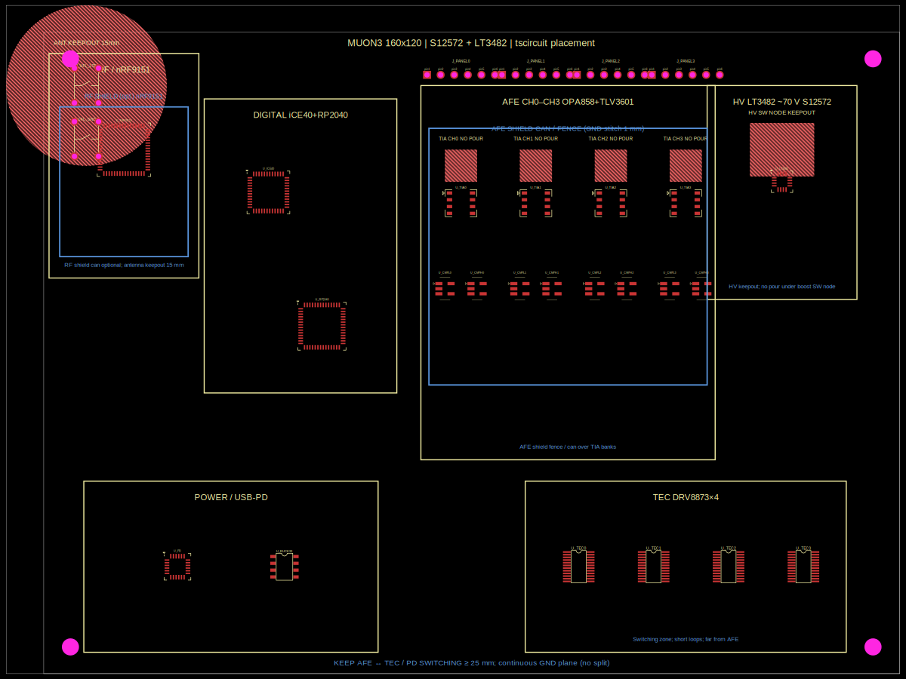

# Muon3 tscircuit placement & shielding

Part of the **Muon3** project (`muon3.kicad_pcb`, hierarchical sheets under `pcb/`).

Uses **[tscircuit](https://docs.tscircuit.com)** (`@tscircuit/core`) to encode
optimal component **placement zones**, **RF/AFE keepouts**, and **shielding
notes** for the four-channel Muon3 station (decommissioned sPHENIX HCal tiles,
Hamamatsu S12572-33-015P + LT3482 ~70 V).

## Quick start

```bash
# needs bun: curl -fsSL https://bun.sh/install | bash
cd pcb/tscircuit
bun install
bun run render
```

## Files (Muon3 naming)

| File | Description |
|------|-------------|
| `muon3_placement.tsx` | Board, zones, chips, keepouts |
| `render_placement.ts` | Export circuit-json + SVG |
| `out/muon3_placement_pcb.svg` | PCB view |
| `out/muon3_placement.circuit.json` | circuit-json |
| `MUON3_PLACEMENT_SHIELDING.md` | Rationale (also `pcb/MUON3_PLACEMENT_SHIELDING.md`) |
| `figures/tscircuit/muon3_placement_pcb.svg` | Shared figure asset |

## Zone map

```
 ← RF │ DIGITAL │ AFE CH0–3 │ HV │
      │ iCE40   │ OPA858    │LT3482│
      │ RP2040  │ panels ↑  │ 70V  │
 ──── POWER / USB-PD ── TEC DRV×4 ─── →
```

See `MUON3_PLACEMENT_SHIELDING.md` and `../DESIGN_RULES.md`.

## Preview



## Next steps

1. Port zone coordinates into `muon3.kicad_pcb`.
2. Optional: feed `muon3_placement.circuit.json` into `@tscircuit/capacity-autorouter`.
3. Validate RF keepout against Nordic nRF9151 reference and openEMS results.
