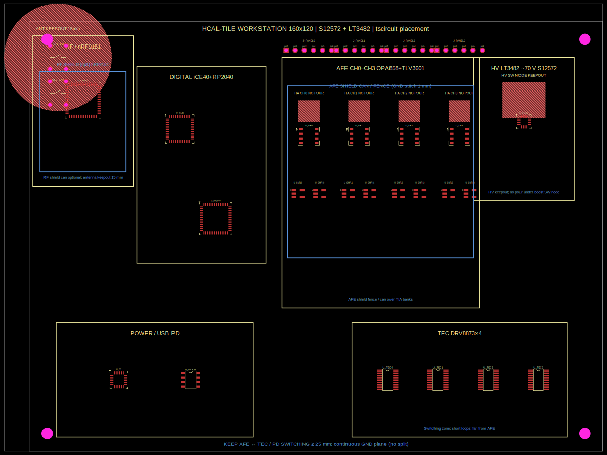

# tscircuit placement & shielding (HCal-tile workstation)

Uses **[tscircuit](https://docs.tscircuit.com)** (`@tscircuit/core`) to encode
optimal component **placement zones**, **RF/AFE keepouts**, and **shielding
notes** for the four-channel station that reads decommissioned sPHENIX Inner
HCal tiles (Hamamatsu S12572-33-015P + LT3482 ~70 V).

## Quick start

```bash
# needs bun: curl -fsSL https://bun.sh/install | bash
cd pcb/tscircuit
bun install
bun run render
```

## Outputs

| File | Description |
|------|-------------|
| `out/hcal_placement_pcb.svg` | PCB view with zones, parts, keepouts |
| `out/hcal_placement.circuit.json` | circuit-json for further tools / autorouter |
| `PLACEMENT_SHIELDING.md` | Rationale table (also copied to `pcb/`) |
| `figures/tscircuit/hcal_placement_pcb.svg` | Paper/README asset |

## Zone map (optimal)

```
 ← RF │ DIGITAL │ AFE CH0–3 │ HV │
      │ iCE40   │ OPA858    │LT3482│
      │ RP2040  │ panels ↑  │ 70V  │
 ──── POWER / USB-PD ── TEC DRV×4 ─── →
```

See `PLACEMENT_SHIELDING.md` and project `DESIGN_RULES.md`.

## Preview



## Next steps

1. Port zone coordinates into `muon3.kicad_pcb`.
2. Optional: feed `circuit.json` connections into `@tscircuit/capacity-autorouter`
   once nets are fully declared.
3. Validate RF keepout against Nordic nRF9151 reference and openEMS results.
