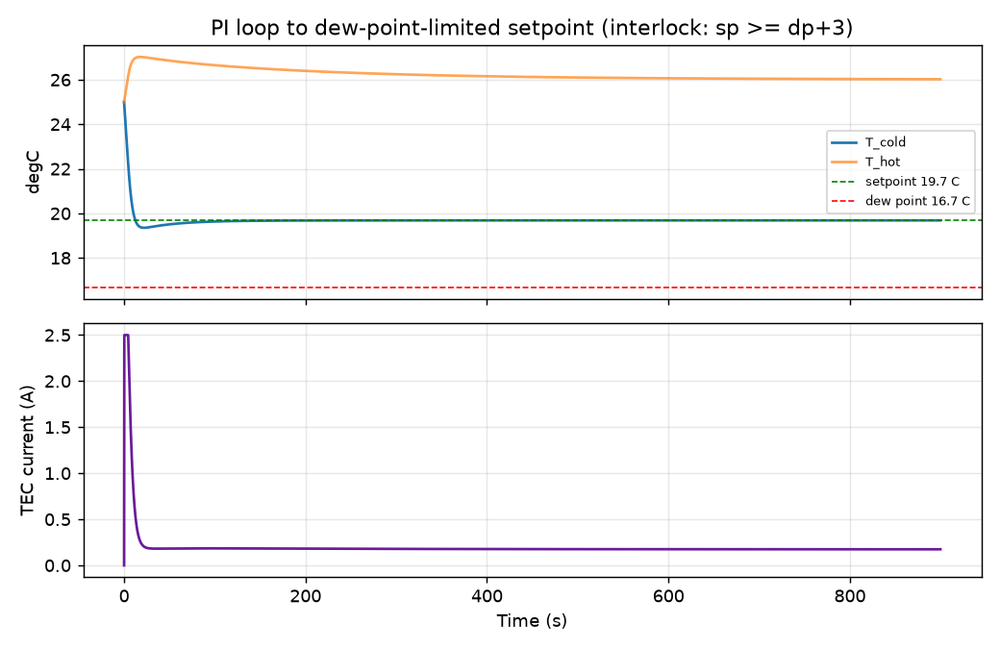
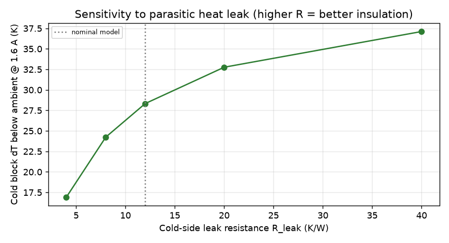

# Muon3 Simulation Models

**In plain English:** Simulations predict how muons will interact with the plastic panels, how much light reaches the sensors, how the electronics will respond, and how much power and cooling will be needed.

**Muon3** is the next-generation four-channel cosmic-ray muon telescope (see top-level README and `pcb/` for hardware context). This `sim/` directory provides the primary modeling infrastructure for electrical, detector physics, thermal, power, and system-level analysis.

**Date**: 2026-07-12 (P0 architecture baseline; recent sim enhancements integrated)

## Scope and Philosophy

The simulations cover:

- **Analog front-end and power electronics** (ngspice) — precise pulse shape, gain, ToT, noise, HV ripple, cable effects, calibration injection.
- **Scintillator + WLS fiber + SiPM optical response** (Geant4) — muon energy deposition, light production, wavelength shifting, collection efficiency, position/angle dependence, photon timing.
- **Behavioral / system models** (Python) — thermal/Peltier control loops, power budgeting under different USB-PD contracts, rate/coincidence statistics, ToT parametrization.
- **Cross-domain coupling** — Geant4 photon statistics drive ngspice current sources; Python models use outputs for higher-level studies (e.g. livetime, accidental rates, dew-point safety).

All models are **parametric** so they can be anchored to real bench data from finished panels (single-p.e. response, MIP yield maps, temperature scans). Prefer measured data when freezing thresholds or efficiency targets.

## Current Design Baseline (2026-07-11 decisions)

- Panels: 200 × 200 × 10 mm EJ-200 (or equivalent polystyrene scintillator)
- WLS fiber: looped Kuraray K-11 / Y-11 class (~1 mm dia.), embedded groove with optical cement, single-end readout
- SiPM (HCal-tile workstation): **Hamamatsu S12572-33-015P** on decommissioned sPHENIX tiles
- HV: **LT3482 C515895** (~70 V); see `circuit/HAMAMATSU_SIPM_COMPATIBILITY.md` and `pcb/parts/hv_lt3482/`
- Legacy reference only: MicroFC-30035 + TPS61170 (~30 V)
- AFE: DC-coupled OPA858 TIA (Rf = 2 kΩ, Cf ≈ 2.2 pF) + dual TLV3601-class comparators (low physics threshold + high shower-discrimination threshold)
- Interconnect: 50 cm hybrid cable carrying signal, bias, cold/hot NTCs, TEC power, fan power/tach
- Timing engine: iCE40UP5K (exact-subset coincidence, dual-ToT, PPS latching, histograms)
- Power: USB-C PD (CH224K) with 5 V fallback (electronics only, cooling disabled) and higher contracts for TECs
- Thermal: 4× independent Same Sky CP30238 Peltier modules + 40 mm tach fans, hardware interlocks, dew-point limiting via BME280

## Directory Layout

```
sim/
├── README.md                     # This file — primary reference
├── circuit/                      # ngspice electrical models
│   ├── muon3_frontend.lib        # SiPM, OPA858, TLV3601, charge injection models
│   ├── afe_dual_threshold.cir    # Full single-channel netlist with dual comparators
│   ├── hv_tps61170.cir           # TPS61170 bias boost + filter + trim + monitor
│   ├── cable_50cm.cir            # Lossy transmission line for 50 cm panel cable
│   ├── run_sweeps.sh             # ngspice batch runner
│   └── analyze_muon3.py          # ToT, time-walk, pulse family analysis + plots
├── geant4/                       # Geant4 particle + optical photon simulation
│   ├── README.md                 # Build & usage instructions for the Geant4 app
│   ├── CMakeLists.txt
│   ├── muon_panel.cc             # Main entry point
│   ├── include/                  # Headers (DetectorConstruction, Actions, SD)
│   ├── src/                      # Implementations
│   └── macros/                   # run.mac, vis.mac, scan_position.mac
├── python/                       # Higher-level behavioral & Monte-Carlo models
│   ├── thermal_peltier.py        # Lumped thermal model + PID + dew-point interlock
│   ├── power_budget.py           # Power consumption table + stacked charts (5 V vs 12/20 V PD)
│   ├── coincidence_rates.py      # Rate, efficiency, accidental coincidence estimator
│   ├── sipm_to_tot.py            # Parametrized ToT vs NPE model
│   └── requirements.txt
├── data/                         # Reference data & notes
│   └── panel_yield_notes.md      # What to measure on real panels
└── docs/                         # (populated by runs) generated plots & reports
```

## ROOT analysis plots

Geant4 hit CSVs are plotted with **ROOT 6** (not matplotlib) for the paper:

```bash
# from physics/ root
root -l -b -q 'sim/reports/root_hcal_and_geant4.C'
# or
python3 sim/reports/make_root_charts.py
```

Inputs: `sim/geant4/hcal_tile_hits.csv`, `hits_fresh.csv` (Muon3 panel).  
Outputs: `figures/hcal_inner_tile_*.png`, `root_hcal_combined.png`, `pe_spectrum.png`, `yield_map.png`, `root_muon3_analysis.png` (also under `sim/geant4/plots/` and `sim/reports/figures/`).

## Octave 3D plots (openEMS + Geant4)

Detailed **3D** surfaces for RF/SI/PI and detector hits:

```bash
# brew install octave gnuplot
octave-cli --no-gui --quiet --eval "run('sim/plots_octave/plot_3d_openems_geant4.m')"
```

Outputs: `figures/octave/octave_*.png` (antenna pattern/S11, cable, HS trace, PDN, HCal/Muon3 Geant4 surfaces). See `sim/plots_octave/README.md`.

## 1. Circuit Simulations (ngspice)

### Key Files

- **muon3_frontend.lib**
  - `MICROFC_30035` — behavioral double-exponential current source. Parameters: NPE, QPE (~480 fC at 3 V overvoltage), TAUR/TAUD (rise/decay), CT (terminal capacitance ~400 pF), IDC (dark current).
  - `OPA858` — decompensated FET-input TIA macromodel (GBW 5.5 GHz, SR 2000 V/µs).
  - `TLV3601` — fast push-pull comparator with ~8 mV hysteresis.
  - `CHARGE_INJ` — simple injection capacitor for calibration studies.

- **afe_hamamatsu_s12572.cir** + **hv_lt3482.cir** + **HAMAMATSU_SIPM_COMPATIBILITY.md**
  - **Primary** HCal-tile path: S12572-33-015P, ~69–70 V (LT3482 C515895 on board), Rf/Cf retuned for ~37 fC/p.e.
- **afe_dual_threshold.cir** / **hv_tps61170.cir**
  - Legacy MicroFC-30035 + TPS61170 ~30 V reference path only.
  - DAC-derived references (VBOT, VTH_LOW, VTH_HIGH) with RC filtering.
  - Charge injection port on the summing node.
  - Parameters controllable via `alterparam` or command line (NPE, VBOT, VTH_*, RF, CF, VANA).

- **hv_tps61170.cir**
  - Averaged boost + output filter network (L/C stages).
  - Resistive feedback + DAC trim (VTRIM).
  - HV quiet rail and divider for HV_MON (ADC).
  - Simple OVP clamp.
  - Use for ripple feedthrough into AFE and trim range studies.

- **cable_50cm.cir**
  - Lossy line model (Z0 ≈ 50 Ω, ~2.5 ns one-way delay).
  - Demonstrates rise-time degradation and reflections for ~1 ns edges over 50 cm.
  - Can be inserted between SiPM model and board-side TIA.

### Running

```bash
cd circuit
./run_sweeps.sh          # runs multiple NPE values + threshold scan stub
python analyze_muon3.py  # produces ToT vs NPE, pulse family plots, etc.
```

Typical outputs (after running):
- Waveforms for 1/3/10/30/100 p.e.
- Logarithmic ToT fit in the linear region: ToT ≈ 14.6·ln(NPE) − 7.5 ns (example from prior calibration)
- Time-walk across dynamic range
- Dual-threshold separation

**Important parameters to tune from measurement**:
- Exact QPE and CT for the chosen MicroFC-30035 overvoltage bin.
- Real rise/decay times (including fiber transit spread).
- Comparator hysteresis and propagation at low overdrive.

## 2. Geant4 Detector Simulation (`geant4/`)

Full muon transport + optical photon simulation of the panel + looped WLS fiber + SiPM.

### Geometry Highlights
- 200 × 200 × 10 mm scintillator box (EJ-200 equivalent).
- Simplified looped fiber (torus + straight exit leg representing the groove + one-end readout).
- Highly reflective wrapping (skin surface).
- 3 × 3 mm SiPM volume at fiber exit with optical interface.

### Physics
- G4EmStandardPhysics + G4OpticalPhysics.
- Scintillation (yield, spectrum, fast decay ~2.1 ns).
- Wavelength shifting in fiber core (absorption blue → emission green).
- Bulk absorption, refractive indices, surface reflectivity.

### Building & Running

```bash
cd geant4
mkdir build && cd build
cmake ..   # or -DGeant4_DIR=/path/to/Geant4/lib/Geant4-11.x
make -j
./muon_panel -m ../macros/run.mac          # 500 vertical-ish muons, text/CSV output
./muon_panel -m ../macros/vis.mac          # interactive visualization (optical photons can be slow)
```

See `geant4/README.md` for more (including position scans, output files `muon_panel_hits.csv` and photon timing stats).

### Key Outputs & Studies
- Deposited energy per event.
- Number of scintillation photons produced.
- Number of WLS-shifted photons.
- Number of photons detected at SiPM (after applying PDE).
- Hit position vs. yield (for uniformity).
- Arrival time distribution at SiPM (convolve with AFE model).

**Tunable constants** (edit `src/PanelDetectorConstruction.cc` or add UI commands):
- `fScintYield` (default 10 000 ph/MeV)
- WLS efficiency, absorption length
- Surface reflectivity (0.92 typical)
- SiPM PDE at fiber emission wavelength (~0.40)

**Relation to hardware**: Feed mean NPE + time profile from Geant4 into ngspice `NPE` parameter and current pulse shape.

## 3. Python Behavioral Models

### thermal_peltier.py
Lumped thermal model for one SiPM + CP30238 Peltier channel (parameters derived from datasheet Vmax/Imax/dTmax):
- Peltier, Joule, and conduction terms with correct signs.
- Hot-side (heatsink + fan) and cold-cavity leak modeling.
- PI control loop with dew-point interlock (setpoint >= dp + 3 °C).
- Recent enhancements (2026-07-12): leak sensitivity sweep, worst-case ambient (35 °C / 80 % RH), 4ch power vs. DCR/yield trade-off analysis, DCR reduction estimates.

Example:
```bash
python thermal_peltier.py
```
Produces `thermal_step.png`, `thermal_sweep.png`, `thermal_pi_loop.png`, `thermal_leak_sweep.png`.

Committed copies live in `figures/`. A dedicated "Thermal Management (Peltier / TEC)" subsection with figures was added to `Muon3_Simulation_Studies.tex`.

**Example Thermal Figures:**





Use to validate:
- 1.2–1.8 A operating point for 15–25 °C drop with dew safety.
- Insulation requirements (R_leak).
- Hardware interlock necessity (open-loop overcooling risk).
- Power budget impact of cooling.

### power_budget.py
Tabular and graphical power consumption for different USB-C PD contracts:
- 5 V fallback (electronics only, ~1.75 W)
- 12 V / 20 V with 1–4 TEC channels active.
- Breakdown: nRF9151 bursts, iCE40, AFE, HV, DRV8873 + CP30238, fans.

Run:
```bash
python power_budget.py
```
Generates `power_budget_modes.png` (also copied to `figures/power_budget_modes.png`).

Critical for PD contract negotiation and 5 V science-mode validation.

**Example:**


### coincidence_rates.py
Monte-Carlo estimator:
- Poisson muon arrivals.
- Lognormal or Gaussian NPE per muon (from Geant4 or measurement).
- Efficiency above threshold.
- Rough accidental rate from dark counts.

Works with or without numpy (pure Python fallback).

Useful for:
- Choosing nominal 3 p.e. threshold.
- Estimating livetime and shadow-window accidentals.
- Fleet coincidence rate predictions.

### sipm_to_tot.py
Simple analytic ToT(NPE) model derived from AFE simulations:
```python
ToT ≈ 14.6 * ln(NPE) - 7.5   # ns (example coefficients)
```
Use to map Geant4 yield distributions to expected FPGA ToT histograms without running full ngspice every time.

## 4. Data & Calibration Notes (`data/panel_yield_notes.md`)

Contains guidance on the measurements that must be performed on real panels before freezing design parameters:
- Single-p.e. amplitude/charge/ToT at operating overvoltage & temperature.
- MIP peak position (most probable NPE).
- Position/angle maps.
- Temperature coefficients.
- Afterpulsing/crosstalk.

Store results in a CSV with columns like: `panel_id, x, y, angle, temp_C, ov_V, npe_mean, npe_sigma, dark_rate_hz`.

## How the Models Fit Together (Recommended Workflow)

1. Run Geant4 position/angle sweeps → obtain NPE distribution and photon time profile.
2. Feed representative NPE + time constants into `circuit/afe_dual_threshold.cir`.
3. Sweep thresholds in ngspice → generate ToT distributions and time-walk data.
4. Use Python models for:
   - Thermal stability & interlock verification.
   - Power budget under real PD contracts.
   - Statistical coincidence / accidental / efficiency predictions.
5. Compare everything against bench data from prototype panels.
6. Iterate parameters, then lock values in `pcb/PART_SELECTION.md`, schematics, and firmware.

## References

- `pcb/PART_SELECTION.md`, `pcb/DESIGN_RULES.md`, `pcb/SCHEMATIC_FREEZE_CHECK.md`
- `reference_documentation/repositories/scintillatorPanel/readme.md` (mechanical assembly, looped fiber)
- `reference_documentation/repositories/fiberPanel/` (phyxch) — Geant4 panel + embedded WLS fiber optical sim; material definitions, optical processes, collection studies (https://github.com/phyxch/fiberPanel)
- `reference_documentation/repositories/magnetocosmics/` (phyxch) — cosmic ray geomagnetic tracking (https://github.com/phyxch/magnetocosmics)
- Publications: GSU ICRC2019, sPHENIX beam test (in `reference_documentation/publications/`)

## Contribution Guidelines

- Record every parameter set used to produce a plot or number that appears in design docs.
- Add new models under the appropriate subdirectory and update this README.
- Keep models modular (easy to drive from Geant4 output or measured data).
- Never treat simulation results as final without cross-check against real hardware.

This simulation suite, together with the KiCad P0 architecture and the documented freeze decisions, forms the foundation for the first manufacturable Muon3 revision.

## Electromagnetic Simulations (openEMS)

FDTD EM modeling in `sim/openems/` (real openEMS + CSXCAD bindings now available and detected by scripts):

- nRF9151 RF antenna (S11, pattern for LTE/GNSS bands)
- 50 cm hybrid cable SI (S-params, pulse distortion)
- High-speed PCB trace SI
- 3V3 PDN impedance

Scripts in `sim/openems/scripts/` (label outputs "openEMS FDTD" when bindings present; representative physics-based models otherwise). Results in `results/` and `plots/` (copied to `figures/openems/` for the paper).

See `sim/openems/README.md` and the paper section "Electromagnetic Simulations (openEMS)" for details. Complements Geant4 and ngspice for full validation of RF, SI/PI, and layout.
